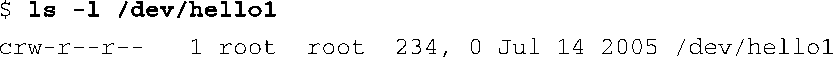

### 8.3.3　设备节点和mknod

为了理解应用程序是如何将其请求绑定到一个具体设备上的，我们必须要理解设备节点的概念。设备节点是Linux中的一种特殊文件类型，它代表一个设备。几乎所有的Linux发行版都将设备节点放在一个公共的位置（这是由文件系统层次结构标准<a class="my_markdown" href="['#anchor087']">[7]</a>指定的），也就说/dev目录中。有一个专门的工具用于在文件系统中创建设备节点。这个工具是mknod。

<a class="my_markdown" href="['#ac087']">[7]</a>　本章末尾参考了这个标准。

为了说明它的功能和它传达的信息，最好的方法就是看一个创建节点的例子。以我们前面介绍的简单设备驱动程序为例，让我们为它创建一个合适的设备节点：

在目标嵌入式系统上执行这条命令之后，我们会得到一个名为/dev/hello1的新文件，它代表我们的设备驱动程序模块。如果我们用 `ls` 命令查看该文件，它看上去会像是这样：

我们传递给mknod的参数包括设备驱动程序的名称、类型、主设备号和次设备号。因为我们是在说明一个字符型（character）驱动程序的使用，因此用字母c来表示。主设备号是234，这是我们为这个例子所选的号码，次设备号是0。

设备节点本身只是我们文件系统中的一个文件而已。然而，由于它作为设备节点的特殊地位，我们可以使用它来绑定一个已安装的设备驱动程序。如果一个应用程序进程发起一个 `open()` 系统调用，并以设备节点作为路径参数，那么，内核会搜索一个有效的设备驱动程序，搜索条件是它注册的主设备号和设备节点的主设备号相匹配——在这里是234。内核就是使用这个机制将我们的具体设备关联到一个设备节点上的。

大多数C程序员都知道， `open()` 系统调用或其变体，会返回一个引用（文件描述符），而应用程序可以使用它来发起后续的文件系统操作，比如读、写和关闭。之后，这个引用会作为参数传递给各种文件系统操作函数，比如读写函数及其变体。

也许你会对次设备号的作用感到好奇，它只是一种机制，用于在一个设备驱动程序中处理多个设备或子设备。操作系统并不使用它，它仅仅是被传递给设备驱动程序。设备驱动程序能够以合适的方式随意使用次设备号。例如，对于一个多端口的串行端口卡，主设备号可用于指定驱动程序，而次设备号可用于指定其中的某个端口，而所有这些端口都是由同一个驱动处理的。请参考设备驱动程序方面的优秀教材以了解更多详细信息。

最后还有一点需要注意。前面对设备节点的讨论只是为了教学目的。在大多数主流Linux系统上，永远都不会实际地创建设备节点。设备节点的创建是由udev自动完成的。我们将在第19章详细讲述它的功能。

