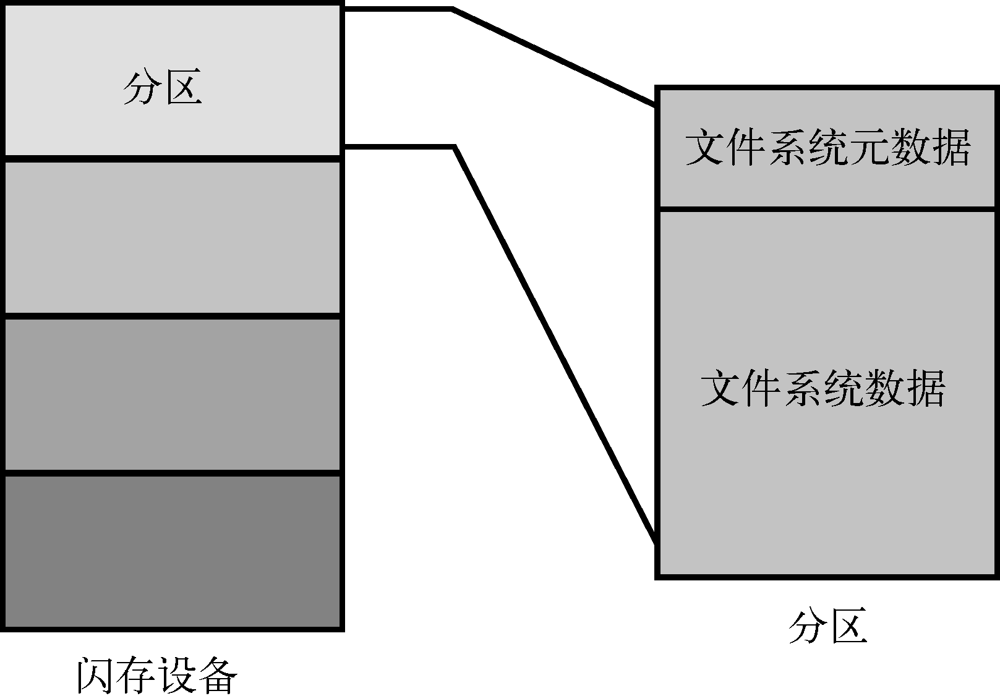
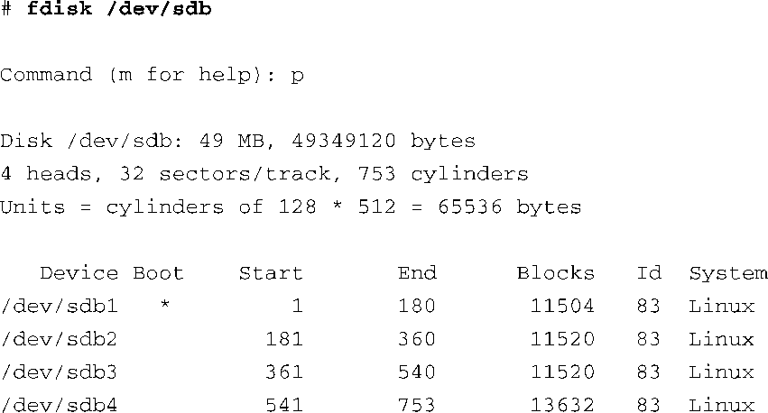

### 9.1　Linux文件系统概念

在深入讨论各个文件系统的细节之前，让我们先大体上看一下数据是怎样存储在Linux系统中的。我们在第8章中研究设备驱动程序时，查看了一个字符设备的结构。一般来说，字符设备以串行字节流的方式存储和获取数据。最基本的字符设备的例子是串行端口和鼠标。相反，块设备在存储和获取数据时，每次读或写都以等同大小的数据块为单位，并且可以访问一个可寻址媒介上的随机位置。例如，一个典型的IDE硬盘控制器可以一次从物理媒介的一个具体的、可寻址的位置上传输512 B的数据。

### 分区

在开始关于文件系统的讨论之前，我们先介绍一下分区的概念。分区是对物理设备的逻辑划分，而文件系统就存在于这个设备之上。在最高的层次上，数据存储于物理设备的分区中。一个分区就是物理媒介（硬盘、闪存）的一个逻辑部分，这个分区中数据的组织形式遵循此分区类型的相应规定。一个物理设备可以只包含一个分区，占据所有可用的空间，或者，它可以被分成多个分区，以适合某个特定任务的要求。一个分区可以被看做是一个逻辑盘，它上面可以存储一个完整的文件系统。

图9-1显示了分区和文件系统之间的关系。

<b class="my_markdown">图9-1　分区和文件系统</b>

Linux使用一个名为fdisk的工具来操控块设备上的分区。最新fdisk工具能够识别90多种不同类型的分区，这个工具在很多Linux发行版上都可以找到。实际上，只有少数几种类型是常用的。一些常见的分区类型有Linux、FAT32和Linux Swap。

代码清单9-1中显示了针对一个连接到USB端口的CompactFlash设备使用fdisk工具时的输出信息。在这个特定的目标系统中，物理CompactFlash设备分配的设备节点为/dev/sdb<a class="my_markdown" href="['#anchor091']">[1]</a>。

代码清单9-1　使用fdisk显示分区信息

/

<a class="my_markdown" href="['#ac091']">[1]</a>　你会在第19章中了解到这是如何完成的。

为了这里的讨论，我们已经使用fdisk工具在这个设备上创建了4个分区。其中之一被标记为可引导分区，从Boot这一列的星号（ `*` ）可以看出来。这反映出，在代表设备分区表的数据结构中有一个引导指示符（boot indicator ）的标志开关。你可以从代码清单中看到，fdisk使用的逻辑存储单元是柱面（cylinder）<a class="my_markdown" href="['#anchor092']">[2]</a>。在这个设备上，一个柱面包含64 KB的数据。另一方面，Linux将最小存储单元表示为逻辑块。你可以从这个代码清单中推导出一个逻辑块包含1024 B（列表中的Blocks列表示占用的逻辑块的数量）。

<a class="my_markdown" href="['#ac092']">[2]</a>　柱面这个词是从旋转型媒介（比如硬盘）所使用的存储单位借鉴而来。它包含了一个磁盘设备的某个扇区上的一组磁头下的所有数据。这里使用它是为了兼容其他已有的文件系统工具。

按照这种方式对CompactFlash进行分区之后，每个分区都由一个设备节点表示，并且可以选择一种文件系统对其进行格式化。如果已经用某种文件系统对一个分区进行了格式化，Linux就可以从那个分区挂载对应的文件系统了。

