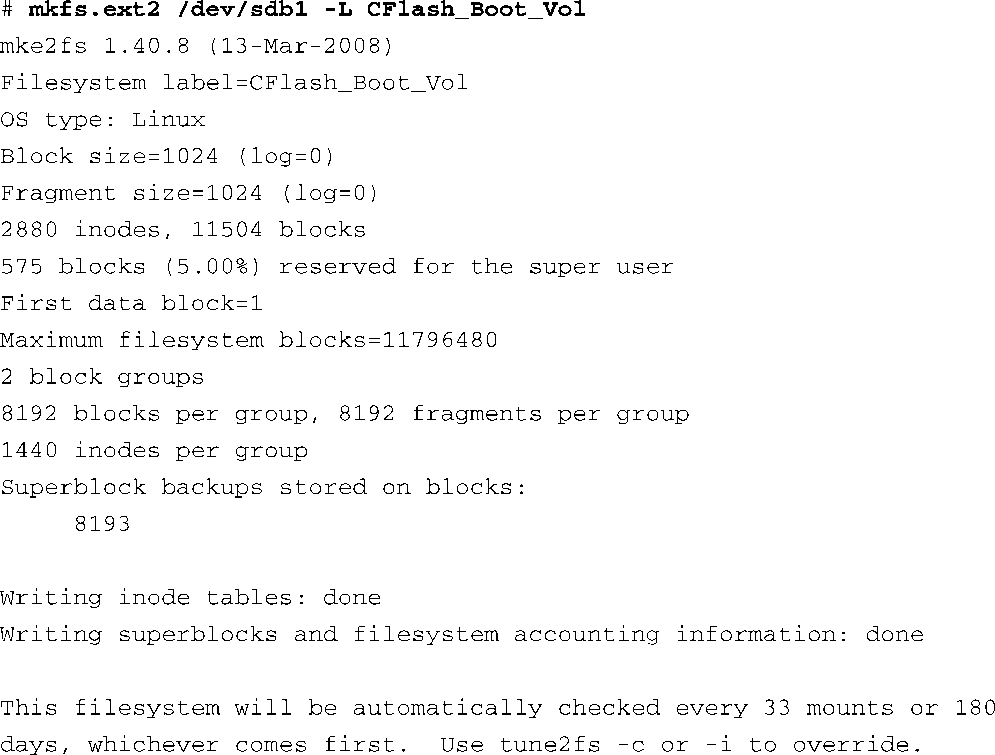

### 9.2　ext2

在代码清单9-1的基础之上，我们需要对fdisk创建的分区进行格式化。为了完成这项工作，我们使用Linux的mkfs.ext2工具。mkfs.ext2类似于我们熟悉的DOS下的 `format` 命令。这个工具在指定的分区上创建一个ext2类型的文件系统。mkfs.ext2与ext2文件系统具体相关；其他类型的文件系统有自己相应的工具。代码清单9-2显示了格式化过程中的输出信息。

代码清单9-2　使用mkfs.ext2格式化一个分区

代码清单9-2包含了很多有关ext2文件系统的详细信息。从这里开始理解ext2的运行特征是个很不错的方法。这个分区被格式化为ext2类型（因为我们使用了ext2的mkfs工具），卷标（volume label）为 `CFlash_Boot_Vol` 。它是在一个Linux分区（OS Type:）上创建的，块大小为1024 B。它为2880个inode分配了空间，共占用11 504个块。inode是一个重要的数据结构，代表一个文件。请参考本章的最后一节，以了解更多有关ext2文件系统内部结构的详细信息。

看一下代码清单9-2中mkfs.ext2的输出，我们可以确定存储设备的一些组织特征。我们已经知道了块大小是1024 B。如果你的应用程序有特殊需要，可以让mkfs.ext2采用不同的块大小来格式化一个ext2文件系统。当前的mkfs.ext2实现支持1024、2048和4096 B的块。

块大小总会为了达到最优性能而妥协。一方面，如果磁盘上有很多小文件，较大的块大小会浪费更多空间，因为每个文件都必须由整数个块来存放。如果文件的大小超出了 `block_size * n` ，超出的部分必须占用另一个完整的块，即使只是超出了1 B。另一方面，如果采用较小的块大小，这会增加文件系统管理元数据的开销，元数据描述了块和文件之间的映射关系。你需要对特殊硬件实现和数据格式做一些基准测试，只有通过这个方法才能确定是否选择了最佳的块大小。

