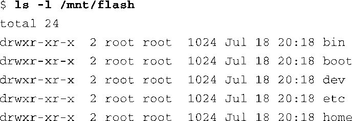
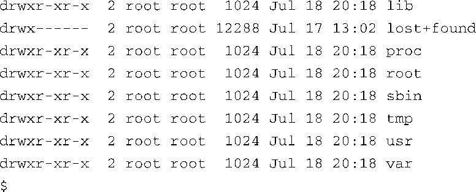

### 9.2.1　挂载文件系统

文件系统创建之后，我们可以将它挂载到一个运行的Linux系统上。内核在编译时必须支持我们特定的文件系统类型，可以将这个支持功能编译进内核，或是编译成一个动态可加载的模块。下面这个命令将我们前面创建的ext2文件系统挂载到指定的挂载点上：

这个例子假设我们在目标Linux设备上有一个已经创建好的目录，名为/mnt/flash。这被称为挂载点，因为我们正在安装（挂载）的文件系统的根目录就位于整个文件系统层次结构的这一点上。我们挂载的是前面描述过的一个闪存设备，为其分配的设备节点为/dev/sdb1。在一个典型的Linux桌面（开发）机器上，我们需要有root用户的权限才能执行这条命令<a class="my_markdown" href="['#anchor093']">[3]</a>。挂载点可以是文件系统中的任意一个目录路径（这是由你决定的），这个目录会成为新挂载设备的顶层目录（根目录）。在前面的例子中，为了访问闪存设备中的文件，必须在路径前加上/mnt/flash。

<a class="my_markdown" href="['#ac093']">[3]</a>　非root用户可以通过使用文件/etc/fstab中的相关条目将某些文件系统（比如cdrom）设置为可挂载。

mount命令有很多选项。mount接受的有些选项依赖于目标文件系统的类型。大多数情况下，一个格式化正确且为内核所知的文件系统类型都可以挂载。在我们学习本章的过程中，我们会给出其他一些使用mount命令的例子。

代码清单9-3显示了一个闪存设备中的目录内容，这个设备是针对一个嵌入式系统配置的。

代码清单9-3　闪存设备中的文件内容

从代码清单9-3这个例子中，我们可以看到，一个嵌入式设备上的根文件系统的顶层（根目录）内容是什么样子的。第6章提供了一些指导和例子，帮助我们确定根文件系统的内容。

