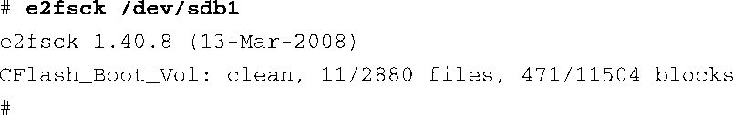
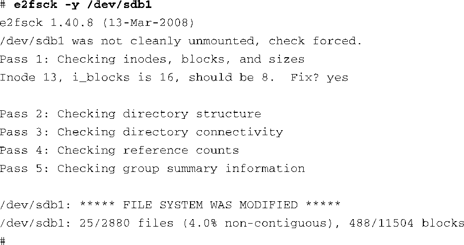

### 9.2.2　检查文件系统的完整性

e2fsck命令用于检查一个ext2文件系统的完整性。有几个原因会造成文件系统的损坏。最常见的原因就是系统意外断电。Linux发行版在关机时会关闭所有已打开的文件并卸载文件系统（假设系统是正常有序地关闭的）。然而，对于嵌入式系统，意外断电是很常见的事情，所以我们需要提供某些防范措施以应对这些情况。e2fsck是我们的第一道防线。

代码清单9-4显示了在前面例子中的CompactFlash上运行e2fsck时的输出信息。它已经被格式化并正确地卸载了，所以没有错误发生。

代码清单9-4　检查正常的文件系统

e2fsck工具会对文件系统的几个方面做一致性检查。如果没有发现问题，e2fsck会输出一条类似于代码清单9-4的消息。注意，e2fsck应该运行于一个未挂载的文件系统上。虽然有可能将它运行于一个已挂载的文件系统上，但这样做会对磁盘或闪存设备的内部文件系统结构造成严重损害。

为了提供一个更加有趣的例子，我们将仍然处于挂载状态的CompactFlash设备从其插槽中拔出来，代码清单9-5显示了此时对文件系统进行检查时的输出信息。我们有意创建了一个文件，在将它从系统中移除之前开始对这个文件进行编辑。结果是，这会损坏用于描述此文件的数据结构，也会损坏实际存储文件数据的数据块。

代码清单9-5　检查一个损坏了的文件系统

从代码清单9-5中，可以看到e2fsck检测到CompactFlash没有正确地卸载。此外，你可以看到e2fsck在检查过程中的处理步骤。e2fsck工具对文件系统进行了5轮遍历，检查了内部文件系统数据结构的各个成员。一个和某文件（由inode<a class="my_markdown" href="['#anchor094']">[4]</a> 13标识）相关的错误被自动修正了，这是因为我们在e2fsck的命令行中包含了 `-y` 标志。

<a class="my_markdown" href="['#ac094']">[4]</a>　文件系统中的文件是由一个称为inode的内部exe2数据结构代表的。

当然，在一个实际的系统中，你也许不会这么幸运。有些文件系统错误是不能由e2fsck修复的。而且，嵌入式系统的设计者应该能够理解以下场景：如果系统在没有正确关机时就意外断电了，再次启动时会花费更长的启动时间，因为它要花时间扫描引导设备并修复发现的错误。实际上，如果这些错误是不可修复的，系统的启动就会终止，并且会提示需要人为干预。此外，还应该注意的是，如果你的文件系统的比较大，文件系统检查（fsck）会花费几分钟甚至几个小时的时间。

另一种抵御文件系统损坏的方法是保证写操作能够立刻提交到磁盘上，即刚一写完就体现在硬件设备上。sync工具可以用于强行将所有排队中的I/O请求提交到对应的设备上。有一个策略可用于降低意外断电时数据损坏的可能性，就是在每次写文件之后执行一下 `sync` 命令，或是按照应用程序的需求有计划地执行 `sync` 命令。当然，代价是性能会受到影响。在所有的现代操作系统中，延迟磁盘写操作是一种优化系统性能的方法。使用sync命令实际上抵消了这一优化。

ext2文件系统已经发展为一个快速、高效和健壮的Linux文件系统。然而，如果你需要日志文件系统提供更高的可靠性，或者系统非正常关闭后的重启时间会影响设计，你应该考虑一下ext3文件系统。

