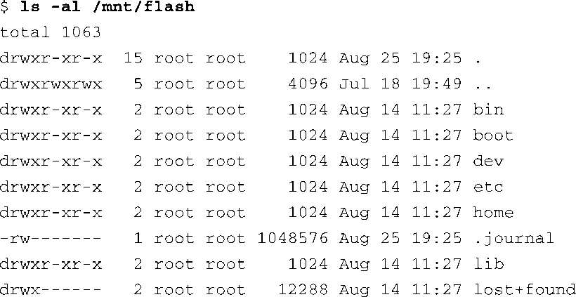
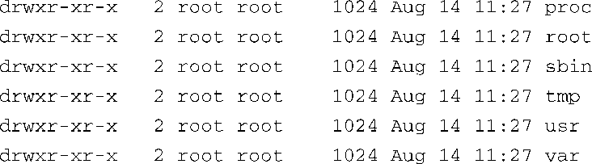

### 9.3　ext3

ext3文件系统已经成为一个强大、高性能和健壮的日志文件系统。目前，它是很多流行桌面Linux发行版的默认文件系统。

ext3文件系统基本上是对ext2文件系统的一个扩展，添加了日志功能。日志（journaling）是一项技术，采用这种技术时，对文件系统所做的每次改变都会记录到一个特殊的文件中，这样文件系统就有可能从已知的日志点恢复过来。ext3文件系统有一大优势，即当系统非正常关闭后，它能够直接被挂载。我们在前一节中提到过，当系统意外关闭时，比如发生供电故障，系统会强行对文件系统进行一致性检查，而这个操作很费时间。如果使用ext3文件系统的话，就不需要一致性检查了，因为简单地回放一下日志就可以保证文件系统的一致性。

我们会迅速地解释一下一个日志文件系统是如何工作的，但不会深入讨论其设计细节，这超出了本书的范围。一个日志文件系统包含一个特殊的文件，通常对用户是隐藏的，它用于存储文件系统元数据<a class="my_markdown" href="['#anchor095']">[5]</a>和文件数据本身，这个特殊的文件被称为日志。一旦文件系统被修改（比如一个写操作），这些修改首先会被写入日志中。文件系统的驱动程序保证该写操作首先被提交到日志中，之后实际的数据改变才会被提交到存储媒介上（例如磁盘或闪存）。当这些改变被记录到日志中后，驱动程序才会改变媒介上的实际文件和元数据。如果在向媒体写数据的过程中发生供电故障，之后系统重启，为了恢复文件系统的一致性，我们所要做的不过是回放一下日志中记录下来的改变。

<a class="my_markdown" href="['#ac095']">[5]</a>　元数据是关于文件的数据，不同于文件中存储的数据。元数据的例子包括文件的访问日期、时间、大小，使用的块数量等。

ext3文件系统的一个重要的设计目标是同时保持与ext2文件系统的后向兼容和前向兼容。可以将一个ext2文件系统转换成ext3文件系统，再转换回去，而不用重新格式化和重写磁盘上的所有数据。让我们看一下这是如何做到的<a class="my_markdown" href="['#anchor096']">[6]</a>。代码清单9-6详细显示了这个过程。

代码清单9-6　将ext2文件系统转换成ext3文件系统

<a class="my_markdown" href="['#ac096']">[6]</a>　以这种方式转换文件系统应该仅仅被看成是一个开发行为。

注意，我们首先将文件系统挂载到了/mnt/flash，这只是为了说明问题。正常情况下，我们会在一个未挂载的ext2分区上执行这条命令。如果文件系统已挂载，tune2fs会创建一个名为.journal的日志文件，这是个隐藏文件。在Linux系统中，如果一个文件的文件名以点号（.）开头，它会被看做是一个隐藏文件。Linux中的大多数命令行文件工具会忽略这种类型的文件。在代码清单9-7中，我们可以看到，执行 `ls` 命令时有一个 `-a` 标志，这会告知ls工具列出所有的文件，包括隐藏文件。

代码清单9-7ext3日志文件

现在我们已经在闪存模块上创建了日志文件，实际上它已经被格式化成了一个ext3文件系统。下一次系统重启，或是在这个分区（包含新创建的ext3文件系统）上运行e2fsck工具时，这个日志文件会自动不可见。它的元数据会被存储到一个专门为此保留的inode中。只要我们还能在目录的文件列表中看到.journal，修改或删除这个文件都是很危险的。

可以在另一台设备上创建日志文件，这样做有时还会带来好处。例如，如果你的系统有一个以上的物理设备，可以将你的ext3日志文件系统放置在第1个驱动器上，并将其日志文件放置在第2个驱动器上。无论物理存储媒介是基于闪存还是旋转型媒体（磁盘），这个方法都是可行的。如果现有的ext2文件系统位于一个分区上，而日志文件存放在另一个分区上，为了从这个文件系统创建出日志文件系统，需要用下面这种方式来执行tune2fs命令：

为了使这条命令生效，你必须对存放日志的设备进行了格式化——并且该设备上的日志文件必须是ext3文件系统。

