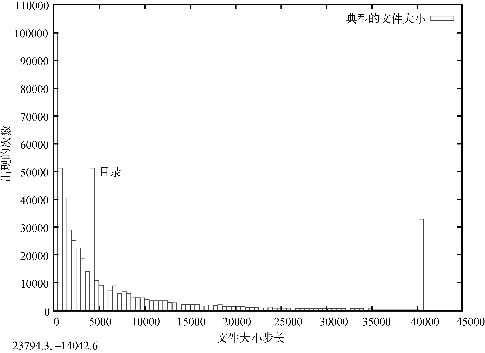
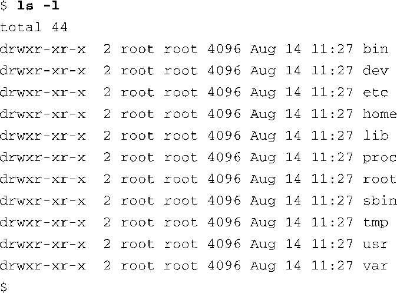
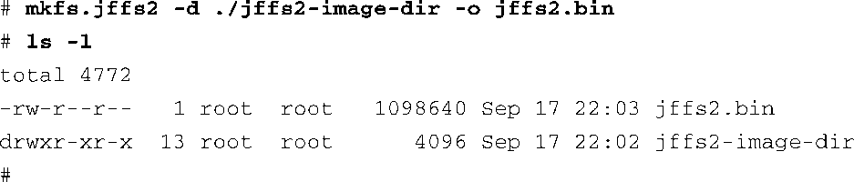

### 9.6　JFFS2

闪存已经在嵌入式产品中得到了广泛使用。由于闪存技术自身的原因，它天生效率较低，并且在意外断电时更容易造成数据损坏。容易损坏的原因是写操作次数太多。低效率则是源于块大小。闪存设备的块大小一般为几十到几百千字节。虽然写操作常常是一次写1 B或一个字，但闪存只能以块为单位进行擦除，一次擦除整个块。为了更新文件，一个整块必须先被擦除，然后再向其中重新写入数据。

大家都知道，在任何一台安装了Linux（或其他操作系统）的电脑上，文件大小的分布是不均匀的，小文件的数量要远远多于大文件的数量。图9-2中由gnuplot制作的柱状图说明了一个典型的Linux开发系统上文件大小的分布情况。

<b class="my_markdown">图9-2　文件大小（以字节为单位）</b>

图9-2显示出大多数文件的大小都小于5 KB。位于4096处的立柱代表目录。目录项（它们本身也是文件）的准确大小为4096 B，而且它们的数量很多。40 000 B以上的立柱是人为测量的结果。它代表的是所有大于40 KB的文件的数量，我们测量时以此为上限。你可以发现一个有趣的现象，大多数文件都是小文件。

小文件会给闪存文件系统的设计者带来独特的挑战。因为闪存必须以块为单位擦除，一次擦除一整块，而闪存的块大小一般是小文件大小的好几倍，所以闪存需要应对耗时的块重写操作。举例来说，假设闪存的块大小为128 KB，块中存放了几十个大小不到4096 B的文件。现在假设我们需要修改其中的一个文件，这会造成闪存文件系统中整个128 KB的块都无效，并将块中的每个文件重写到另一个新擦除的块中。这会是一个相当耗时的过程。

因为闪存的写操作很费时间（比硬盘的写操作慢很多），这就增加了系统意外断电时数据损坏的可能性。意外断电的情况在嵌入式系统中是很常见的。例如，在刚才说的例子中，如果在重写128 KB数据块的过程中断电了，几十个文件都可能会丢失。

JFFS2（第二代日志闪存文件系统）登场了。JFFS2的良好设计已经基本上解决了我们前面所讨论的问题。最初的JFFS是由瑞典的安讯士网络通信公司（Axis Communications AB）设计的，专门针对当时常用的闪存设备。JFFS了解闪存架构，更重要的是，它知道这种架构带来的限制。

闪存文件系统所面临的另一个问题是闪存的寿命有限。一般的闪存设备至少可以写入10万次，而且，最近，可写入1万次的闪存设备已经变得很普遍了。这个次数指的是闪存设备中每个块的写寿命。这是个不同寻常的限制，它要求文件系统将所有写操作均匀分布于闪存设备的各个块中。JFFFS2使用了一种称为耗损均衡（wear leveling）的技术来实现这个功能。

### 构建JFFS2镜像

构建JFFS2镜像相对比较简单。虽然无须内核的支持，你就可以在工作站上构建一个JFFS2镜像，但你不能挂载它。在继续之前，先确认内核支持JFFS2，并且开发工作站中包含一个兼容版的mkfs.jffs2工具。这些工具的源码可以从下面这个网址下载并编译：ftp://ftp.infradead.org/ pub/mtd-utils/。当然，更好的做法是从你的桌面Linux发行版的软件包管理器中下载安装。比如，在Ubuntu中，你可以使用下面这条命令来安装这些工具：

在你的Linux发行版上，这些工具的名字有可能会有所不同，比如mtd-utils。请参考你的桌面Linux发行版中附带的文档。

JFFS2镜像是从一个目录构建而来的，这个目录中包含了我们想放到这个文件系统镜像中的所有文件。代码清单9-8显示了一个针对闪存设备的典型的目录结构，用于充当根文件系统。

代码清单9-8　JFFS2文件系统的目录布局

当我们在这个目录中放置了合适的运行时文件后，这个目录布局就可以作为mkfs.jffs2命令的模板了。 `mkfs.jffs2` 命令会从一个目录树（比如代码清单9-8中所显示的）生成一个格式化好的JFFS2文件系统镜像。 `mkfs.jffs2` 的命令行参数指定了目录位置和输出文件（这个文件中包含了JFFS2镜像）的文件名。代码清单9-9显示了用于构建JFFS2镜像的命令。

代码清单9-9　 `mkfs.jffs2` 命令的例子

在这个例子中，代码清单9-8中所显示的目录结构和文件就位于目录jffs2-image-dir中。我们在这个目录的上层目录中执行了 `mkfs.jffs2` 命令。在 `mkfs.jffs2` 命令行中，我们使用 `-d` 标志来告诉它文件系统模板的位置。使用 `-o` 标志来指定输出文件的文件名，最终的JFFS2镜像会被写入这个文件中。最终生成的镜像 `jffs2.bin` 会在第10章中使用。到时我们会研究这个JFFS2文件和MTD子系统。

有一点需要注意，任何一种基于闪存并支持写操作的文件系统都会遇到底层闪存设备过早损坏的情况。例如，如果打开了系统日志程序（syslogd或klogd），并配置它将数据写入基于闪存的文件系统中，这时，连续的写操作会很容易损坏闪存。某些类型的程序错误也会造成连续的写操作。必须注意限制对闪存设备的写操作，将其数量控制在闪存设备的寿命之内。

