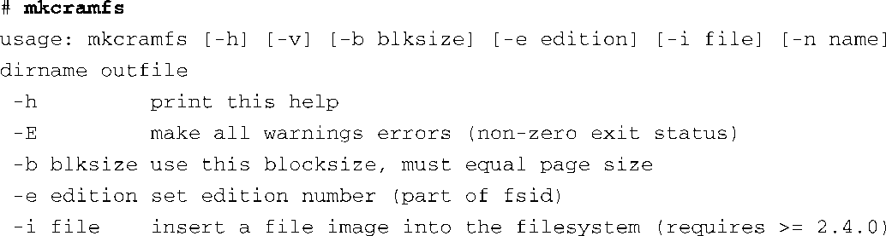
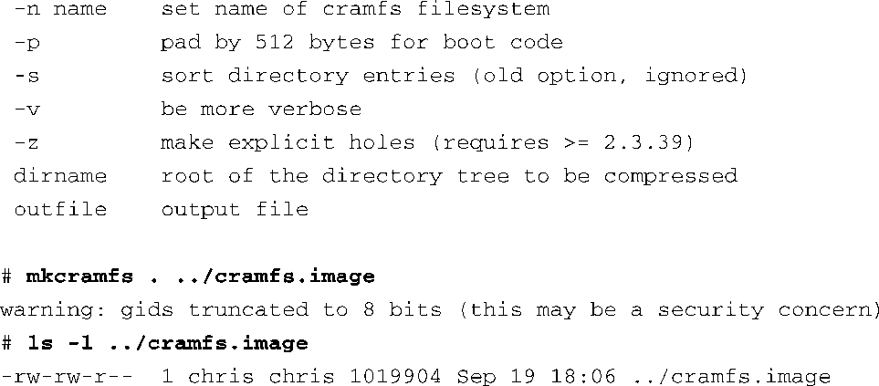
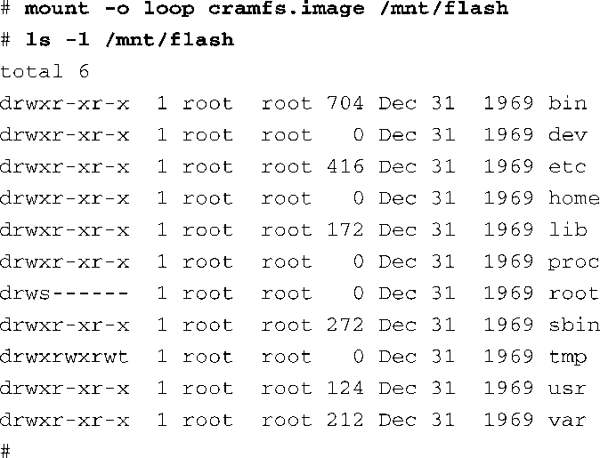

### 9.7　cramfs

从cramfs项目的README文件中可以看到，cramfs的目标是“将一个文件系统塞（cram）到一个小容量ROM中”。对于那些包含一个小容量ROM或闪存的嵌入式系统来说，cramfs非常有用，在这些系统中，ROM或闪存一般用于存放静态数据和程序。再次借鉴一下cramfs项目的README文件：“cramfs是一个简单小巧的文件系统，而且可以很好地对文件进行压缩。”

cramsfs是一个只读文件系统。它是由一个名为 `mkcramfs` 的命令行工具创建的。如果你的开发工作站中没有这个工具，可以从网上下载它，本章末尾提供了下载地址。和JFFS2一样，cramfs是从命令行中指定的目录来构建文件系统。代码清单9-10显示了构建 `cramfs` 镜像的详细过程。我们使用了与代码清单9-8一样的文件系统结构，而我们在前面使用这个目录结构创建了一个JFFS2镜像。

代码清单9-10　 `mkcramfs` 命令的例子

我们先不带任何参数执行一下 `mkcramfs` 命令，这会显示该命令的使用说明。因为这个命令没有帮助手册，所以这是理解它的使用方法的最佳途径。接着，在执行这条命令时将当前目录（.）指定为cramfs文件系统的文件源，并指定一个名为cramfs.image的文件为目标文件。最后，列出刚创建的文件的相关信息，从中我们可以看到新创建的名为cramfs.image的文件。

注意，如果内核配置为支持cramfs，你就可以将刚才创建的文件系统镜像挂载到你的Linux开发工作站上，并查看其中的内容。当然了，由于它是一个只读文件系统，你不能修改它的内容。代码清单9-11展示了如何将这个cramfs文件系统挂载到名为/mnt/flash的挂载点上。

代码清单9-11　查看cramfs 文件系统的内容

你可能已经注意到了，在代码清单9-10中，执行 `mkcramfs` 命令会输出一条有关组ID（Group ID，GID）的警告消息。cramfs文件系统使用的元数据非常少，为的是降低文件系统的大小并提高执行速度。cramfs的一个“特性”就是它将组ID字段的长度截短为8比特。Linux使用长度为16比特的组ID字段。结果是，如果创建文件的组ID的值超过255，它就会被截短，并会输出代码清单9-10中的警告消息。

虽然cramfs文件系统有很多限制，比如限制了文件大小、文件数量等，但它对于引导ROM（boot ROM）来说是理想的选择，因为只读操作和快速压缩都是引导ROM期望具备的特性。

