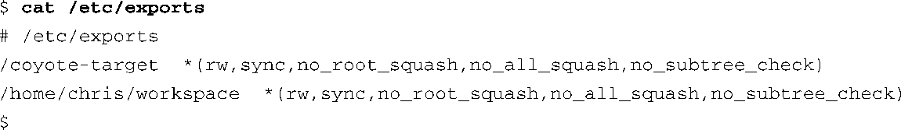
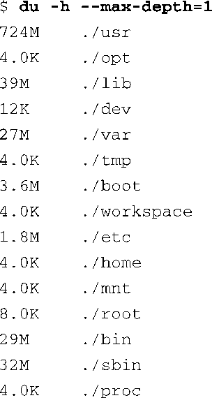
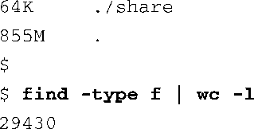
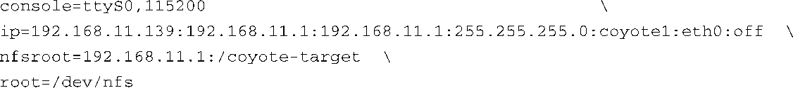

### 9.8　网络文件系统

如果你在UNIX环境下从事过开发工作的话，你肯定很熟悉网络文件系统（NFS）。配置好之后，NFS允许你在NFS服务器上导出目录，并且可以在远程客户机上挂载这个目录，就像本地文件系统那样。一般而言，对于那些包含众多UNIX/Linux机器的大型网络来说，这很有用，而对于嵌入式开发者来说，它也是一剂灵丹妙药。如果在目标板上使用了NFS，即使目标嵌入式系统的资源有限，作为一名嵌入式开发人员，你也可以在开发和调试过程中访问大量的文件、程序库、工具和实用程序。

和其他文件系统一样，你的内核必须配置为支持NFS，而且要同时包含服务器端和客户端的功能。在内核配置中，NFS的服务器端功能和客户端功能是独立配置的。

关于配置和调节NFS的具体操作指南超出了本书的范围，但我们可以在此简要介绍一下NFS的使用，以了解它在嵌入式开发环境中所起的作用。请参考本章最后一节，那里列出了NFS主页的网址，可以从中了解有关NFS的详细信息，包括完整的NFS Howto文档。

如果你的开发工作站上开启了NFS服务器的功能，NFS的一个配置文件中会包含一个目录列表，其中列出了你想通过网络文件系统导出的每个目录。在Red Hat、Ubuntu和大多数其他发行版中，这个文件位于/etc目录中，名为exports。代码清单9-12是一个示例/etc/exports文件，你可以在嵌入式开发的开发工作站上找到它。

代码清单9-12　/etc/exports文件的内容

这个文件中包含了Linux开发工作站上的两个目录名。第一个目录中包含了一个目标文件系统，针对的是ADI Engineering公司的Coyote参考板。第二个目录是一个通用的工作区，其中包含了与嵌入式系统有关的很多项目。这是随意配置的，你可以自行选择NFS的配置方式。

在一个开启了NFS客户端功能的嵌入式系统上，下面这条命令用于挂载一个由NFS服务器导出的目录（.../workspace），挂载点可以自行选择。

注意一下这条命令中的几个要点。我们让 `mount` 命令挂载一个远端的目录（这个目录位于一个名为pluto的机器上，也就是我们的开发工作站），将它挂载到一个本地名为/workspace的挂载点上。为了使这条命令生效，嵌入式目标板必须满足两个需求。首先，为了使目标板能够识别机器名pluto，它必须能够解析这个符号。最简单的方法就是在目标板的/etc/hosts文件中添加一个条目。这就使目标板的网络子系统能够将这个符号名称解析为对应的IP地址。目标板的/etc/hosts文件中的条目看起来会像这样：

第二个需要满足的需求是，嵌入式目标板上必须有一个名为/workspace的目录，位于根目录中。（你可以任选一个路径。比如，可以将它挂载到/mnt/mywork上。）这被称为挂载点。前提条件是目标板上必须已经创建好了你在 `mount` 命令中所指定的目录（挂载点）。

前面例子中的 `mount` 命令允许我们通过嵌入式系统的/workspace路径来访问NFS服务器上/home/chris/workspace目录中的内容。

这非常有用，尤其是在交叉开发环境中。假设你参与了一个大型项目，开发嵌入式设备。每一次你对项目做出修改后，你都需要将应用程序移到目标板上，以便对它进行测试和调试。如果你按照我们刚才描述的方式使用了NFS，并且假设你工作于一个NFS导出的主机目录中，你所做的修改会立刻体现在目标嵌入式系统中，而不再需要将新编译出的项目文件上传到目标板上了。这能够显著提高开发效率。

### NFS上的根文件系统

对于开发和调试来说，在目标嵌入式系统上挂载开发工作站上的项目工作区是很有用的，因为这使目标板能够快速地看到工作区内容的变化和其中的源码，以便于源码级调试。当目标系统的资源非常有限时，这就更有用了。当你完全从一个NFS服务器挂载嵌入式目标的根文件系统时，NFS作为开发工具的优势就真正体现出来了。请注意代码清单9-12中的 `coyote-target` 条目。这是一个位于开发工作站上的目录，其中可能会包含几百个或几千个与目标架构兼容的文件。

那些面向嵌入式系统的主要的Linux发行版一般都会包含上万个文件，它们都是针对所选目标架构编译和测试的。为了说明这一点，代码清单9-13中列出了（代码清单9-12引用的）coyote-target目录中每个子目录的磁盘空间占用情况（使用 `du` 命令）以及文件个数（使用 `find` 和 `wc` 命令）。

代码清单9-13　目标文件系统概况

这个目标文件系统中包含了不到1 GB的针对ARM架构的二进制文件。你可以从上面的代码清单中看到，这包含了29 000多个二进制文件、配置文件和文档。要想将它们放置到一个普通嵌入式系统的闪存设备中几乎不可能！

这时，用NFS挂载根文件系统的优势就体现出来了。从开发角度来看，如果嵌入式系统能够访问Linux工作站上所有你熟悉的工具和实用程序的话，这只会增加你的工作效率。实际上，有几十种你可能从未见过的命令行工具和开发工具能够帮助你节省大量的开发时间。你将会在第13章中了解更多有关这些实用工具的信息。

可以配置嵌入式系统，让它在引导时通过NFS来挂载其根文件系统，这是相对比较容易的。首先，必须配置目标板的内核支持NFS。在内核配置中还有另一个配置选项，用于开启内核挂载一个NFS远程目录作为根文件系统的功能。图9-3显示了这些配置选项。

<b class="my_markdown">图9-3　NFS相关的内核配置</b>

注意，在上面的内核配置中，我们已经选中了NFS file system support选项，同样也选中了Root file system on NFS选项。当选中这些内核配置参数之后，剩下的工作就是以某种方式将相关信息传递给内核，让它知道去哪儿查询NFS服务器。有几种方法可以做到这一点，其中有些方法依赖于所选的目标架构以及引导加载程序。至少，我们可以使用内核命令行来传递合适的参数，使目标板能够在启动时配置NFS服务器的IP端口和服务器信息。一个典型的内核命令行看上去会像是这样：

这告诉内核其根文件系统应该通过NFS挂载<a class="my_markdown" href="['#anchor097']">[7]</a>，并且需要从BOOTP服务器获取相关的参数（服务器名称、IP地址、要挂载的根目录）。在一个项目的开发阶段，这样的配置很普遍，也非常有用。如果你静态配置了目标板的IP地址，内核命令行看起来会像是这样：

<a class="my_markdown" href="['#ac097']">[7]</a>　这里 `root` 参数的值 `/dev/nfs` 并不代表一个设备，它只是代表通过NFS挂载根文件系统，可以参考内核源码init/do_mounts.c中的函数 `name_to_dev_t()` 。——译者注

当然了，以上这条命令行应该只占用一行。命令行中的 `ip=` 参数在内核文档.../Documentation/ filesystems/nfsroot.txt中有说明，它的具体语法规则如下，所有成员都在同一行上：

在这里， `client-ip` 是目标板的IP地址； `server-ip` 是NFS服务器的IP地址； `gw-ip` 是网关（路由器）的IP地址，服务器在不同的子网才会用到它； `netmask` 是目标板的子网掩码。 `hostname` 是一个字符串，代表目标板的主机名； `device` 是Linux设备名，比如eth0； `autoconf` 定义了获取初始IP参数的协议，比如BOOTP协议或DHCP协议。如果不需要自动配置，可以将它的值设为 `off` 。

