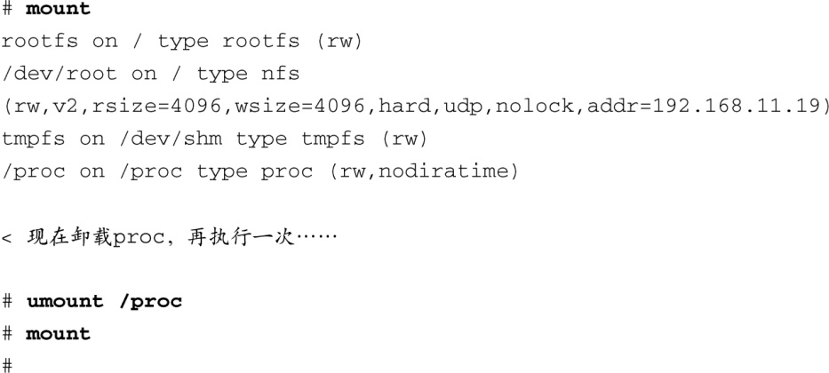
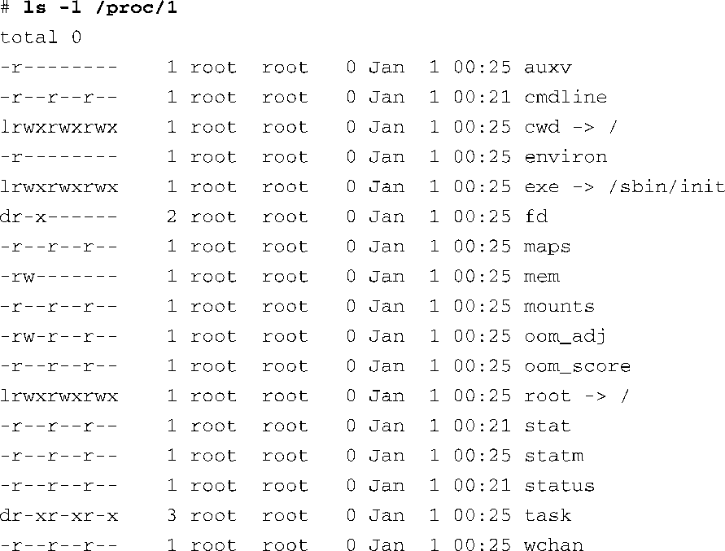
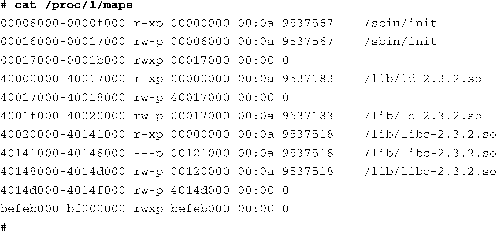

### 9.9.1　/proc文件系统

/proc文件系统的名称来源于它最初的设计目的：它是一个接口，内核通过它可以获取一个Linux系统上所有运行进程的信息。随着时间的推移，它也不断发展和壮大，可以提供更多方面的信息，而不仅限于进程。我们在这里介绍一下它的重要特性；而对/proc文件系统的全面研究则作为练习留给读者。

/proc文件系统已经成为几乎所有Linux系统（最简单的除外），甚至嵌入式Linux系统的必需品。很多用户空间的应用程序都依靠/proc文件系统中的内容来完成它们的工作。例如， `mount` 命令，如果在执行时不带任何参数，会列出系统中当前所有已挂载的文件系统的信息，而它是从/proc/mounts文件中获取这些信息的。如果不存在/proc文件系统， `mount` 命令直接返回，不输出任何信息。代码清单9-14中显示了在ADI Engineering公司的Coyote参考板上执行 `mount` 命令的情况，说明了它对/proc文件系统的依赖。

代码清单9-14　 `mount` 命令对/proc文件系统的依赖

注意，在代码清单9-14中，/proc自身也被列为一个已挂载的文件系统，类型为proc，挂载于/proc。这不是故弄玄虚；你的系统上必须有一个名为/proc的挂载点（目录），位于顶层目录中，作为/proc文件系统的挂载目的地<a class="my_markdown" href="['#anchor098']">[8]</a>。为了挂载/proc文件系统，你需要使用 `mount` 命令，和挂载其他文件系统类似：

<a class="my_markdown" href="['#ac098']">[8]</a>　当然，可以将/proc文件系统挂载到文件系统的任意位置上，但所有依赖proc文件系统的应用程序（包括 `mount` 命令）都期望它被挂载到/proc目录上。

从 `mount` 命令的帮助手册可以看到，这个命令的一般形式为：

在前面的 `mount` 命令行中，我们也可以将 `/proc` 替换成 `none` ，像下面这样：

这看起来就不太像是故弄玄虚了。 `mount` 命令中的 `something` 字段不是严格必需的，因为/proc是一个伪文件系统，而不是一个真实的设备。然而，在前面的例子中指定/proc可以给我们提个醒，我们是在将/proc文件系统挂载到/proc目录上（或者，更恰当地说是/proc挂载点）。

当然了，如果想获得/proc文件系统的功能，你必须在内核配置中使能它，现在，这也许是显而易见的了。这个内核配置选项可以在File Systems子菜单下面的Pseudo File Systems类别中找到。

内核中运行的每个用户进程都会由/proc文件系统中的一个对应条目代表。例如，我们在第6章中介绍过 `init` 进程，它的进程ID总是被分配为1。每个用户进程是由/proc文件系统中的一个目录所代表的，这个目录的名称就是进程的PID。例如， `init` 进程的PID为1，它是由/proc/1目录所代表的。代码清单9-15显示了我们的嵌入式Coyote参考板上的这个目录的内容。

代码清单9-15　 `init` 进程在/proc 文件系统中的对应条目

每个运行的进程在/proc文件系统中都有这些条目，它们包含了很多有用的信息，这对于分析和调试进程特别有用。例如， `cmdline` 条目中包含了用于启动这个进程的完整命令行，包括所有的参数。cwd和root目录分别指向进程的当前工作目录和当前根目录。

对于系统调试来说，还有一个更加有用的条目，那就是 `maps` 。它包含了一个列表，列出了分配给这个程序（进程）的每一段虚拟内存，以及相关属性。代码清单9-16显示了/proc/1/maps的内容，对应于我们的 `init` 进程。

代码清单9-16　 `init` 进程的内存段信息，来自/proc

这些信息的价值是显而易见的。从中你可以看到，开始的两个条目代表了 `init` 进程本身的程序段（program segment）<a class="my_markdown" href="['#anchor099']">[9]</a>。你还可以看到 `init` 进程使用的共享程序库中的对象所占用的内存段。每个条目的格式如下：

<a class="my_markdown" href="['#ac099']">[9]</a>　第1个条目是代码段，第2个条目是数据段。——译者注

在这里， `vmstart` 和 `vmend` 分别代表虚拟内存的起始地址和结束地址。 `attr` 表示这块内存区域的属性，比如可读、可写、可执行，以及这块区域是否是可共享的。 `pgoffset` 是这块区域的页面偏移量（这是一个内核虚拟内存参数）。 `devname` ，显示格式为xx:xx，是内核中与这块内存区域相关联的设备ID。如果一个内存区域没有和一个文件相关联，那么它也不会和一个设备相关联——这时显示为00:00。最后两项代表与此内存区域相关联的文件，分别是文件的inode号和文件名。当然了，如果一个内存段没有和一个文件相关联，inode字段的值是0。这种内存区域一般是数据段。

/proc文件系统中还列出了进程的其他有用信息。status条目（例如/proc/1/status）中包含了这个运行进程的状态信息，包括父进程ID（PID）、用户ID和组ID、虚拟内存的使用情况、信号和能力等。如果想获取更多详细信息，可以参考本章末尾列出的文献。

经常使用的/proc条目有 `cpuinfo` 、 `meminfo` 和 `version` 。 `cpuinfo` 条目中包含了系统中处理器的相关信息。 `meminfo` 条目提供了所有系统内存的统计信息。 `version` 条目包含了Linux内核版本字符串，以及构建内核所使用的编译器和机器的信息。

内核会生成很多有用的/proc条目，对于这个有用的子系统，我们只是接触了一点儿皮毛。已经有很多工具专门设计用于提取和汇报/proc文件系统中所包含的信息。两个流行的工具是top和ps，每个嵌入式Linux开发人员都应该非常熟悉它们。我们将在第13章中介绍这些工具。其他一些与/proc文件系统交互的实用程序还包括free、pkill、pmap和uptime。请参考procps软件包，以获取更多详细信息。

