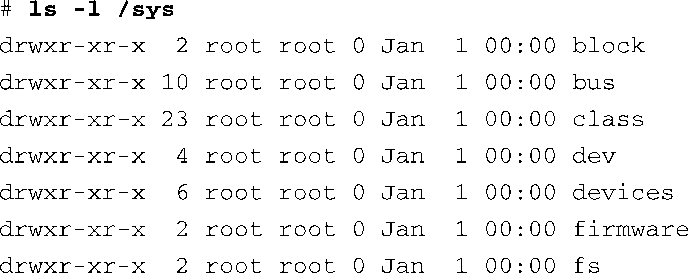
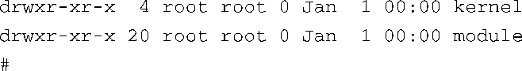
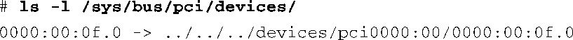
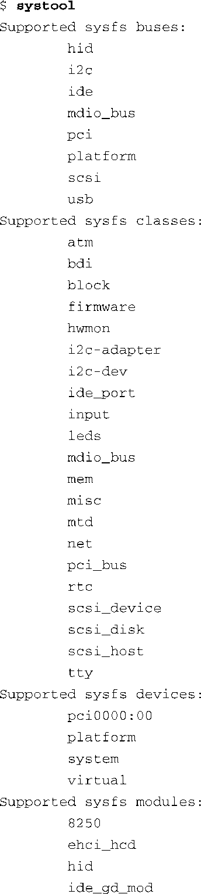
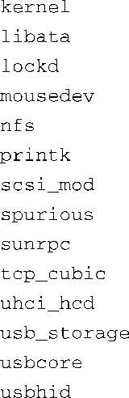

### 9.9.2　sysfs

和/proc文件系统一样，sysfs同样也不代表真实的物理设备。相反，sysfs是对具体的内核对象（比如物理设备）进行建模，并且提供一种将设备和设备驱动程序关联起来的方法。在典型的Linux发行版中，一些用户空间的代理程序依赖于sysfs所提供的信息。

我们可以直接看一下sysfs导出的目录结构，以了解它会导出哪些类型的内核对象。代码清单9-17显示了Coyote参考板上的顶层/sys目录的内容.

代码清单9-17　顶层 /sys 目录的内容

在顶层目录中，sysfs为几种系统元素（包括系统总线）分别提供了一个子目录。例如，在block子目录中，每个块设备都由一个子目录项所代表。顶层目录中的其他子目录的情况也是类似的。

sysfs存储的大部分信息都更适合由机器来读取，而不是由人来读取。例如，为了发现PCI总线上的设备，有可能会直接看一下/sys/bus/pci子目录中内容。在我们的Coyote参考板上，它只包含一个PCI设备（以太网卡），这个目录的内容看上去像是这样：

简洁起见，我们省去了输出的部分内容。这个条目实际上是一个符号链接，指向sysfs目录树的另一个节点。这个符号链接的名称就是PCI总线设备在内核中的表示，它指向一个名为pci0000:00（代表PCI总线）的设备子目录。这个子目录中包含了很多子目录和文件，它们代表了具体PCI设备的一些属性。可以看到，这里显示的数据很难发现和分析。

有一个有用的工具能够帮助你浏览sysfs文件系统的目录结构。它的名字叫systool，来自sysfsutils软件包，你可以在sourceforge.net网站上找到它。下面的例子说明了systool是怎样显示我们前面讨论的PCI总线的信息的。

我们再一次看到了总线和设备（0f）在内核中的表示，但这个工具还显示了厂商ID（8086，代表英特尔）和设备ID（1229，代表eepro 100以太网卡），这些信息是从/sys目录的子目录/sys/devices/pci0000:00中获取的，这个目录中存储了设备的相关属性。如果在执行时不带任何参数，systool会显示顶层系统层次结构。代码清单9-18显示了在我们的Coyote参考板上执行这条命令时的情况。

代码清单9-18　systool的输出

我们可以从这个代码清单中看到，从sysfs中可以获取很多系统信息。很多实用工具都使用了这些信息，以确定系统设备的特征或执行系统策略，比如电源管理和热插拔能力。

你可以从维基百科（http://en.wikipedia.org/wiki/Sysfs）中了解更多关于sysfs的信息。

