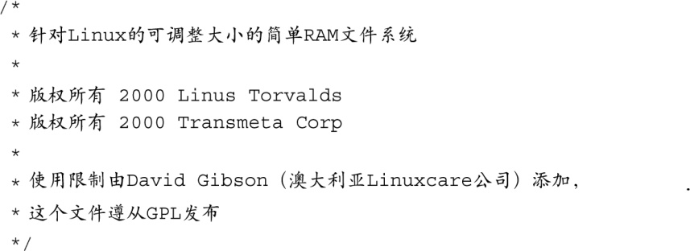

### 9.10　其他文件系统

Linux支持数量众多的文件系统。由于篇幅关系，我们不能在这里一一讲述。然而，你应该了解一些嵌入式系统中常用的重要文件系统。

了解ramfs文件系统的最佳方式是从实现它的源码文件<a class="my_markdown" href="['#anchor0910']">[10]</a>入手。代码清单9-19显示了文件的开始几行的内容。

代码清单9-19　Linux ramfs 源码模块中的注释

<a class="my_markdown" href="['#ac0910']">[10]</a>　这个文件具体是指.../fs/ramfs/inode.c。——译者注

从代码注释中可以看出，编写这个ramfs软件模块的主要目的是以它为例来说明如何编写一个虚拟文件系统。这个文件系统和主流Linux内核中的ramdisk之间的主要差别是：它能够根据其使用情况动态地增长和缩小。ramdisk没有这样的特性。这份代码很简洁，也很优秀。它的主要作用体现在它的教育价值上。如果你想更多地了解Linux文件系统，我们鼓励你研究一下这份代码。

tmpfs文件系统类似于ramfs，也与它有关系。和ramfs一样，tmpfs中的所有内容都是存储在内核的虚拟内存中的，断电或重启后，这些内容就丢失了。tmpfs文件系统对于快速临时文件存储很有用。使用tmpfs的一个很好的例子是将tmpfs挂载到/tmp目录上。对于那些会使用很多小的临时文件的应用程序来说，这可以提高它们的性能。这也是保持/tmp目录干净的极好的方法，因为每次重启后，它的内容就丢失了。挂载tmpfs和挂载其他任何一种虚拟文件系统类似：

和其他虚拟文件系统（比如/proc）一样， `mount` 命令中的 `/tmpfs` 参数是一个“空操作”。也就是说，如果将它替换为 `none` ，这条命令同样生效。然而，它可以很好地提醒你，你是在挂载一个名为tmpfs的虚拟文件系统。

