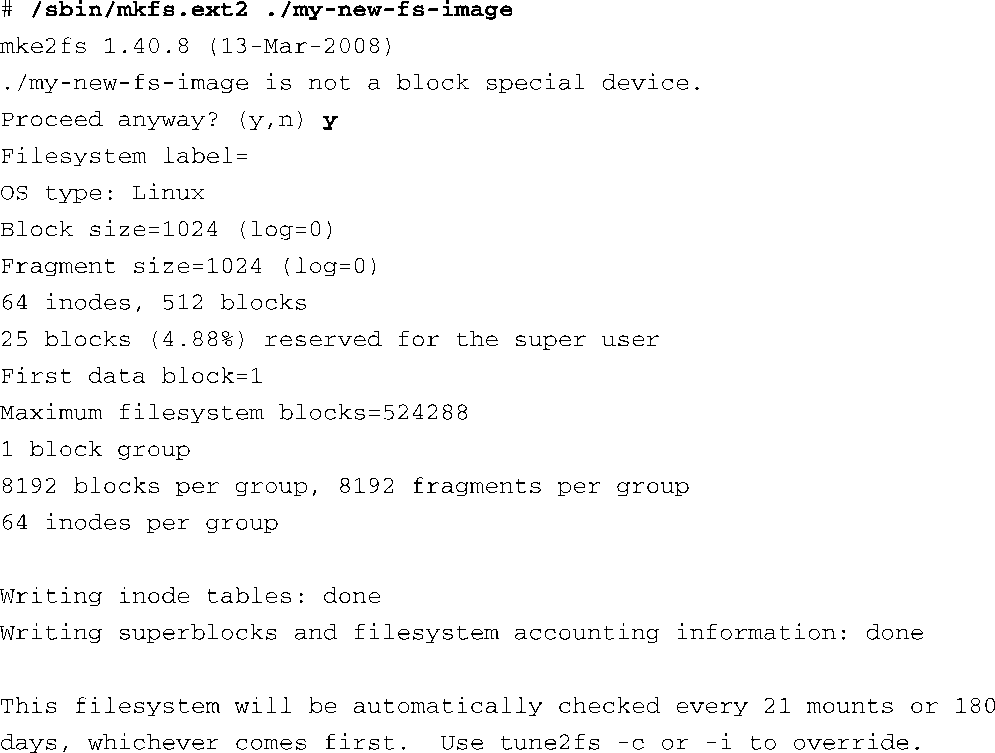

### 9.11　创建简单的文件系统

创建一个简单的文件系统镜像是很容易的。我们会在这里说明一下Linux内核的回环设备（loopback device）的使用。回环设备使我们能够将一个普通文件当作块设备使用。简而言之，我们先在一个普通文件中创建一个文件系统镜像，然后使用Linux的回环设备来挂载这个文件，就像是挂载一个块设备。

为了创建一个简单的根文件系统，我们首先创建一个内容为全0的、固定大小的文件：

这条命令会创建一个大小为512 KB的文件，内容为全0。我们将文件的内容填充为全0是为了对后面的文件压缩有所帮助，并且确保文件系统中所有未初始化的数据块都有一致的数据模式。使用 `dd` 命令的时候要小心。如果在执行 `dd` 命令时没有限制范围（ `count=` ）或者指定的范围不对，它会在你的硬盘驱动器中填满数据并有可能造成系统崩溃。 `dd` 是一个强大的工具；使用它时应当谨慎。如果你以root用户的身份执行类似 `dd` 这样的命令，命令行中的简单笔误会摧毁无数文件系统。

当我们创建好新的镜像文件后，我们需要对其进行格式化，以使其包含一个给定文件系统所定义的数据结构。在这个例子里，我们会创建一个ext2文件系统。代码清单9-20显示了格式化的详细过程。

代码清单9-20　创建一个ext2文件系统镜像

和 `dd` 一样， `mkfs.ext2` 命令也能摧毁你的系统，所以使用的时候要小心。在这个例子中，我们让 `mkfs.ext2` 格式化一个文件而不是一个硬盘驱动器的分区（块设备），而它原本也是这么设计的。因此， `mkfs.ext2` 在发现这个事实之后会询问我们是否继续这个操作。在得到确认之后， `mkfs.ext2` 接着将一个ext2超级块（superblock）和文件系统的数据结构写入这个文件中。然后，我们就可以使用Linux环回设备来挂载这个文件了，就像挂载其他块设备一样：

这条命令将文件my-new-fs-image看做是一个文件系统，并将它挂载到名为/mnt/flash的挂载点上。挂载点的名称并不重要；你可以将它挂载到任意位置，只要这个挂载点存在。你可以使用 `mkdir` 命令来创建挂载点。

当这个新创建的镜像文件被挂载为一个文件系统后，我们就可以随意改变其中的内容了。我们可以添加和删除目录、创建设备节点，等等。我们还可以使用 `tar` 命令将文件复制到里面，或从中复制出来。改动完成后，假设文件没有超出设备的大小，它们会被保存到文件中。请记住，使用这种方法时，文件系统的大小在创建的时候就确定了而且不能改变。

