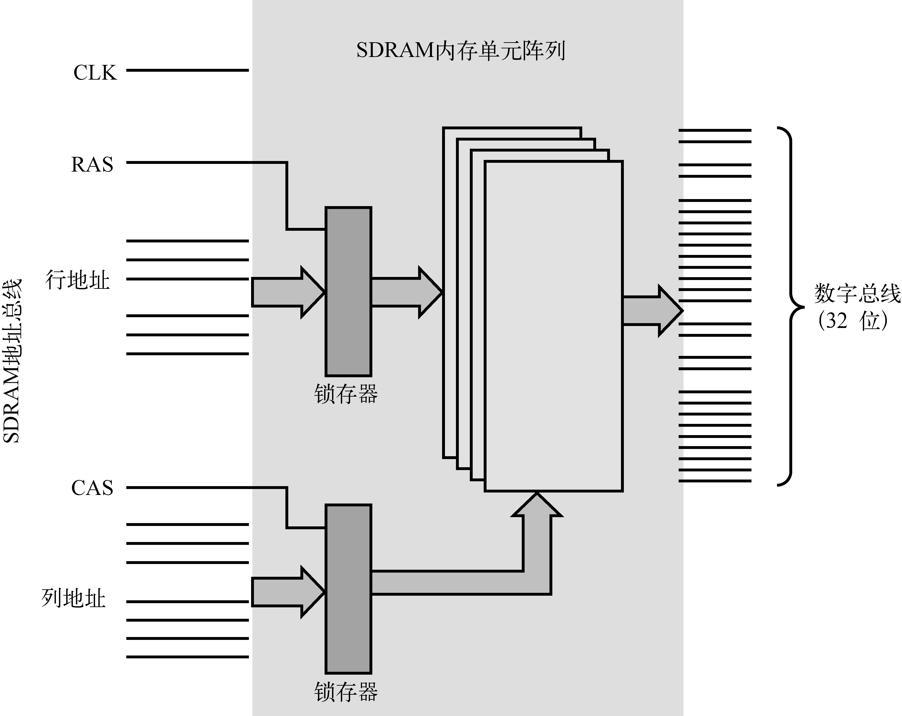
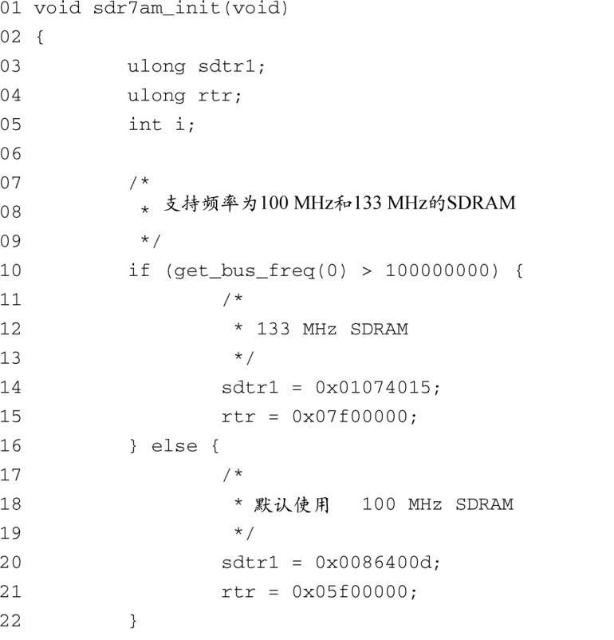
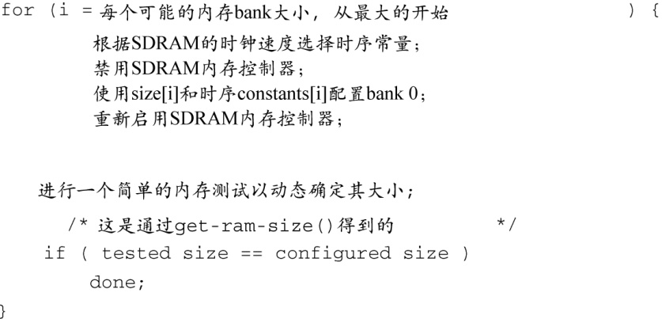
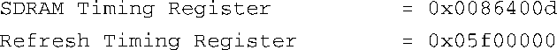

### 附录C　SDRAM接口注意事项

**附录内容**

+ SDRAM基础
+ 时钟
+ SDRAM设置
+ 小结

初看起来，对SDRAM控制器进行编程似乎很难。的确，为了满足用户对内存性能和密度的无尽需求，大量SDRAM（同步动态随机访问存储器）技术已经让人眼花缭乱了，而这同时也催生了各种各样的架构和操作模式。

我们将以AMCC PowerPC 405GP处理器为例，讨论SDRAM接口方面的注意事项。在探讨有关SDRAM接口的问题时，SDRAM芯片的用户手册也许会对你很有帮助。本附录的最后一节引用了一些芯片资料。

## C.1　SDRAM基础

要理解SDRAM的设置，必须首先理解SDRAM设备的基本工作原理。不用考虑具体的硬件设计细节，我们只需要知道SDRAM设备的组织形式是一个存储单元阵列，地址中有几个比特是行地址，另有几个比特是列地址，如图C-1所示。

<b class="my_markdown">图C-1　简化的SDRAM框图</b>

内存阵列内部的电路结构相当复杂。简单来说，内存的读操作过程是这样的：先在行地址线上放置行地址，接着在列地址线上放置列地址，这样就确定了内存单元的位置。经过一段时间之后，该内存位置中存储的数据就会出现在数据总线上，可供处理器使用。

处理器先在SDRAM的地址总线上输出行地址并发出行地址选择（RAS）信号。经过一段预定义的延时之后，SDRAM电路获得了行地址，处理器再输出列地址并发出列地址选择（CAS）信号。SDRAM控制器负责将实际的物理地址转换成行地址和列地址。很多SDRAM控制器的行宽度和列宽度都是可配置的，PPC 405GP也不例外。后面你会看到在设置SDRAM控制器时必须配置该项。

虽然这是个经过高度简化的例子，但概念是一样的。例如，突发读（burst read）操作可以一次读取4个内存位置但只输出单个RAS和CAS周期。SDRAM内部的电路会自动增加后面3个读操作的列地址，这样就避免了处理器发出4次独立的CAS周期。这只是性能优化的一个例子。理解这些操作的最佳途径是仔细研究一块真实的内存芯片。本附录的最后一节引用了一篇写得很好的数据手册。

### SDRAM刷新

SDRAM中的每个存储单元是由一个晶体管和一个电容组成的。晶体管负责提供电荷，而电容的任务则是保持（存储）内存单元的值。但是，电容中的值只能保持一段很短的时间，所以必须周期性地对电容进行充电从而维持其中的值。这是动态内存的一个重要概念，被称为SDRAM刷新。

刷新周期是一种特殊的内存周期。它不会对内存进行读写，只是执行必要的刷新周期。SDRAM控制器的一个首要任务就是保证及时地产生刷新周期，从而满足芯片的需求。

芯片厂商会指定芯片的最短刷新间隔，设计人员的职责是满足这个最低要求。通常，可以通过直接配置SDRAM控制器来选择刷新间隔。你一会就会了解到PowerPC 405GP中有一个专门用于此目的的寄存器。

## C.2　时钟

“同步”一词的含义是SDRAM设备的读写周期和来自CPU的时钟信号步调一致。单数据速率（SDR）SDRAM在每个SDRAM时钟周期内读写一次。双数据速率（DDR）SDRAM在每个时钟周期内读写两次——一次在时钟的上升沿，另一次在时钟的下降沿。

现代处理器中的时钟子系统很复杂。很多处理器内部都存在多个时钟速率，分别用于系统的不同部分。常见处理器使用一个较低频率的由晶振产生的外部时钟源作为其主时钟信号。处理器内部的锁相环（PLL）负责生成CPU的主时钟（这就是我们在比较CPU速度时所说的时钟速率）。因为CPU的运行速度要比内存子系统快很多，所以处理器会生成一个CPU主时钟的分频信号提供给SDRAM子系统。需要根据具体的CPU和SDRAM组合来配置这个时钟比率。

要想SDRAM能够正常工作，必须正确配置处理器和内存子系统的时钟。处理器的用户手册中会有专门的章节讲解时钟的设置和管理。在设计板卡时你应该仔细阅读相关内容，从而正确地设置它们。

AMCC 405GP是一款典型的处理器。它以单个晶振作为输入时钟源，并由此生成几个内部和外部时钟，以满足各个子系统的需要。它生成了CPU、PCI接口，板上外设总线（OPB），处理器本地总线（PLB）和内存的时钟，以及几个外设（比如定时器和UART）的内部时钟。表C-1显示了一个典型的时钟配置。

<b class="my_markdown">表C-1　示例的时钟配置</b>

| 时钟 | 速率 | 注释 |
| :-----  | :-----  | :-----  | :-----  | :-----  |
| 晶振参考时钟 | 33 MHz | 提供给处理器的基本参考时钟 |
| CPU时钟 | 133 MHz | 由处理器内部的PLL生成。受硬件引脚连接情况和寄存器设置的控制 |
| PLB时钟 | 66 MHz | 从CPU时钟衍生而来，可以通过连接硬件引脚和设置寄存器对它进行配置。用于内部处理器本地总线上高速模块之间的数据交互 |
| OPB时钟 | 66 MHz | 从PLB时钟衍生而来，可以通过设置寄存器对它进行配置。用于不需要高速连接的外设之间的内部连接 |
| PCI时钟 | 33 MHz | 由PLB时钟衍生而来，可以通过设置寄存器对它进行配置 |
| 内存时钟 | 100 MHz | 直接驱动SDRAM芯片。由CPU时钟衍生而来，可以通过设置寄存器对它进行配置 |

有关时钟设置的决定一般是在硬件设计时作出的。硬件引脚的连接情况决定了处理器在加电时的初始时钟配置。处理器内部有一些专门用于控制时钟子系统的寄存器，通过设置这些寄存器可以调整分频系数，从而控制生成的时钟频率。在这里基于405GP的例子中，最终的时钟配置是由硬件引脚的连接情况和固件配置共同决定的。系统加电之后，引导加载程序负责设置初始的分频系数以及其他由寄存器配置的时钟选项。

## C.3　SDRAM设置

配置了时钟之后，下一步工作是配置SDRAM控制器。不同处理器中的控制器差别很大，但要达到的最终结果是一样的：必须提供正确的时钟和时序值，从而使SDRAM子系统能够正常和高效地工作。

和本书中的其他内容一样，必须详细了解硬件细节才能对其进行配置，对于SDRAM来说尤其如此。有关SDRAM设计的探讨超出了本附录的范围，但你需要了解一些基础知识。很多SDRAM设备厂商的数据手册中都包含了有用的技术说明。我们建议你花时间熟悉一下其中的内容。要想正确配置SDRAM子系统，你不需要拥有硬件工程师学位，但需要对它们有一定程度的了解。

下面我们看一下U-Boot引导加载程序是如何配置405GP处理器中的SDRAM控制器的。回顾一下7.4.5节， U-Boot在汇编语言启动代码中提供了一个“钩子”用于SDRAM的初始化，具体的汇编源文件是4xx系列CPU目录中的start.S。代码清单C-1显示了U-Boot源码文件.../cpu/ppc4xx/sdram.c中的 `sdram_init()` 函数。

代码清单C-1　U-Boot中针对ppc4xx的 `sdram_init()` 函数

第一步动作是读取405GP处理器的硬件引脚的值，从而确定SDRAM时钟的设计值。这里，我们看到有两种时钟频率可供选择——100 MHz和133 MHz。程序根据时钟频率选择对应的常量，而这些常量将会在后面传入函数用于设置SDRAM控制器中的寄存器。

从第24行开始是一个 `for` 循环，用于设置5个预定义内存大小的相关参数。目前，U-Boot支持的内存bank大小为4 MB、16 MB、32 MB、64 MB或128 MB。这些数值是在数组mb0cf（定义于.../cpu/ppc4xx/sdram.c）中定义的。这个数组的每个成员将一个常量和内存大小相关联，这个常量则用于设置405GP的内存bank配置寄存器。在每个循环中：

这段简单的代码根据SDRAM的时钟速率和U-Boot中预定义的内存bank大小在SDRAM控制器中设置了正确的时序常量。通过这里的解释，你可以很容易地理解405GP参考手册中的内存bank配置值。对于64 MB大小的DRAM，内存bank控制器的设置如下：

PowerPC 405GP的用户手册描述了内存bank 0控制寄存器中各个字段的含义，如表C-2所示。

<b class="my_markdown">表C-2　405GP内存bank 0-3配置寄存器字段</b>

| 字段 | 值 | 注释 |
| :-----  | :-----  | :-----  | :-----  | :-----  |
| bank地址（BA） | 0x00 | bank的起始内存地址 |
| 大小（SZ） | 0x4 | 内存bank的大小——这里是64 MB |
| 寻址模式（AM） | 0x2 | 决定内存的组织形式，包括行地址和列地址的位数。这里，Mode 2表示行地址的位数是12，列地址的位数是9或10，最多有4个内部SDRAM bank。这些数据是由405 GP的用户手册提供的 |
| Bank使能（BE） | 0x1 | bank的使能位。405GP有4个这样的内存bank配置寄存器 |

设计人员必须根据板卡上具体使用的内存模块来确定这个表中的数值。

让我们看一个时序的例子，以了解典型的SDRAM控制器对时序的具体要求。假设SDRAM的时钟速率是100 MHz，内存大小是64 MB，代码清单C-1中的 `sdram_init()` 函数会选择以下时序常量：

PowerPC 405GP的用户手册描述了SDRAM时序寄存器的各个字段，如表C-3所示。

<b class="my_markdown">表C-3　405GP SDRAM时序寄存器的字段</b>

| 字段 | 数值 | 注释 |
| :-----  | :-----  | :-----  | :-----  | :-----  |
| CAS延时（CASL） | 0x1 | SDRAM CAS延时。这个值直接来源于SDRAM芯片的规范。它代表从处理器发出read命令（CAS信号）开始到数据出现在数据总线上为止所经历的时间，以时钟周期为单位。这里的0x1代表两个时钟周期，参见405GP的用户手册 |
| 预充电命令到下一次激活（PTA） | 0x1 | SDRAM的预充电命令使某个行无效。相反，激活命令使某个行有效，从而允许后续的访问，比如在一个突发周期中。这个时序参数规定了预充电和激活之间的最小时间间隔，这是由SDRAM芯片决定的。正确的数值必须来自SDRAM芯片的规范。这里的0x1代表两个时钟周期，参见405GP的用户手册 |
| 读/写命令到预充电命令的最小值（CTP） | 0x2 | 这个时序参数规定了SDRAM读或写命令和下一个预充电命令之间的最小时间间隔。正确的数值必须来自SDRAM芯片的规范。这里的0x2代表3个时钟周期，参见405GP的用户手册 |
| SDRAM初始命令（Leadoff） | 0x1 | 这个时序参数规定了地址或命令周期和bank选择周期之间的最小时间间隔。正确的数值必须来自SDRAM芯片的规范。这里的0x1代表两个时钟周期，参见405GP的用户手册 |

在代码清单C-1中，U-Boot代码配置的最后一个时序参数是刷新时序寄存器的值。这个寄存器中的一个字段决定了SDRAM控制器的刷新间隔。这个代表刷新间隔的字段会被看做是一个以SDRAM时钟频率运行的计数器。在这个例子中，我们假设SDRAM的时钟频率是100 MHz，这个寄存器的值被设置为0x05f0_0000。根据PowerPC 405GP的用户手册，可以确定每隔15.2微秒会产生一次刷新请求。和其他时序参数一样，这个值是由SDRAM芯片的规范规定的。

典型的SDRAM芯片中的每一行都需要一个刷新周期，它必须在生产商规定的最短时间内被刷新一次。在本附录最后一节中引用的芯片手册中，生产商规定必须每64毫秒刷新完毕8192行。这就需要每隔7.8微秒生成一个刷新周期，以满足这个特定设备的需求。

## C.4　小结

SDRAM设备十分复杂。本附录列举了一个简单的例子，旨在帮助你了解SDRAM控制器的相关设置。SDRAM控制器的功能至关重要，因此设置必须适当。为此，唯一的方法就是深入了解规范，并掌握其中的信息。本附录引用的两篇示例文档都是很好的入手点。

### 补充阅读建议

“AMCC 405GP 嵌入式处理器用户手册”，AMCC 公司。

<a class="my_markdown" href="['http://www.amcc.com/Embedded/']">www.amcc.com/Embedded/</a>

“同步DRAM MT48LC64M4A2 数据手册”，Micron Technology公司。

http://download.micron.com/pdf/datasheets/dram/sdram/256MSDRAM.pdf

