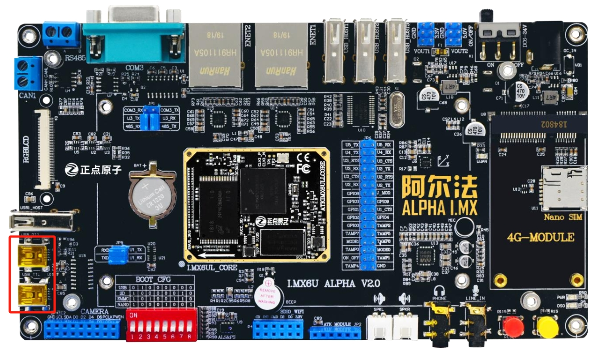
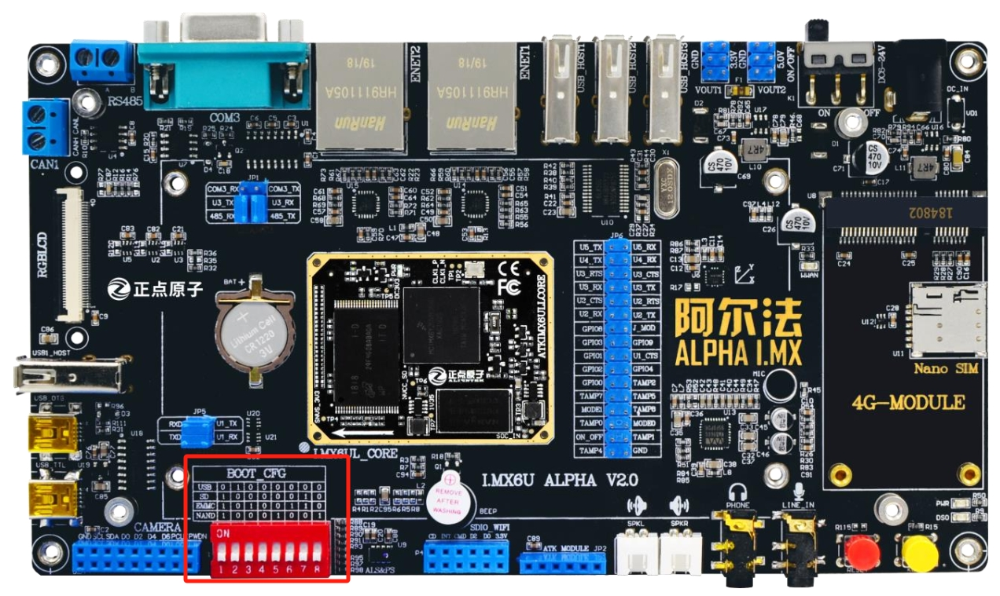
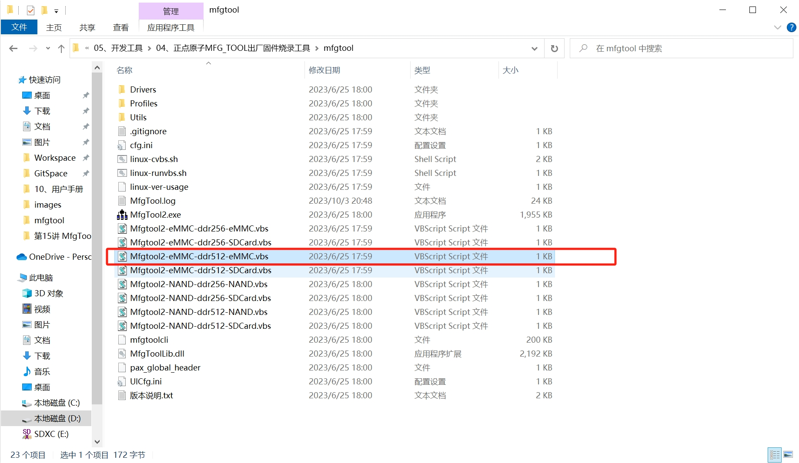
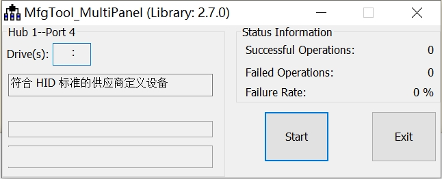
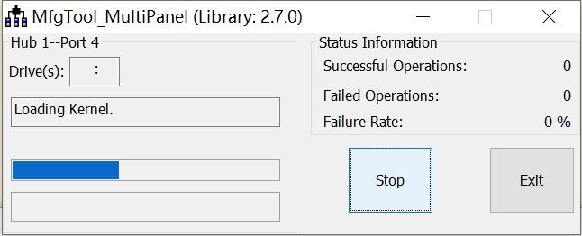
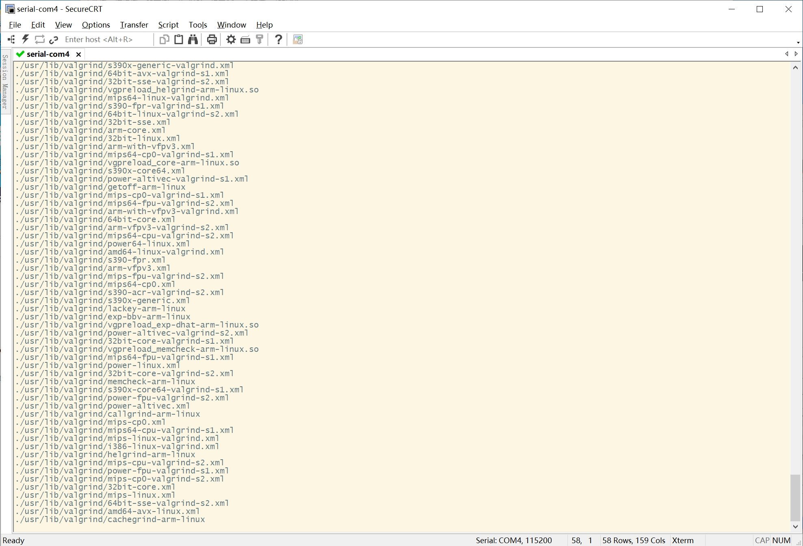
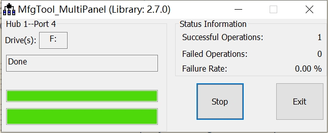

[toc]

> 提示：`MfgTool` 烧录工具地址：[正点原子\【正点原子】阿尔法Linux开发板（A盘）-基础资料\【正点原子】阿尔法Linux开发板（A盘）-基础资料\【正点原子】阿尔法Linux开发板（A盘）-基础资料\05、开发工具]()

#### 1. 将设备连接到电脑

1. 关闭设备。

2. 将两个 `USB` 线分别连接到设备上的 `USB TTL` 和 `USB OTG` 接口上。

   

3. 将 `BOOT_CFG` 开关按照 `USB` 连接提示标记打开或关闭开关。相关开关标记如下：

   <table>
       <tr>
           <th colspan="9" align="center">Boot_CFG</th>
       </tr>
       <tr>
       	<td>USB</td>
           <td>0</td>
           <td>1</td>
           <td>0</td>
           <td>0</td>
           <td>0</td>
           <td>0</td>
           <td>0</td>
           <td>0</td>
       </tr>
       <tr>
       	<td>SD</td>
           <td>1</td>
           <td>0</td>
           <td>0</td>
           <td>0</td>
           <td>0</td>
           <td>0</td>
           <td>1</td>
           <td>0</td>
       </tr>
       <tr>
       	<td>EMMC</td>
           <td>1</td>
           <td>0</td>
           <td>1</td>
           <td>0</td>
           <td>0</td>
           <td>1</td>
           <td>1</td>
           <td>0</td>
       </tr>
       <tr>
       	<td>NAND</td>
           <td>1</td>
           <td>0</td>
           <td>0</td>
           <td>0</td>
           <td>1</td>
           <td>0</td>
           <td>0</td>
           <td>1</td>
       </tr>
   </table>

   

4. 打开设备。

#### 2. 烧录镜像

1. 根据设备硬件信息启动对应的 `MfgTool` 软件，我买的开发版是 `512 MB EMMC` 的主板，因此可以通过 [正点原子\【正点原子】阿尔法Linux开发板（A盘）-基础资料\【正点原子】阿尔法Linux开发板（A盘）-基础资料\【正点原子】阿尔法Linux开发板（A盘）-基础资料\05、开发工具\04、正点原子MFG_TOOL出厂固件烧录工具\mfgtool\Mfgtool2-eMMC-ddr512-eMMC.vbs]()，双击该脚本文件即可启动 `MfgTool` 应用。

   

2. 启动 `MfgTool` 应用后，`MfgTool` 检测到设备后显示如下：

   

   如果未显示 `符合 HID 标准的供应商定义设备` ，则重新检测步骤 1。

3. 单击 `Start` 按钮开始烧录镜像。

   

   这时可以通过串口查看烧录日志：

   

   烧录时间根据镜像大小而定，大约需要几分钟的时间。

4. 烧录成功后显示效果如下：

   

5. 点击 `Stop` 按钮，然后再点击 `Exit` 按钮退出 `MsgTool` 应用。

#### 3. 重启设备

1. 关闭设备。

2. 将设备 `BOOT_CFG` 开关组拨至 `EMMC` 提示的卡关组合。

   <table>
       <tr>
           <th colspan="9" align="center">Boot_CFG</th>
       </tr>
       <tr>
       	<td>USB</td>
           <td>0</td>
           <td>1</td>
           <td>0</td>
           <td>0</td>
           <td>0</td>
           <td>0</td>
           <td>0</td>
           <td>0</td>
       </tr>
       <tr>
       	<td>SD</td>
           <td>1</td>
           <td>0</td>
           <td>0</td>
           <td>0</td>
           <td>0</td>
           <td>0</td>
           <td>1</td>
           <td>0</td>
       </tr>
       <tr>
       	<td>EMMC</td>
           <td>1</td>
           <td>0</td>
           <td>1</td>
           <td>0</td>
           <td>0</td>
           <td>1</td>
           <td>1</td>
           <td>0</td>
       </tr>
       <tr>
       	<td>NAND</td>
           <td>1</td>
           <td>0</td>
           <td>0</td>
           <td>0</td>
           <td>1</td>
           <td>0</td>
           <td>0</td>
           <td>1</td>
       </tr>
   </table>

3. 重新打开设备。