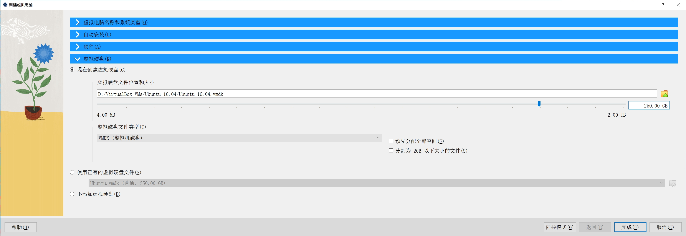

[toc]

##### 1. 下载 Ubuntu 16.04.7 系统镜像

下载地址：<http://releases.ubuntu.com/16.04/ubuntu-16.04.7-desktop-amd64.iso>

##### 2. 下载 Oracle VM VirtualBox 虚拟机软件

下载地址：<https://download.virtualbox.org/virtualbox/7.0.10/VirtualBox-7.0.10-158379-Win.exe>

##### 3. 下载 Oracle VM VirtualBox 虚拟机扩展插件

下载地址：<https://download.virtualbox.org/virtualbox/7.0.10/Oracle_VM_VirtualBox_Extension_Pack-7.0.10.vbox-extpack>

##### 4. 安装 Oracle VM VirtualBox 虚拟机

##### 5. 安装 Oracle VM VirtualBox 虚拟机扩展插件

双击第 3 步下载的 Oracle VM VirtualBox 虚拟机扩展插件文件，例如 [Oracle_VM_VirtualBox_Extension_Pack-7.0.10.vbox-extpack]() ，按照提示安装插件即可。

##### 6. 在虚拟机中安装 Ubuntu 16.04.7 系统

1. 打开 `Oracle VM VirtualBox` 软件。

2. 点击主界面上的 `新建` 按钮。

3. 在 `新建虚拟电脑` 对话框中输入如下信息：

   + 在 `虚拟电脑名称和系统类型`展开项的 `名称`中输入虚拟电脑名称；在 `文件夹` 中选择虚拟电脑的存储位置；在 `类型` 中选择 `Linux`；在 `版本` 中选择 `Ubuntu（64-bit）`。注意，不要在 `虚拟光盘` 中设置 `Ubuntu` 系统镜像文件。

     

   + `自动安装` 展开项保持默认即可。

     

   + 在 `硬件` 展开项的 `内存大小` 项中拖动滑块或在右边输入框中输入分配给虚拟机的内存大小，在这里我设置为 4096 MB（4GB）；在 `处理器` 选项中设置分配给虚拟机的 `CPU` 个数，在这里我设置为 4 个 `CPU`。

     

   + 在 `虚拟硬盘` 展开项中的 `虚拟硬盘文件位置和大小` 项设置分配给虚拟机的硬盘大小为 250 GB；在 `虚拟磁盘文件类型` 中选择 `VMDK（虚拟机磁盘）`，其他保持默认。

     

   + 单击 `新建虚拟电脑` 对话框中的 `完成` 按钮，完成虚拟机配置。

4. 在 `Oracle VM VirtualBox` 主界面中选中刚才创建的 `Ubuntu 16.04` 虚拟机，然后点击 `设置` 按钮。

   

5. 在 `Ubuntu 16.04 - 设置` 对话框中进行如下设置：

   + 在 `常规` 设置项中切换至 `高级` 选项卡，将 `共享粘贴板` 设置为 `双向`。

     

   + 在 `显示` 设置项中切换至 `屏幕` 选项卡，将显存大小设置为最大。

     

   + 在 `存储` 设置项中选中 `控制器：IDE` 下面的 `没有盘片` 项，然后点击右边的磁盘图标按钮，在弹出的下拉菜单中选中 `选择虚拟盘...` 菜单，在弹出的 `请选择一个虚拟光盘文件` 对话框中选择 `Ubuntu` 系统镜像文件，例如 `ubuntu-16.04.7-desktop-amd64.iso`，最后点击 `打开` 按钮即可。

     

   + 在 `USB 设备` 设置项中选择  `USB 3.0（xHCI）控制器`。

     

   + 最后单击 `确定` 按钮完成配置。

6. 在 `Oracle VM VirtualBox` 主界面中选中刚才创建的 `Ubuntu 16.04` 虚拟机，然后点击 `启动` 按钮，开始运行虚拟机。

##### 7. 在虚拟电脑中安装增强功能

1. 启动虚拟电脑。

2. 在 `Oracle VM VirtualBox` 菜单中选择 `设备` -> `安装增强功能...` 菜单。

   

3. 在弹出的对话框中点击 `运行` 按钮即可。

4. 安装完成后按下任意按键退出安装窗口，然后重启电脑。

##### 8. 调整虚拟电脑的屏幕尺寸

1. 启动虚拟电脑。

2. 勾选 `Orcale VM VirtualBox` 中的 `视图` -> `自动调整显示尺寸` 菜单，设置完成后，通过调整 `Orcale VM VirtualBox` 窗口尺寸，虚拟电脑的屏幕尺寸也会跟着变换。

   > 注意：在进行这一操作前，必须先完成 `7. 在虚拟电脑中安装增强功能` 步骤中的操作。

##### 9. 添加共享文件夹

1. 如果虚拟电脑正在运行，需要关闭虚拟电脑。

2. 打开 `Oracle VM VirtualBox` 应用，选择要设置的虚拟电脑，再点击右边的 `设置` 按钮。

3. 在 `设置` 对话框中，选择 `共享文件夹` 设置项，点击右边的 `文件夹加号` 图标。

   

4. 在弹出的 `添加共享文件夹` 对话框中的 `共享文件夹路径` 项，选择要共享的文件夹路径；在 `共享文件夹名称` 中输入文件夹名称；在挂载点钟输入虚拟电脑的挂载点；勾选 `自动挂载` 选项，最后点击 `确定` 按钮关闭对话框。

   

5. 在 `设置` 对话框中点击 `确定` 按钮完成设置。

6. 在 `Oracle VM VirtualBox` 界面中选择刚才的虚拟电脑，然后点击 `启动` 按钮，启动虚拟电脑。

7. 在 `Ubuntu` 系统中，打开 `文件` 应用，可以看到左侧文件列表中已经有我们刚才添加的共享文件夹挂载点了。这时点击该挂载点，系统将会弹出 `无法显示这一位置` 的对话框，这是因为系统当前账户没有访问该挂载点的权限造成的。

   

8. 在 `Ubuntu` 系统中按下 <kbd>Ctrl</kbd> + <kbd>Alt</kbd> + <kbd>T</kbd> 快捷键打开 `终端` 应用。

9. 在终端中执行 `ls -l /media` 命令：

   ```shell
   xiaotuan@xiaotuan:~$ ls -l /media
   总用量 4
   drwxrwx---  1 root vboxsf    0 10月  3 10:34 E
   drwxr-x---+ 3 root root   4096 10月  3 10:40 xiaotuan
   xiaotuan@xiaotuan:~$ 
   ```

   可以看到挂载点 `E` 属于 `vboxsf` 用户组的，而当前用户 `xiaotuan` 不属于 `vboxsf` 用户组，因此需要将 `xiaotuan` 添加到 `vboxsf` 用户组中。

10. 执行下面命令将 `xiaotuan` 用户添加到 `vboxsf` 用户组中。

    ```shell
    xiaotuan@xiaotuan:~$ sudo adduser xiaotuan vboxsf
    [sudo] xiaotuan 的密码： 
    正在添加用户"xiaotuan"到"vboxsf"组...
    正在将用户“xiaotuan”加入到“vboxsf”组中
    完成。
    xiaotuan@xiaotuan:~$ 
    ```

11. 重启虚拟电脑。

##### 10. 设置虚拟电脑屏幕不休眠

1. 打开 `Ubuntu` 系统中的 `设置` 应用，在个人项中找到 `亮度和锁屏` 设置项，然后点击 `亮度和锁屏` 按钮，打开 `亮度和锁屏` 设置界面。

   

2. 在 `亮度和锁屏` 设置界面中，设置 `在此时间内无操作则关闭屏幕` 为 `从不`；关闭 `锁屏` 开关。

   

##### 11. 固定 IP 地址

1. 在本地电脑中按下 <kbd>Win</kbd> + <kbd>R</kbd> 快捷键，打开运行对话框，在输入框中输入 `cmd` ，然后点击 `确定` 按钮打开 `Windows 命令提示符` 程序。

2. 在 `命令提示符` 界面中输入 `ipconfig` 命令：

   ```shell
   C:\Users\xiaotuan>ipconfig
   
   Windows IP 配置
   
   
   以太网适配器 以太网:
   
      媒体状态  . . . . . . . . . . . . : 媒体已断开连接
      连接特定的 DNS 后缀 . . . . . . . :
   
   以太网适配器 以太网 2:
   
      连接特定的 DNS 后缀 . . . . . . . :
      本地链接 IPv6 地址. . . . . . . . : fe80::3c26:caf7:22c:b3e%10
      IPv4 地址 . . . . . . . . . . . . : 192.168.56.1
      子网掩码  . . . . . . . . . . . . : 255.255.255.0
      默认网关. . . . . . . . . . . . . :
   
   无线局域网适配器 本地连接* 1:
   
      媒体状态  . . . . . . . . . . . . : 媒体已断开连接
      连接特定的 DNS 后缀 . . . . . . . :
   
   无线局域网适配器 本地连接* 2:
   
      媒体状态  . . . . . . . . . . . . : 媒体已断开连接
      连接特定的 DNS 后缀 . . . . . . . :
   
   无线局域网适配器 WLAN:
   
      连接特定的 DNS 后缀 . . . . . . . :
      IPv6 地址 . . . . . . . . . . . . : 240e:3b7:3221:d70:2899:822c:43f3:44e6
      临时 IPv6 地址. . . . . . . . . . : 240e:3b7:3221:d70:31ff:cb63:ca84:7ab6
      本地链接 IPv6 地址. . . . . . . . : fe80::e3d:f1aa:75a4:a250%11
      IPv4 地址 . . . . . . . . . . . . : 192.168.1.6
      子网掩码  . . . . . . . . . . . . : 255.255.255.0
      默认网关. . . . . . . . . . . . . : fe80::1%11
                                          192.168.1.1
   
   以太网适配器 蓝牙网络连接:
   
      媒体状态  . . . . . . . . . . . . : 媒体已断开连接
      连接特定的 DNS 后缀 . . . . . . . :
   
   ```

   在上面的命令输出中找到 `IPV4` 地址，比如：192.168.56.1。

3. 打开 `Ubuntu` 虚拟电脑中的 `设置` 应用，在 `设置` 界面中点击`网络` 按钮。

   

4. 在弹出的 `网络` 对话框中，点击右下角的 `选项(O)...` 按钮。

   

5. 在弹出的对话框中，切换至 `IPv4 设置` 选项卡，在方法下拉框中选择 `手动`，再点击`添加` 按钮，输入与本地电脑同一网段的 `IP` 地址，例如 `192.168.56.236`。设置好后点击 `保存` 按钮关闭对话框。

   

6. 在 `网络` 设置界面中关闭网络再打开，使其生效。

7. 如果上述设置后虚拟电脑无法上网，可以进行如下操作：

   +  右击虚拟机下方的网络连接图标，在弹出的菜单中选择 `网络...` 菜单。

   + 在弹出的对话框中切换到当前虚拟电脑正在使用的网卡，比如 `网卡 1`。在 `连接方式` 的下拉框中选择 `桥接网卡`；在 `名称` 中选择本地电脑当前正在使用的网卡；最后单击 `确定` 按钮。

     

   + 最后在虚拟电脑中关闭网络连接后再打开即可。

##### 12. 设置软件来源

1. 在 `Ubuntu` 设置中点击 `软件和更新` 选项。

2. 在弹出的对话框中切换至 `Ubuntu 软件` 选项卡，在 `下载自` 下拉框中选择 `中国 的服务器`。

   

##### 13. 安装 gnome 经典桌面

1. 在 `Ubuntu` 系统中按下 <kbd>Ctrl</kbd> + <kbd>Alt</kbd> + <kbd>T</kbd> 快捷键打开 `终端` 应用，在终端中输入如下命令：

   ```shell
   xiaotuan@xiaotuan:~$ sudo apt-get install gnome-session-flashback
   [sudo] xiaotuan 的密码： 
   正在读取软件包列表... 完成
   正在分析软件包的依赖关系树       
   正在读取状态信息... 完成       
   将会同时安装下列软件：
     alacarte gir1.2-gmenu-3.0 gir1.2-panelapplet-5.0 gnome-applets
     gnome-applets-data gnome-flashback gnome-flashback-common gnome-panel
     gnome-panel-data indicator-applet-complete libcpufreq0 libgdm1
     libpanel-applet0 metacity python-gi
   建议安装：
     tomboy evolution-common desktop-base gnome-control-center python-gi-cairo
   推荐安装：
     gnome-media
   下列【新】软件包将被安装：
     alacarte gir1.2-gmenu-3.0 gir1.2-panelapplet-5.0 gnome-applets
     gnome-applets-data gnome-flashback gnome-flashback-common gnome-panel
     gnome-panel-data gnome-session-flashback indicator-applet-complete
     libcpufreq0 libgdm1 libpanel-applet0 metacity python-gi
   升级了 0 个软件包，新安装了 16 个软件包，要卸载 0 个软件包，有 41 个软件包未被升级。
   需要下载 8,493 kB 的归档。
   解压缩后会消耗 37.5 MB 的额外空间。
   您希望继续执行吗？ [Y/n] Y
   获取:1 http://mirrors.tuna.tsinghua.edu.cn/ubuntu xenial/main amd64 python-gi amd64 3.20.0-0ubuntu1 [194 kB]
   获取:2 http://mirrors.tuna.tsinghua.edu.cn/ubuntu xenial-updates/main amd64 gir1.2-gmenu-3.0 amd64 3.13.3-6ubuntu3.1 [3,726 B]
   获取:3 http://mirrors.tuna.tsinghua.edu.cn/ubuntu xenial/universe amd64 alacarte all 3.11.91-2 [83.6 kB]
   获取:4 http://mirrors.tuna.tsinghua.edu.cn/ubuntu xenial-updates/universe amd64 libpanel-applet0 amd64 1:3.18.3-0ubuntu0.1 [25.0 kB]
   获取:5 http://mirrors.tuna.tsinghua.edu.cn/ubuntu xenial-updates/universe amd64 gir1.2-panelapplet-5.0 amd64 1:3.18.3-0ubuntu0.1 [4,422 B]
   获取:6 http://mirrors.tuna.tsinghua.edu.cn/ubuntu xenial/universe amd64 libcpufreq0 amd64 008-1 [13.7 kB]
   获取:7 http://mirrors.tuna.tsinghua.edu.cn/ubuntu xenial/universe amd64 gnome-applets-data all 3.18.2-1 [6,042 kB]
   获取:8 http://mirrors.tuna.tsinghua.edu.cn/ubuntu xenial-updates/universe amd64 gnome-panel-data all 1:3.18.3-0ubuntu0.1 [980 kB]
   获取:9 http://mirrors.tuna.tsinghua.edu.cn/ubuntu xenial-updates/universe amd64 libgdm1 amd64 3.18.3-0ubuntu2.2 [60.9 kB]
   获取:10 http://mirrors.tuna.tsinghua.edu.cn/ubuntu xenial-updates/universe amd64 gnome-panel amd64 1:3.18.3-0ubuntu0.1 [353 kB]
   获取:11 http://mirrors.tuna.tsinghua.edu.cn/ubuntu xenial/universe amd64 gnome-applets amd64 3.18.2-1 [244 kB]
   获取:12 http://mirrors.tuna.tsinghua.edu.cn/ubuntu xenial/universe amd64 gnome-flashback-common all 3.18.2-1ubuntu1 [45.0 kB]
   获取:13 http://mirrors.tuna.tsinghua.edu.cn/ubuntu xenial/universe amd64 gnome-flashback amd64 3.18.2-1ubuntu1 [173 kB]
   获取:14 http://mirrors.tuna.tsinghua.edu.cn/ubuntu xenial-updates/main amd64 metacity amd64 1:3.18.7-0ubuntu0.3 [245 kB]
   获取:15 http://mirrors.tuna.tsinghua.edu.cn/ubuntu xenial/universe amd64 gnome-session-flashback all 1:3.18.2-1ubuntu1 [5,988 B]
   获取:16 http://mirrors.tuna.tsinghua.edu.cn/ubuntu xenial/universe amd64 indicator-applet-complete amd64 12.10.2+15.04.20141127.2-0ubuntu1 [20.2 kB]
   已下载 8,493 kB，耗时 3分 27秒 (41.0 kB/s)            
   正在选中未选择的软件包 python-gi。
   (正在读取数据库 ... 系统当前共安装有 215100 个文件和目录。)
   正准备解包 .../python-gi_3.20.0-0ubuntu1_amd64.deb  ...
   正在解包 python-gi (3.20.0-0ubuntu1) ...
   正在选中未选择的软件包 gir1.2-gmenu-3.0:amd64。
   正准备解包 .../gir1.2-gmenu-3.0_3.13.3-6ubuntu3.1_amd64.deb  ...
   正在解包 gir1.2-gmenu-3.0:amd64 (3.13.3-6ubuntu3.1) ...
   正在选中未选择的软件包 alacarte。
   正准备解包 .../alacarte_3.11.91-2_all.deb  ...
   正在解包 alacarte (3.11.91-2) ...
   正在选中未选择的软件包 libpanel-applet0。
   正准备解包 .../libpanel-applet0_1%3a3.18.3-0ubuntu0.1_amd64.deb  ...
   正在解包 libpanel-applet0 (1:3.18.3-0ubuntu0.1) ...
   正在选中未选择的软件包 gir1.2-panelapplet-5.0。
   正准备解包 .../gir1.2-panelapplet-5.0_1%3a3.18.3-0ubuntu0.1_amd64.deb  ...
   正在解包 gir1.2-panelapplet-5.0 (1:3.18.3-0ubuntu0.1) ...
   正在选中未选择的软件包 libcpufreq0。
   正准备解包 .../libcpufreq0_008-1_amd64.deb  ...
   正在解包 libcpufreq0 (008-1) ...
   正在选中未选择的软件包 gnome-applets-data。
   正准备解包 .../gnome-applets-data_3.18.2-1_all.deb  ...
   正在解包 gnome-applets-data (3.18.2-1) ...
   正在选中未选择的软件包 gnome-panel-data。
   正准备解包 .../gnome-panel-data_1%3a3.18.3-0ubuntu0.1_all.deb  ...
   正在解包 gnome-panel-data (1:3.18.3-0ubuntu0.1) ...
   正在选中未选择的软件包 libgdm1。
   正准备解包 .../libgdm1_3.18.3-0ubuntu2.2_amd64.deb  ...
   正在解包 libgdm1 (3.18.3-0ubuntu2.2) ...
   正在选中未选择的软件包 gnome-panel。
   正准备解包 .../gnome-panel_1%3a3.18.3-0ubuntu0.1_amd64.deb  ...
   正在解包 gnome-panel (1:3.18.3-0ubuntu0.1) ...
   正在选中未选择的软件包 gnome-applets。
   正准备解包 .../gnome-applets_3.18.2-1_amd64.deb  ...
   正在解包 gnome-applets (3.18.2-1) ...
   正在选中未选择的软件包 gnome-flashback-common。
   正准备解包 .../gnome-flashback-common_3.18.2-1ubuntu1_all.deb  ...
   正在解包 gnome-flashback-common (3.18.2-1ubuntu1) ...
   正在选中未选择的软件包 gnome-flashback。
   正准备解包 .../gnome-flashback_3.18.2-1ubuntu1_amd64.deb  ...
   正在解包 gnome-flashback (3.18.2-1ubuntu1) ...
   正在选中未选择的软件包 metacity。
   正准备解包 .../metacity_1%3a3.18.7-0ubuntu0.3_amd64.deb  ...
   正在解包 metacity (1:3.18.7-0ubuntu0.3) ...
   正在选中未选择的软件包 gnome-session-flashback。
   正准备解包 .../gnome-session-flashback_1%3a3.18.2-1ubuntu1_all.deb  ...
   正在解包 gnome-session-flashback (1:3.18.2-1ubuntu1) ...
   正在选中未选择的软件包 indicator-applet-complete。
   正准备解包 .../indicator-applet-complete_12.10.2+15.04.20141127.2-0ubuntu1_amd64.deb  ...
   正在解包 indicator-applet-complete (12.10.2+15.04.20141127.2-0ubuntu1) ...
   正在处理用于 man-db (2.7.5-1) 的触发器 ...
   正在处理用于 hicolor-icon-theme (0.15-0ubuntu1.1) 的触发器 ...
   正在处理用于 gnome-menus (3.13.3-6ubuntu3.1) 的触发器 ...
   正在处理用于 desktop-file-utils (0.22-1ubuntu5.2) 的触发器 ...
   正在处理用于 bamfdaemon (0.5.3~bzr0+16.04.20180209-0ubuntu1) 的触发器 ...
   Rebuilding /usr/share/applications/bamf-2.index...
   正在处理用于 mime-support (3.59ubuntu1) 的触发器 ...
   正在处理用于 libc-bin (2.23-0ubuntu11.3) 的触发器 ...
   正在处理用于 dbus (1.10.6-1ubuntu3.6) 的触发器 ...
   正在处理用于 libglib2.0-0:amd64 (2.48.2-0ubuntu4.8) 的触发器 ...
   正在设置 python-gi (3.20.0-0ubuntu1) ...
   正在设置 gir1.2-gmenu-3.0:amd64 (3.13.3-6ubuntu3.1) ...
   正在设置 alacarte (3.11.91-2) ...
   正在设置 libpanel-applet0 (1:3.18.3-0ubuntu0.1) ...
   正在设置 gir1.2-panelapplet-5.0 (1:3.18.3-0ubuntu0.1) ...
   正在设置 libcpufreq0 (008-1) ...
   正在设置 gnome-applets-data (3.18.2-1) ...
   正在设置 gnome-panel-data (1:3.18.3-0ubuntu0.1) ...
   正在设置 libgdm1 (3.18.3-0ubuntu2.2) ...
   正在设置 gnome-panel (1:3.18.3-0ubuntu0.1) ...
   正在设置 gnome-applets (3.18.2-1) ...
   正在设置 gnome-flashback-common (3.18.2-1ubuntu1) ...
   正在设置 gnome-flashback (3.18.2-1ubuntu1) ...
   正在设置 metacity (1:3.18.7-0ubuntu0.3) ...
   update-alternatives: 使用 /usr/bin/metacity 来在自动模式中提供 /usr/bin/x-window-manager (x-window-manager)
   正在设置 gnome-session-flashback (1:3.18.2-1ubuntu1) ...
   正在设置 indicator-applet-complete (12.10.2+15.04.20141127.2-0ubuntu1) ...
   正在处理用于 libc-bin (2.23-0ubuntu11.3) 的触发器 ...
   正在处理用于 dbus (1.10.6-1ubuntu3.6) 的触发器 ...
   xiaotuan@xiaotuan:~$ 
   
   ```

2. 点击屏幕右上角的设置按钮，在弹出的菜单中选择 `注销...` 菜单。

3. 在弹出的对话框中点击 `注销` 按钮。

4. 在 `Ubuntu` 登录界面中，点击密码输入框右上角的图标，在弹出的菜单中选择 `GNOME Flashback (Metacity)`。

5. 输入登录密码登录系统，系统现在应用的样式就是 `Gnome` 经典桌面了。


