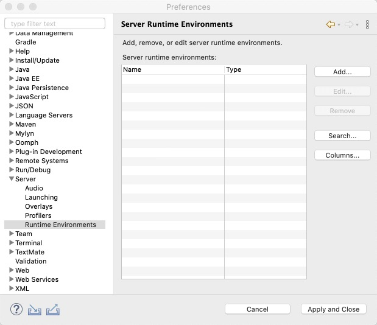
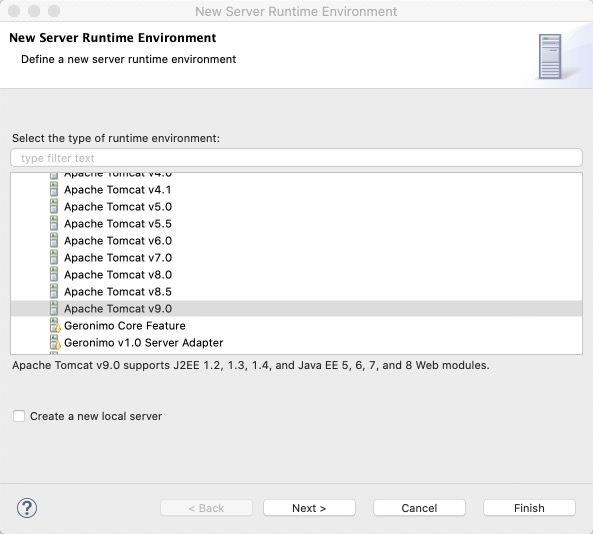
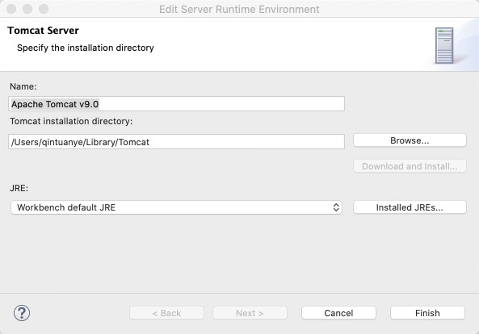

1. 打开 `Eclipse` 首选项 `Eclipse -> Preferences` ，找到 `Server -> Runtime Environments` 项，点击右侧的 `Add...` 按钮。	

2. 在弹出的窗口选择对应的 `Tomcat` 版本，然后点击 `Finish` 按钮。

3. 在弹出的窗口，点击 `Browse...` 按钮选择 `Tomcat` 的安装目录.

4. 点击 `Finish` 配置成功。