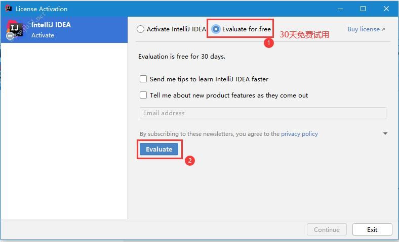
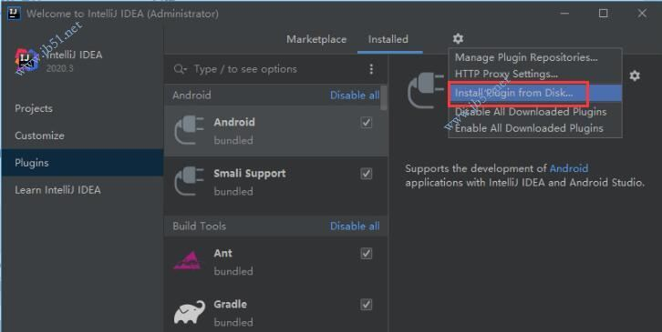
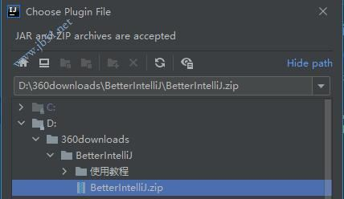
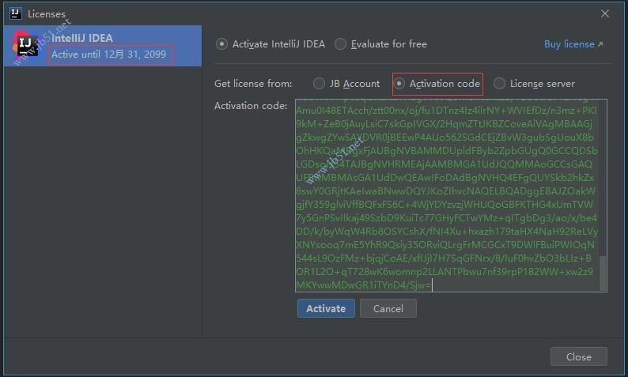

> 参考：[IntelliJ IDEA 2020.3.x 全家桶通用补丁(BetterIntelliJ) 最新免费版](https://www.jb51.net/softs/758627.html)

1、下载解压文件，把文件放到一个位置（尽量不要有中文路径），激活后，不要删除

2、安装软件后，打开软件，提示需要注册，勾选试用（Evaluate for free）选项，点击Evaluate进入IDE

3、打开插件中心，选择通过磁盘安装：File -> Settings ->Install Plugin from disk

4、找到之前解压的文件，选择安装即可

5、重启软件

6、打开主界面，找到 Help->Register，选择activation code，将key复制到框内，点击activate即可，如图

