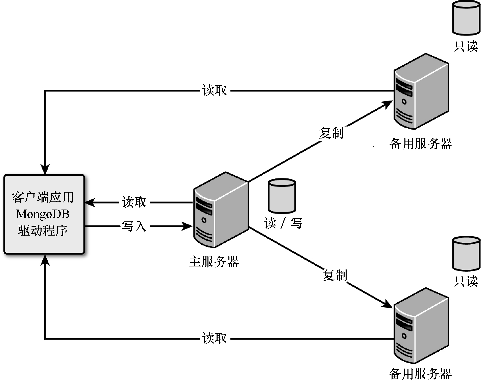
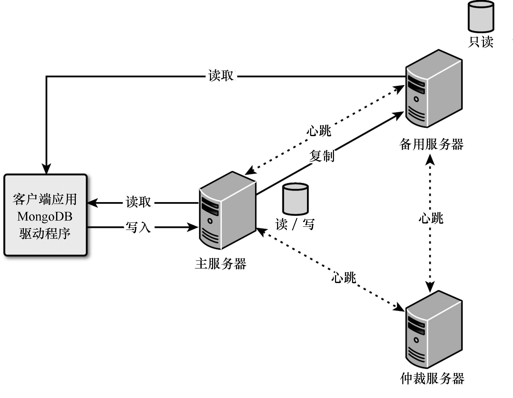

### 23.1　在MongoDB中实现复制

高性能数据库最重要的方面之一是复制，这指的是使用多个MongoDB服务器来存储相同的数据。副本集中的MongoDB服务器分三类，如图23.1所示。

<b class="my_markdown">图23.1　在MongoDB中实现副本集</b>

+ **主服务器：** 主服务器是副本集中唯一一种可写入的服务器，这让主服务器能够确保写入操作期间的数据完整性。一个副本集只能有一个主服务器。
+ **备份服务器：** 备份服务器包含主服务器上数据的副本。为确保数据是准确的，备份服务器应用主服务器提供的oplog（操作日志），这样在主服务器上执行的所有写入操作都将按顺序在备用服务器上执行。客户端可读取但不能写入备份服务器。
+ **仲裁者：** 仲裁服务器很有趣，它不包含数据副本，但能够在主服务器出现故障，需要选举新的主服务器时发挥作用。主服务器出现故障时，副本集中的其他服务器将检测到，进而选举新的主服务器，这是通过在主服务器、备份服务器和仲裁服务器之间使用心跳协议实现的。图23.2是一个包含仲裁服务器的副本集。

复制提供了两方面的好处：高性能和高可用性。使用副本集可提高性能，因为虽然客户端不能写入备份服务器，但可从备份服务器读取数据。这让您能够为应用程序提供多个读取源。

使用副本集可提高可用性，因为主服务器发生故障，其他服务器有数据的副本，可接管主服务器的工作。副本集使用心跳协议在服务器之间通信，进而判断主服务器是否出现了故障。如果主服务器出现了故障，就选举新的主服务器。

副本集至少需要包含三个服务器。另外，还应确保服务器为奇数，这样更容易选举出主服务器，这正是仲裁服务器的用武之地。仲裁服务器占用的资源很少，却能在选举新的主服务器时节省时间。图23.2是一个包含仲裁服务器的副本集，注意到仲裁服务器没有数据副本——它只参与心跳协议。

<b class="my_markdown">图23.2　在MongoDB副本集中实现仲裁服务器，确保服务器数为奇数</b>

