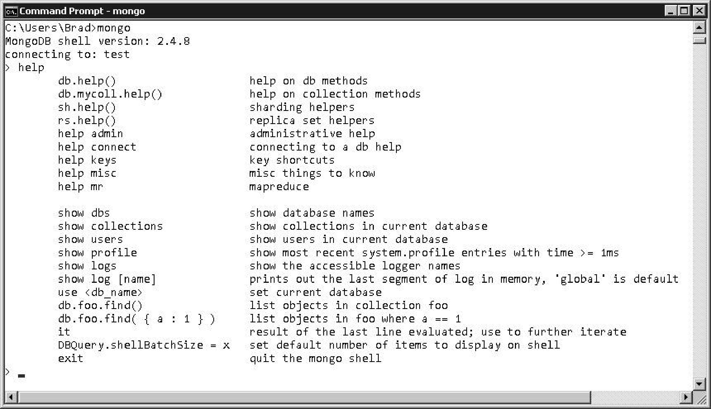

### 2.3.1 启动MongoDB shell

MongoDB shell是一个可执行文件，位于MongoDB安装路径下的/bin文件夹中。要启动MongoDB shell，可执行命令mongo。这将在控制台提示符中启动该shell，如图2.2所示。

<b class="my_markdown">图2.2 启动MongoDB shell</b>

启动MongoDB shell后，就可通过它管理MongoDB的各个方面。使用MongoDB shell时，别忘了它是基于JavaScript的。这意味着您可使用大部分JavaScript语法（包括循环和函数）来与数据库交互。

