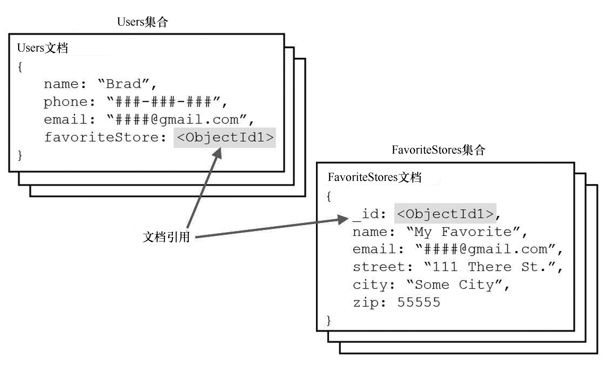

### 1.5.1 使用文档引用范式化数据

数据范式化指的是通过组织文档和集合以最大限度地减少冗余和依赖。为此，可找出这样的对象属性，即属性为子对象，而且应作为一个独立的文档存储在对象文档中的不同集合中。通常这对于这样的对象很有用，即与子对象的关系是一对多或多对多的。

对数据进行范式化的优点是，可减少数据库的规模，因为将只在独立的集合中存储子对象的一个拷贝，而不是在多个对象中重复存储它们。另外，如果需要频繁地修改子对象中的信息，将只需在一个地方修改，而无需在包含它的每个对象中进行修改。

对数据进行范式化的一个重大缺点是，查找对象时如果需要返回子对象，就必须再次查找它。如果需要频繁地访问这些对象，这将严重影响性能。

例如，如果一个系统中的用户都喜欢同一个商店，那么该系统适合对数据进行范式化。表示用户的对象包含属性name、phone和favoriteStore，其中的属性favoriteStore是一个子对象，包含属性name、street、city和zip。

数千位用户可能都喜欢同一个商店，这是一种明显的一对多关系。因此，在每个User对象中都存储FavoriteStore对象不合理，因为这可能导致相同的对象存储数千次。相反，FavoriteStore对象应包含一个_id属性，用于在User对象中引用FavoriteStore对象。这样，应用程序就可在Users集合中使用引用ID favoriteStore关联到FavoriteStores集合中的FavoriteStore文档。

图1.1说明了刚才描述的集合Users和FavoriteStores的结构。

<b class="my_markdown">图1.1 添加指向另一个集合中文档的引用，以定义范式化MongoDB文档</b>

