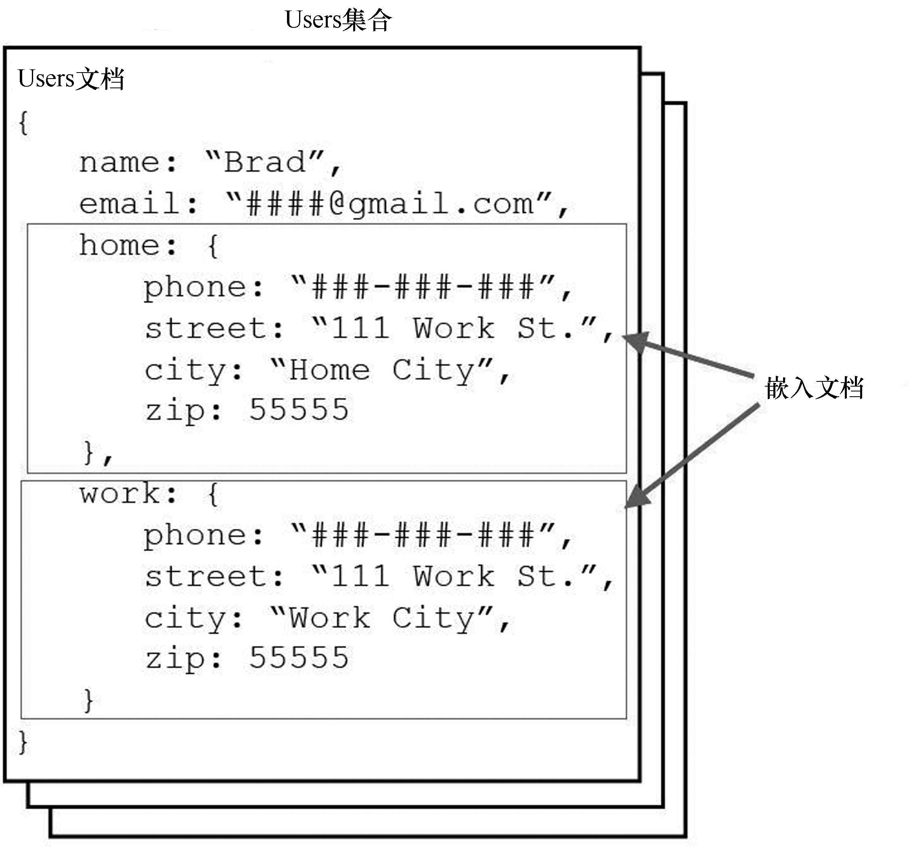

### 1.5.2 使用嵌入式文档对数据进行反范式化

对数据进行反范式化指的是找出应直接嵌入到主对象文档中的子对象。这通常适用于这样的情形：主对象和子对象之间为一对一关系或者子对象很少且不会频繁更新。

反范式化文档的主要优点是，只需一次查找就能获得整个对象，而无需在其他集合中查找子对象。这可极大地改善性能。其缺点是，对于与主对象存在一对多关系的子对象，将其存储多个拷贝，这将稍微降低插入速度，还将占用更多的磁盘空间。

一个适合对数据进行反范式化的例子是，系统包含用户的家庭联系信息和工作联系信息。这种用户用包含属性name、home和work的User文档表示，其中属性home和work都是子对象，包含属性phone、street、city和zip。

用户的属性home和work不会频繁变化；多名用户的家庭联系信息可能相同，但这样的情况不会太多。另外，这些子对象存储的值不大，也不会频繁变化。因此，将家庭联系信息直接存储在User对象中是合适的。

属性work需要考虑一下。在您接触的人当中，有多少人的工作联系信息相同呢？如果答案是不多，那么子对象work也应嵌入到User对象中。查询User时，需要获取工作联系信息的频率高吗？如果很少这样做，也许应该将work存储在独立的集合中。然而，如果经常或总是需要这样做，也许应该将其嵌入到User对象中。

图1.2说明了前面描述的内嵌家庭和工作联系信息的User文档的结构。

<b class="my_markdown">图1.2 将对象内嵌在文档中，以定义反范式化MongoDB文档</b>

