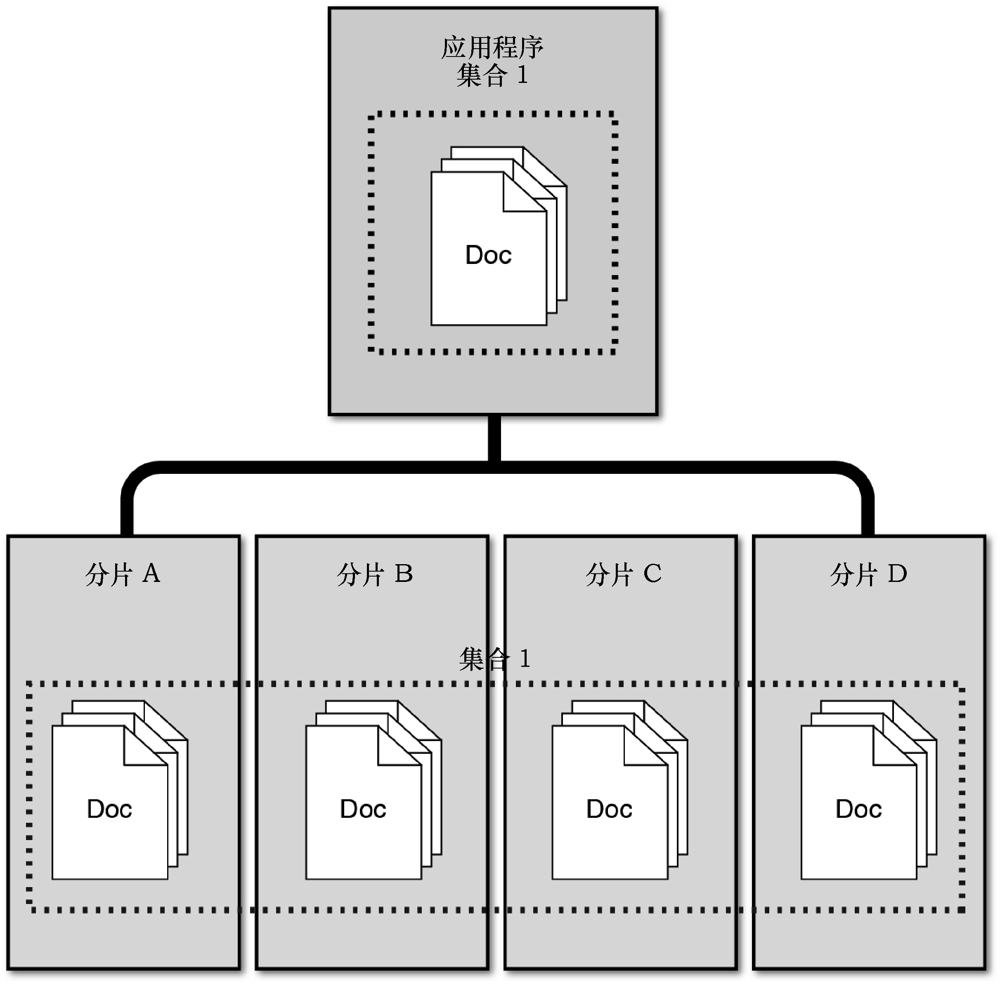

### 23.2　在MongoDB中实现分片

很多大型应用程序都会遇到的一个严峻问题是，MongoDB中存储的数据非常多，性能受到严重的影响。数据集合太大时，索引可能严重影响性能，磁盘数据量可能影响系统性能，而来自客户端的请求可能让服务器不堪重负。这将导致应用程序读写数据库的速度越来越慢。

MongoDB通过分片来解决这种问题。分片指的是将文档存储在多个服务器中，这些服务器运行在不同机器上。这让MongoDB数据库能够横向扩展。您添加的MongoDB服务器越多，应用程序可支持的文档就越多。图23.3说明了分片的概念：在应用程序看来，只有一个集合，但实际上有4个MongoDB分片服务器，每个都包含该集合的部分文档。

<b class="my_markdown">图23.3　在应用程序看来，访问的是一个集合，但这个集合的文档实际上分散在多个MongoDB分片服务器中</b>

