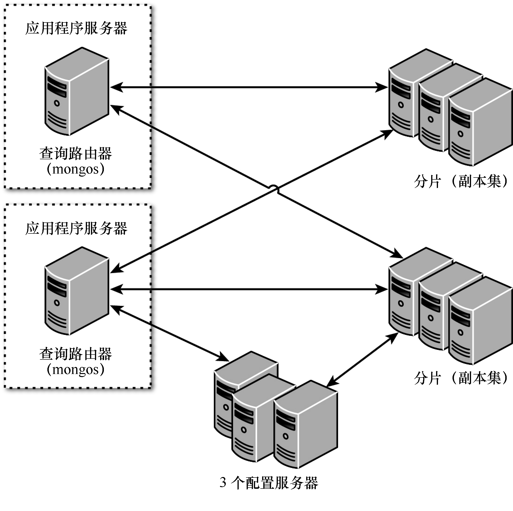

### 23.2.1　理解分片服务器的类型

对数据进行分片时，需要使用3种MongoDB服务器，这些服务器各司其职，向应用程序提供统一的视图。下面描述了每种服务器，图23.4说明了不同类型的分片服务器之间的交互。

+ **分片：** 分片存储集合中的文档，可以是单个服务器，但为了在生产环境中提供高可用性和数据一致性，应考虑使用副本集，它们提供分片的主副本和备份副本。
+ **查询路由器：** 查询路由器运行一个mongos实例。它提供让客户端应用程序能够与集合交互的接口，并隐藏数据被分片的事实。查询路由器处理请求，将操作发送给分片，再将各个分片的响应合并成发送给客户端的单个响应。一个分片集群可包含多个查询路由器，在存在大量客户端请求时，这是一种极佳的负载均衡方式。
+ **配置服务器：** 配置服务器存储有关分片集群的元数据，包含集群数据集到分片的映射。查询路由器根据这些元数据确定要将操作发送给哪些分片。在生产型分片集群中，应包含三个配置服务器。

<b class="my_markdown">图23.4　查询路由器接受来自MongoDB shell的请求，再与各个分片服务器通信以读取或写入数据</b>

