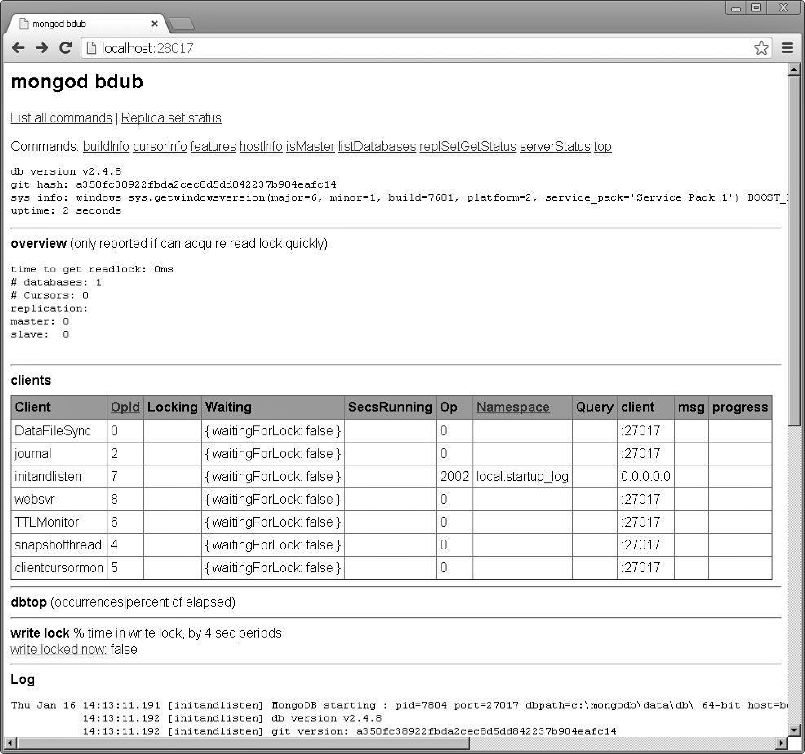

### 2.2 访问MongoDB HTTP接口

MongoDB内置了一个HTTP接口，可向您提供有关MongoDB服务器的信息。HTTP接口提供了有关MongoDB服务器的状态信息，还提供了一个REST接口，让您能够通过REST调用来访问数据库。

在大多数情况下，您都将在应用程序中使用编程语言专用的驱动程序来访问MongoDB数据库。然而，使用HTTP接口通常有助于获悉如下信息。

+ 版本。
+ 数据库个数。
+ 活动游标数。
+ 复制信息。
+ 客户端信息，包括锁和查询。
+ DB日志视图。

要访问MongoDB HTTP接口，可访问该接口的端口28017。

例如，在启动了MongoDB服务器的情况下，在本地主机上使用下面的URL可访问MongoDB HTTP接口（如图2.1所示）：<a class="my_markdown" href="['http://localhost:28017/']">http://localhost:28017/</a>。

<b class="my_markdown">图2.1 使用MongoDB HTTP接口在浏览器中查看MongoDB数据库信息</b>

