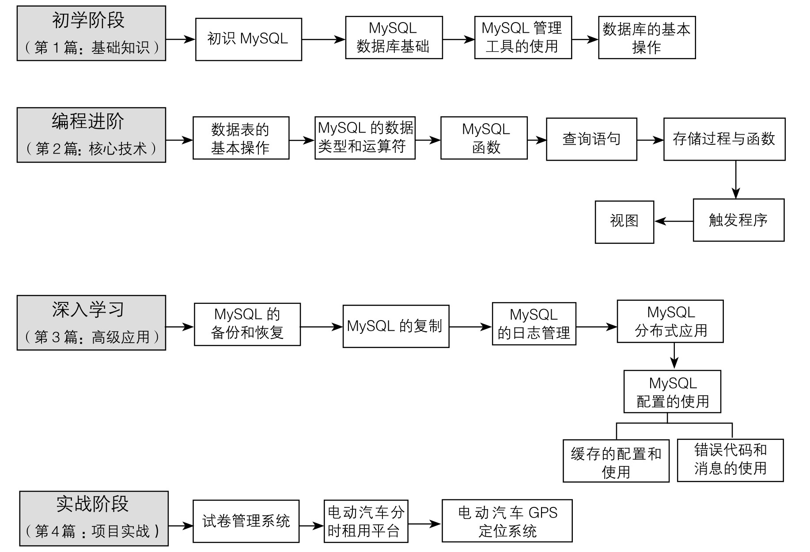
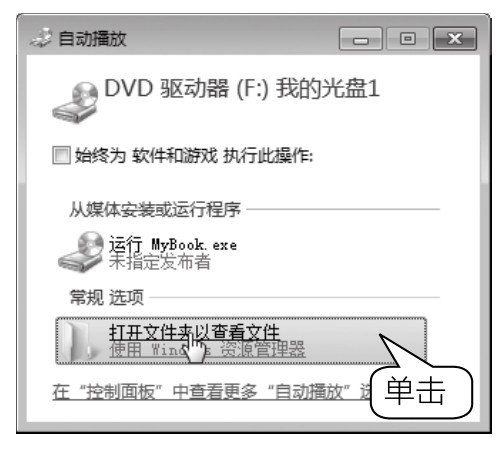
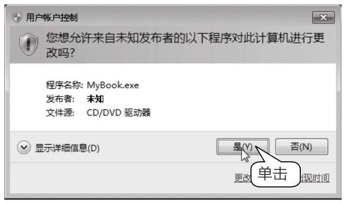
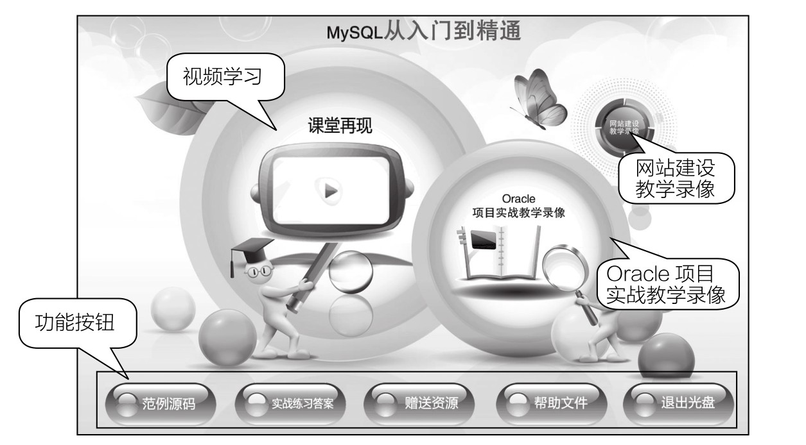

# 
  前言

“从入门到精通”系列图书是专门为编程初学者量身定做的一套编程学习用书，由龙马高新教育策划，国家863中部软件孵化器组织编写。

本书专门为MySQL初学者和爱好者打造，旨在帮助读者掌握MySQL相关知识并能够进行项目开发。当您认真系统地学习本书之后，就可以骄傲地宣布——“我是一位真正的MySQL程序员了！”。

为什么要写这样一本书

荀子曰：“不闻不若闻之，闻之不若见之，见之不若知之，知之不若行之。”

实践对于学习的重要性由此可见一斑。纵观当前编程图书市场，理论知识与实践经验脱节是一些MySQL图书的写照。为了改变这一现象，本书立足于实战，从项目开发的实际需求入手，将理论知识与实际应用相结合，目的就是让初学者能够快速成长为初级程序员，并拥有一定的项目开发经验，从而在职场中拥有一个高起点。

MySQL的最佳学习途径

本书总结了作者多年的教学实践经验，为读者设计了最佳的学习路线。

本书特色

▶零基础、入门级的讲解

无论读者是否从事计算机相关行业，是否接触过MySQL，是否使用MySQL开发过项目，都能从本书中找到最佳起点。

▶超多、实用、专业的范例和项目

本书结合实际工作中的范例逐一讲解MySQL的各种知识和技术，【项目实战】篇中更以3个项目的实现来总结本书所学知识，帮助读者掌握实战技能，轻松拥有项目经验。

▶随时检测自己的学习成果

每章首页中均提供了学习要点，以指导读者重点学习并对照检查。章后的高手点拨和实战练习，均根据本章内容精选而成，读者可以随时检测自己的学习成果，做到融会贯通。

▶细致入微、贴心提示

本书在讲解过程中使用了“提示”“注意”“技巧”等小栏目，帮助读者在学习过程中更清楚地理解基本概念、掌握相关操作，并轻松获取实战技巧。

超值光盘

▶15小时全程同步教学录像

录像涵盖本书所有知识点，详细讲解每个实例及项目的开发过程及关键点，帮助读者更轻松地掌握书中所有的MySQL程序设计知识。

▶超多容量王牌资源大放送

赠送大量王牌资源，包括MySQL参考手册、JSP连接MySQL数据库电子书、MySQL数据库远程连接开启方法电子书、MySQL安全配置电子书、MySQL常用维护管理工具电子书、MySQL数据备份电子书、MySQL常用命令电子书、MySQL数据库优化电子书、MySQL修改root密码方法电子书、PHP连接MySQL实例电子书、MySQL常见面试题及解析电子书、软件开发文档模板库、12小时网站建设教学录像、18小时Oracle项目实战教学录像等。

读者对象

▶没有任何数据库基础的初学者。

▶有一定的数据库基础，想精通MySQL的人员。

▶有一定的MySQL数据库基础，没有项目开发经验的人员。

▶大专院校及培训学校的老师和学生。

光盘使用说明

01 将光盘放入光驱中，几秒钟后系统会弹出【自动播放】对话框，如下图所示。

02 在Windows 7 操作系统中单击【打开文件夹以查看文件】链接以打开光盘文件夹，用鼠标右键单击光盘文件夹中的MyBook.exe 文件，并在弹出的快捷菜单中选择【以管理员身份运行】菜单项，打开【用户账户控制】对话框，如下图所示。单击【是】按钮，光盘即可自动播放。在Windows 8 操作系统中会在桌面右上角显示快捷操作界面，单击界面后，在其列表中选择【运行MyBook.exe】选项即可。

03 光盘运行后首先播放片头动画，之后进入光盘的主界面。其中包括【课堂再现】、【Oracle项目实战教学录像】和【网站建设教学录像】三个学习通道，以及【范例源码】、【实战练习答案】、【赠送资源】、【帮助文件】、【退出光盘】5个功能按钮。

04 单击【课堂再现】按钮，进入多媒体同步教学录像界面。在左侧的章号按钮上单击鼠标左键，在弹出的快捷菜单上单击要播放的节名，即可开始播放相应的教学录像。

05 单击【Oracle项目实战教学录像】和【网站建设教学录像】按钮，可打开对应的实战教学录像。

06 单击【范例源码】按钮，可打开本书范例源码文件夹。

07 单击【实战练习答案】按钮，可在打开的文件夹中看到实战练习答案的PDF文件，打开PDF文件即可查看本书实战练习部分的答案。

08 单击【赠送资源】按钮，可以查看随本书赠送的扩展学习资源。

09 单击【帮助文件】按钮，可以打开“光盘使用说明.pdf ”文档，该说明文档详细介绍了光盘在计算机上的运行环境及运行方法等。

10 单击【退出光盘】按钮，即可退出本光盘系统。

创作团队

本书由龙马高新教育策划，周喜平任主编，师晓利、邵彧和赵雪琴任副主编。郑州大学西亚斯国际学院王颖和河南省机关事务管理局詹保坡负责编写第0～3章、第18章，郑州大学西亚斯国际学院邵彧和张波、郑州升达经贸管理学院宁跃飞负责编写第4～7章，郑州大学西亚斯国际学院赵雪琴、宋小芹、周喜平负责编写第8～12、16、17、19、20章，郑州大学西亚斯国际学院师晓利负责编写第13～15章。参与本书编写、资料整理、多媒体开发及程序调试的人员有孔万里、周奎奎、张任、张田田、尚梦娟、李彩红、尹宗都、王果、陈小杰、左琨、邓艳丽、崔姝怡、侯蕾、左花苹、刘锦源、普宁、王常吉、师鸣若、钟宏伟、陈川、刘子威、徐永俊、朱涛和张允等。

在本书的编写过程中，我们竭尽所能地将最好的内容呈现给读者，但也难免有疏漏和不妥之处，敬请广大读者不吝指正。读者在学习过程中有任何疑问或建议，可发送电子邮件至zhangyi@ptpress.com.cn。

编者

