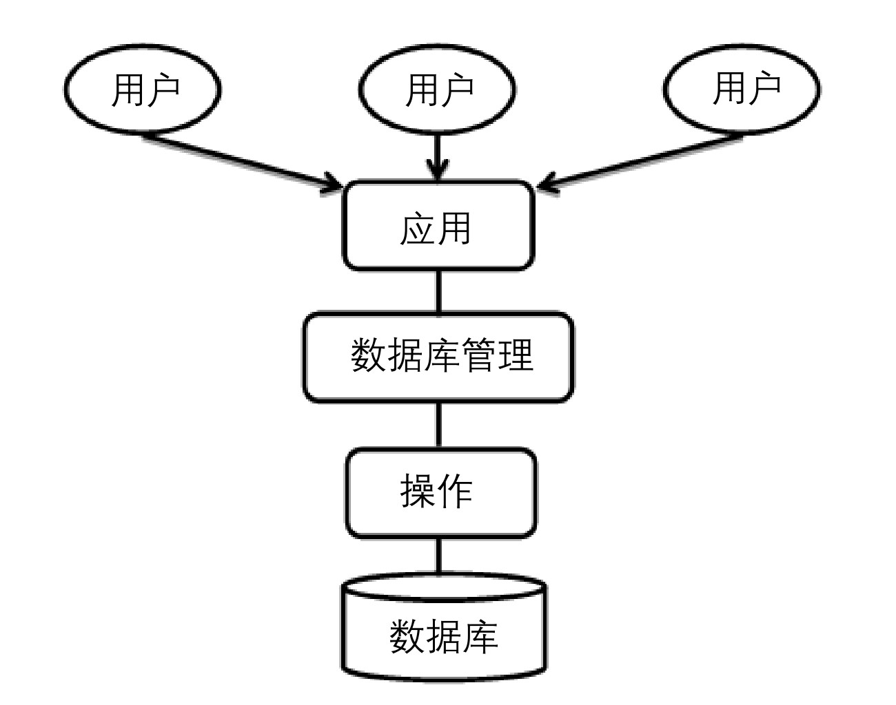

### 
  0.1 什么是数据库

 本节视频教学录像：8分钟

要想学好MySQL，就必须对数据库的概念和基础知识有所了解。MySQL是众多数据库的一种。

⒈ 什么是数据库

数据库（DataBase，DB）是按照数据结构来组织、存储和管理数据的仓库。随着信息技术和市场的发展，特别是20世纪90年代以后，数据管理不再仅仅是存储和管理数据，而转变成用户所需要的各种数据管理的方式。数据库有很多种类型，从最简单的存储有各种数据的表格到能够进行海量数据存储的大型数据库系统，在各个方面都得到了广泛的应用。

数据库是一个长期存储在计算机内的、有组织的、有共享的、统一管理的数据集合。它是一个按数据结构来存储和管理数据的计算机软件系统。也就是说，数据库包含有两种含义：保管数据的“仓库”，以及管理数据的方法和技术。

数据库的发展大致可以划分为以下几个阶段：人工管理阶段、文件系统阶段、数据库系统阶段、高级数据库阶段。根据数据结构的联系和组织，数据库大致可以分为3类：层次式数据库、网络式数据库和关系型数据库。

不管是哪种类型的数据库，都应该有以下共同的属性：采用特定的数据类型；增加数据共享、减少数据冗余；具有较高的数据独立性；具有统一的数据控制功能。

常见的数据库有甲骨文公司的Oracle、IBM公司的DB2、微软公司的Access与SQL Server以及本书正要详细介绍的MySQL。

⒉ 数据库系统

数据库系统包括3个主要的组成部分。

⑴ 数据库：用于存储数据的存储空间。

⑵ 数据库管理系统：用于管理数据库的软件。

⑶ 数据库应用程序：为了提高数据库系统的处理能力所使用的管理数据库的软件补充。

数据库（DataBase，DB）提供一个存储空间用于存储数据，就像一个仓库一样，可以存储很多种不同的文件。一个数据库系统可能包含有很多种数据库。

数据库管理系统（Database Management System，DBMS）是用于创建、管理、和维护数据库时所使用的软件，介于用户和操作系统之间，对数据库进行管理。DBMS能定义数据存储结构，提供数据的操作机制，维护数据库的安全性、完整性和可靠性。

数据库应用程序（Database Application），相对于DBMS，数据库应用程序可以帮助用户实现对数据库操作的更高要求，可以让管理过程更加的直观和友好。

⒊ SQL语言

SQL的含义是结构化查询语言（Structured Query Language），它是用来实现对数据库进行查询和修改操作的标准语言。

SQL语言包含以下4个部分。

⑴ 数据定义语言（DDL）：DROP、CREATE、ALTER等语句。

⑵ 数据操作语言（DML）：INSERT、UPDATE、DELETE语句。

⑶ 数据查询语言（DQL）：SELECT语句。

⑷ 数据控制语言（DCL）：GRANT、REVOKE、COMMIT、ROLLBACK等语句。

在这里不对上面的语句一一说明，只是给读者一个直观的印象，在后面的章节，笔者将详细介绍这些知识。

⒋ 数据库访问技术

数据库存储的程序最终是要为软件服务的，因此，程序通过数据库访问技术访问调用数据库。不同的程序设计语言会采用不同的数据库访问技术。主要的数据库访问技术有ODBC、JDBC、ADO.NET、PDO等。

