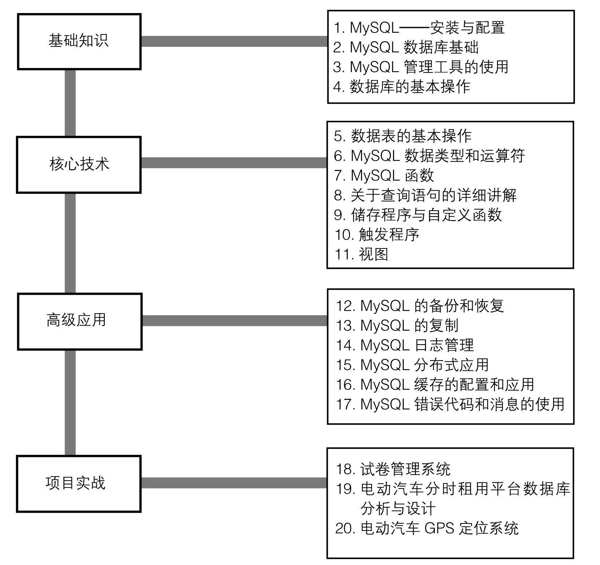

### 
  0.6 MySQL学习路线图

 本节视频教学录像：2分钟

学习是一个由浅入深的过程。学习MySQL也是如此，笔者编制了一个系统的学习路线图，在以后的章节中，将带领大家按照学习论线图，一点一点引领大家认识MySQL、熟悉MySQL直至掌握MySQL。

学习MySQL主要分为4个阶段。

⒈ MySQL基础知识的学习。主要包括MySQL安装与配置、MySQL数据库基础、MySQL管理工具的使用、数据库的基本操作等。

⒉ MySQL核心技术的学习。主要包括数据表的基本操作、MySQL数据类型和运算符、MySQL函数、关于查询语句的详细讲解、存储程序与自定义函数、触发程序、视图等。

⒊ MySQL的高级应用。主要包括MySQL的备份和恢复、MySQL的复制、MySQL日志管理、MySQL分布式应用、MySQL缓存的配置和使用、MySQL错误代码和消息的使用。

⒋ MySQL的项目实战。在此列举了3个比较典型的实战项目，来检验上面3个阶段的学习情况，以及各种综合应用。

