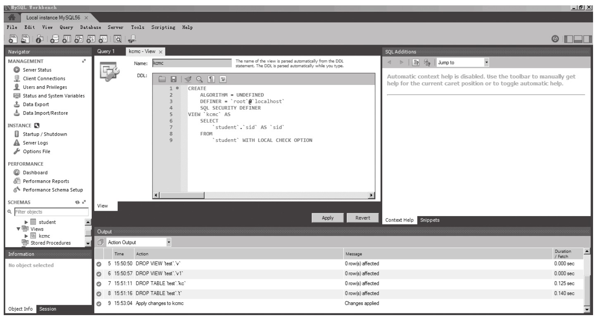
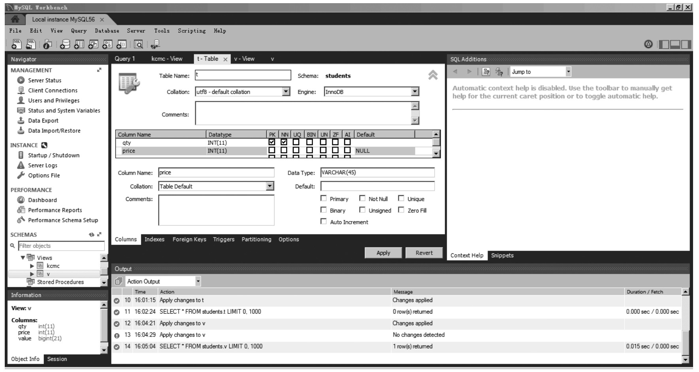
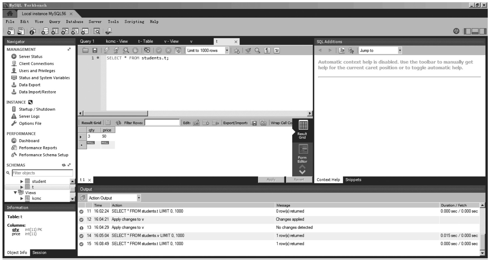
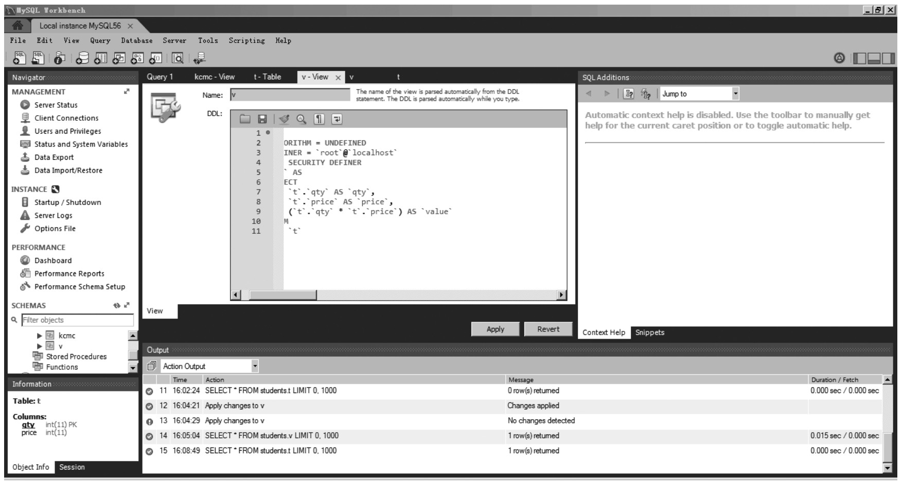
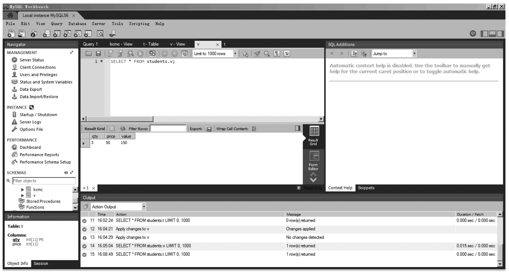

#### 
  11.2.1 创建视图

创建视图的语法格式如下。

&#13;
    CREATE [ALGORITHM={UNDEFINED|MERGE|TEMPTABLE}]&#13;
    VIEW view_name AS&#13;
    SELECT column_name(s) FROM table_name&#13;
    [WITH [CASCADED|LOCAL] CHECK OPTION];&#13;

其中，ALGORITHM为可选参数，表示视图选择的算法。UNDEFINED表示MySQL将自动选择所要使用的算法；MERGE表示将视图的语句与视图定义合并起来，使得视图定义的某一部分取代语句的对应部分；TEMPTABLE表示将视图的结果存入临时表，然后使用临时表执行语句。

view_name为指创建视图的名称，可包含其属性列表。

column_name(s)为指查询的字段，也就是视图的列名。

table_name指从那个数据表获取数据，这里也可以从多个表获取数据，格式写法请读者自行参考SQL联合查询。

WITH CHECK OPTION为可选参数，表示更新视图时要保证在视图的权限范围内。CASCADED表示更新视图时要满足所有相关视图和表的条件才进行更新；LOCAL表示更新视图时，要满足该视图本身定义的条件即可更新。

该语句能创建新的视图，如果给定了OR REPLACE子句，该语句还能替换已有的视图。select_statement是一种SELECT语句，它给出了视图的定义。该语句可从基表或其他视图进行选择。

该语句要求具有针对视图的CREATE VIEW权限，以及针对由SELECT语句选择的每一列上的某些权限。对于在SELECT语句中其他地方使用的列，必须具有SELECT权限。如果还有OR REPLACE子句，必须在视图上具有DROP权限。

提示 
 WITH CHECK OPTION虽是可选属性，但为了数据安全性建议读者使用。

【范例11-1】

如果需要创建一个名为myview的视图，可以使用如下命令。

&#13;
    mysql> CREATE VIEW kcmc&#13;
    -> AS SELECT sid FROM student&#13;
    -> WITH LOCAL CHECK OPTION;&#13;
    Query OK, 0 rows affected (0.08 sec)&#13;

需要说明一点：视图属于数据库，在默认情况下，将在当前数据库创建新视图。要想在给定数据库中明确创建视图，创建时，应将名称指定为db_name.view_name。

&#13;
    mysql> CREATE VIEW test.v AS SELECT * FROM t;&#13;

表和视图共享数据库中相同的名称空间，因此，数据库不能包含具有相同名称的表和视图。

视图必须具有唯一的列名，不得有重复，就像基表那样。默认情况下，由SELECT语句检索的列名将用作视图列名。要想为视图列定义明确的名称，可使用可选的column_list子句，列出由逗号隔开的ID。column_list中的名称数目必须等于SELECT语句检索的列数。

SELECT语句检索的列可以是对表列的简单引用。也可以是使用函数、常量值、操作符等的表达式。

对于SELECT语句中不合格的表或视图，将根据默认的数据库进行解释。通过用恰当的数据库名称限定表或视图名，视图能够引用表或其他数据库中的视图。

能够使用多种SELECT语句创建视图。视图能够引用基表或其他视图，它能使用联合、UNION和子查询。SELECT甚至不需引用任何表。在下面的示例中，定义了从另一表选择两列的视图，并给出了根据这些列计算的表达式。

【范例11-2】

&#13;
    mysql> CREATE TABLE t (qty INT, price INT);&#13;

&#13;
    mysql> INSERT INTO t VALUES(3, 50);&#13;

&#13;
    mysql> CREATE VIEW v AS SELECT qty, price, qty*price AS value FROM t;&#13;

&#13;
    mysql> SELECT * FROM v;&#13;
    +------+-------+-------+&#13;
    |qty |price|value|&#13;
    +------+-------+-------+&#13;
    |  3|  50| 150|&#13;
    +------+-------+-------+&#13;

视图定义服从下述限制。

⑴SELECT语句不能包含FROM子句中的子查询。

⑵ELECT语句不能引用系统或用户变量。

⑶SELECT语句不能引用预处理语句参数。

⑷在存储子程序内，定义不能引用子程序参数或局部变量。

⑸在定义中引用的表或视图必须存在。但是，创建了视图后，能够舍弃定义引用的表或视图。要想检查视图定义是否存在这类问题，可使用CHECK TABLE语句。

⑹在定义中不能引用TEMPORARY表，不能创建TEMPORARY视图。

⑺在视图定义中命名的表必须已存在。

⑻不能将触发程序与视图关联在一起。

⑼在视图定义中允许使用ORDER BY，但是，如果从特定视图进行了选择，而该视图使用了具有自己ORDER BY的语句，它将被忽略。

⑽对于定义中的其他选项或子句，它们将被增加到引用视图的语句的选项或子句中，但效果未定义。例如，如果在视图定义中包含LIMIT子句，而且从特定视图进行了选择，而该视图使用了具有自己LIMIT子句的语句，那么对使用哪个LIMIT未做定义。相同的原理也适用于其他选项，如跟在SELECT关键字后的ALL、DISTINCT或SQL_SMALL_RESULT，并适用于其他子句，如INTO、FOR UPDATE、LOCK IN SHARE MODE以及PROCEDURE。

⑾如果创建了视图，并通过更改系统变量更改了查询处理环境，会影响从视图获得的结果。

【范例11-3】

&#13;
    mysql> CREATE VIEW v AS SELECT CHARSET(CHAR(65)), COLLATION(CHAR(65));&#13;
    Query OK, 0 rows affected (0.00 sec)&#13;
    mysql> SET NAMES 'latin1';&#13;
    Query OK, 0 rows affected (0.00 sec)&#13;
    mysql> SELECT * FROM v;&#13;
    +-------------------+---------------------+&#13;
    | CHARSET(CHAR(65)) | COLLATION(CHAR(65)) |&#13;
    +-------------------+---------------------+&#13;
    |latin1      |latin1_swedish_ci |&#13;
    +-------------------+---------------------+&#13;
    1 row in set (0.00 sec)&#13;
    mysql> SET NAMES 'utf8';&#13;
    Query OK, 0 rows affected (0.00 sec)&#13;
    mysql> SELECT * FROM v;&#13;
    +-------------------+---------------------+&#13;
    | CHARSET(CHAR(65)) | COLLATION(CHAR(65)) |&#13;
    +-------------------+---------------------+&#13;
    |utf8       |utf8_general_ci  |&#13;
    +-------------------+---------------------+&#13;
    1 row in set (0.00 sec)&#13;

可选的ALGORITHM子句是对标准SQL的MySQL扩展。ALGORITHM可取三个值：MERGE、TEMPTABLE或UNDEFINED。如果没有ALGORITHM子句，默认算法是UNDEFINED（未定义的）。算法会影响MySQL处理视图的方式。

对于MERGE，会将引用视图的语句的文本与视图定义合并起来，使得视图定义的某一部分取代语句的对应部分。

对于TEMPTABLE，视图的结果将被置于临时表中，然后使用它执行语句。

对于UNDEFINED，MySQL将选择所要使用的算法。如果可能，它倾向于MERGE而不是TEMPTABLE，这是因为MERGE通常更有效，而且如果使用了临时表，视图是不可更新的。

明确选择TEMPTABLE的1个原因在于，创建临时表之后、并在完成语句处理之前，能够释放基表上的锁定。与MERGE算法相比，锁定释放的速度更快，这样，使用视图的其他客户端不会被屏蔽过长时间。

视图算法可以是UNDEFINED，有以下3种方式。

⑴在CREATE VIEW语句中没有ALGORITHM子句。

⑵CREATE VIEW语句有1个显式ALGORITHM = UNDEFINED子句。

⑶为仅能用临时表处理的视图指定ALGORITHM = MERGE。在这种情况下，MySQL将生成告警，并将算法设置为UNDEFINED。

正如前面所介绍的那样，通过将视图定义中的对应部分合并到引用视图的语句中，对MERGE进行处理。在下面的示例中，简要介绍了MERGE的工作方式。在该示例中，假定有1个具有下述定义的视图v_merge。

&#13;
    CREATE ALGORITHM = MERGE VIEW v_merge (vc1, vc2) AS&#13;
    SELECT c1, c2 FROM t WHERE c3 > 100;&#13;

示例1：假定发出了下述语句。

&#13;
    SELECT * FROM v_merge;&#13;

MySQL以下述方式处理语句。

&#13;
    v_merge成为t&#13;
    *成为vc1、vc2，与c1、c2对应&#13;
    增加视图WHERE子句&#13;

所产生的将执行的语句如下。

&#13;
    SELECT c1, c2 FROM t WHERE c3 > 100;&#13;

示例2：假定发出了下述语句。

&#13;
    SELECT * FROM v_merge WHERE vc1 < 100;&#13;

该语句的处理方式与前面介绍的类似，但vc1 < 100变为c1 < 100，并使用AND连接词将视图的WHERE子句添加到语句的WHERE子句中（增加了圆括号以确保以正确的优先顺序执行子句部分）。所得的将要执行的语句如下。

&#13;
    SELECT c1, c2 FROM t WHERE (c3 > 100) AND (c1 < 100);&#13;

事实上，将要执行的语句是具有下述形式的WHERE子句。

&#13;
    WHERE (select WHERE) AND (view WHERE)&#13;

MERGE算法要求视图中的行和基表中的行具有一对一的关系。如果不具有该关系。必须使用临时表取而代之。如果视图包含下述结构中的任何一种，将失去一对一的关系。

⑴聚合函数（SUM(), MIN(), MAX(), COUNT()等）。

&#13;
    DISTINCT&#13;
    GROUP BY&#13;
    HAVING&#13;
    UNION或UNION ALL&#13;

⑵仅引用文字值（在该情况下，没有基本表）。

某些视图是可更新的。也就是说，可以在诸如UPDATE、DELETE或INSERT等语句中使用它们，以更新基表的内容。对于可更新的视图，在视图中的行和基表中的行之间必须具有一对一的关系。还有一些特定的其他结构，这类结构会使得视图不可更新。更具体地讲，如果视图包含下述结构中的任何一种，那么它就是不可更新的。

⑴聚合函数（SUM(), MIN(), MAX(), COUNT()等）。

&#13;
    DISTINCT&#13;
    GROUP BY&#13;
    HAVING&#13;
    UNION或UNION ALL&#13;

⑵位于选择列表中的子查询如下。

&#13;
    Join&#13;

⑶FROM子句中的不可更新视图。

⑷WHERE子句中的子查询，引用FROM子句中的表。

⑸仅引用文字值（在该情况下，没有要更新的基本表）。

⑹ALGORITHM = TEMPTABLE（使用临时表总会使视图成为不可更新的）。

关于可插入性（可用INSERT语句更新），如果它也满足关于视图列的下述额外要求，可更新的视图也是可插入的。

⑴不得有重复的视图列名称。

⑵视图必须包含没有默认值的基表中的所有列。

⑶视图列必须是简单的列引用而不是导出列。导出列不是简单的列引用，而是从表达式导出的。

混合了简单列引用和导出列的视图是不可插入的，但是，如果仅更新非导出列，视图是可更新的。考虑下述视图。

&#13;
    CREATE VIEW v AS SELECT col1, 1 AS col2 FROM t;&#13;

该视图是不可插入的，这是因为col2是从表达式导出的。但是，如果更新时不更新col2，它是可更新的，这类更新是允许的。

&#13;
    UPDATE v SET col1 = 0;&#13;

下述更新是不允许的，原因在于它试图更新导出列。

&#13;
    UPDATE v SET col2 = 0;&#13;

在某些情况下，能够更新多表视图，假定它能使用MERGE算法进行处理。为此，视图必须使用内部联合（而不是外部联合或UNION）。此外，仅能更新视图定义中的单个表，因此，SET子句必须仅命名视图中某一表的列。即使从理论上讲也是可更新的，也不允许使用UNION ALL的视图，这是因为在实施中将使用临时表来处理它们。

对于多表可更新视图，如果是将其插入单个表中，INSERT能够工作，不支持DELETE。

对于可更新视图，可给定WITH CHECK OPTION子句来防止插入或更新行，除非作用在行上的select_statement中的WHERE子句为“真”。

在关于可更新视图的WITH CHECK OPTION子句中，当视图是根据另一个视图定义的时，LOCAL和CASCADED关键字决定了检查测试的范围。LOCAL关键字对CHECK OPTION进行了限制，使其仅作用在定义的视图上，CASCADED会对将进行评估的基表进行检查。如果未给定任一关键字，默认值为CASCADED。请考虑下述表和视图集合的定义。

&#13;
    mysql> CREATE TABLE t1 (a INT);&#13;
    mysql> CREATE VIEW v1 AS SELECT * FROM t1 WHERE a < 2&#13;
    -> WITH CHECK OPTION;&#13;
    mysql> CREATE VIEW v2 AS SELECT * FROM v1 WHERE a > 0&#13;
    -> WITH LOCAL CHECK OPTION;&#13;
    mysql> CREATE VIEW v3 AS SELECT * FROM v1 WHERE a > 0&#13;
    -> WITH CASCADED CHECK OPTION;&#13;

这里，视图v2和v3是根据另一视图v1定义的。v2具有LOCAL检查选项，因此，仅会针对v2检查对插入项进行测试。v3具有CASCADED检查选项，因此，不仅会针对它自己的检查对插入项进行测试，也会针对基本视图的检查对插入项进行测试。

