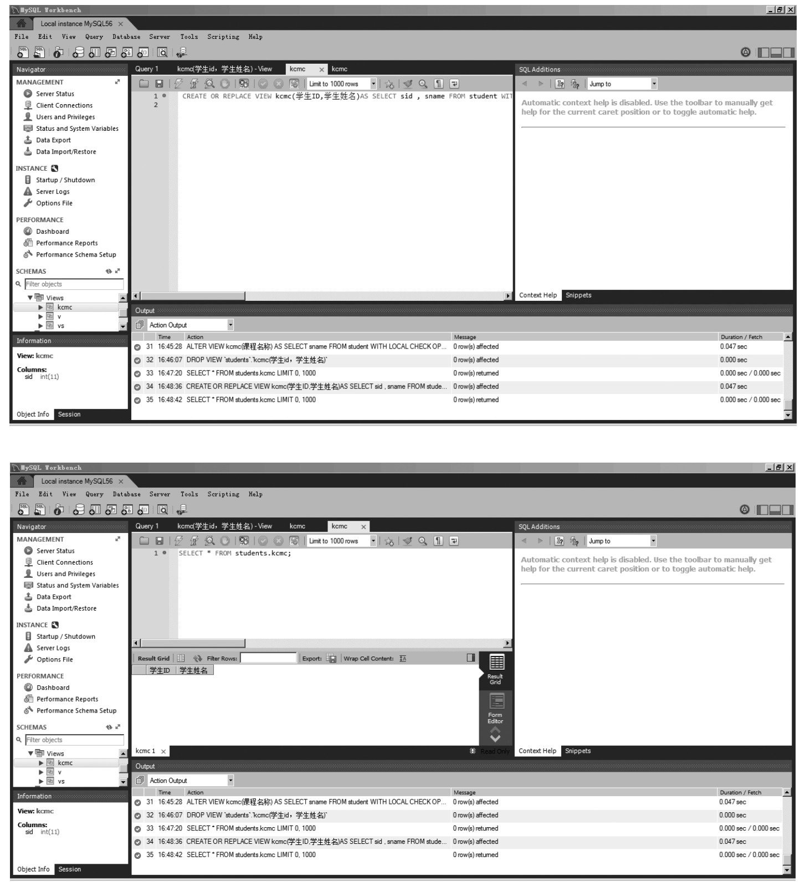
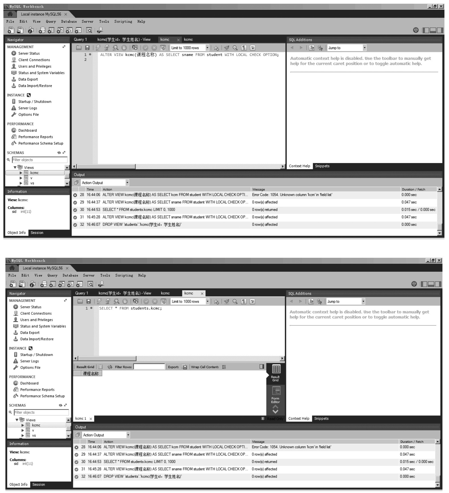
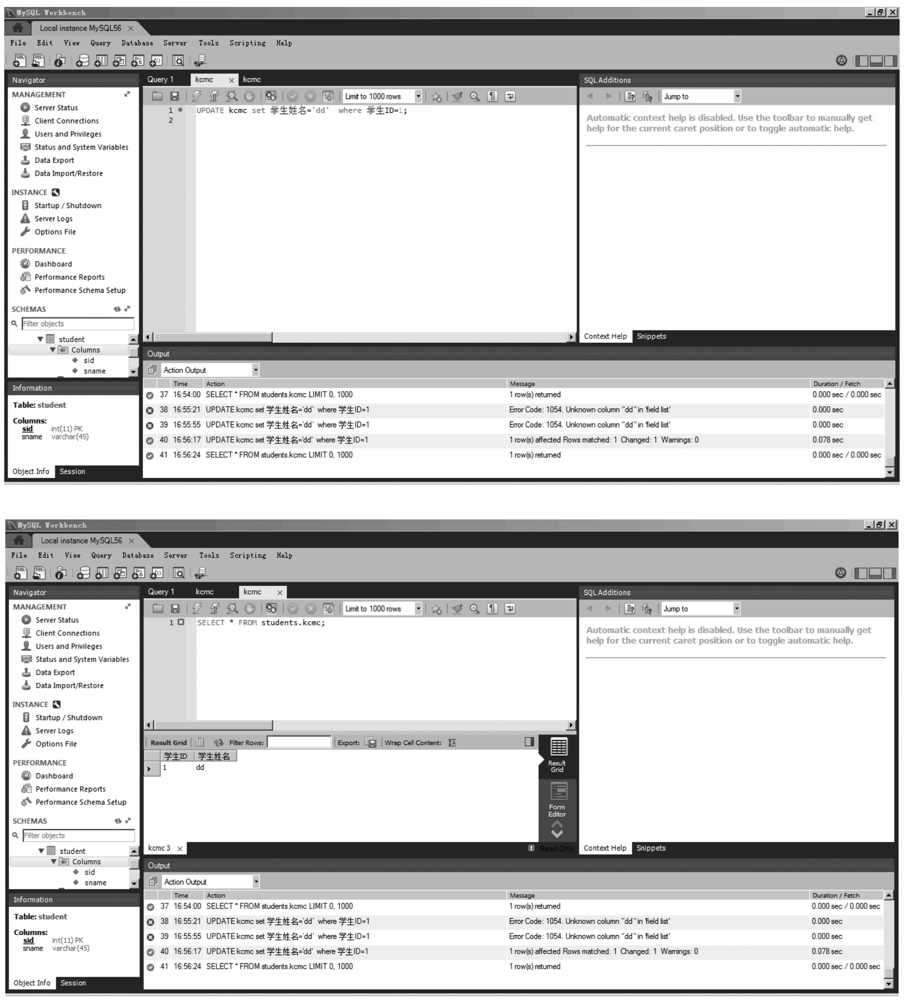
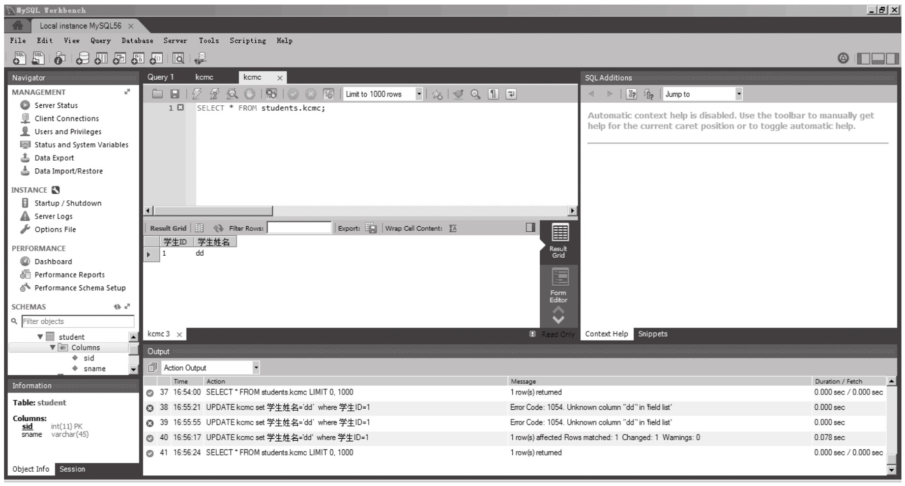

#### 
  11.2.2 修改视图

视图的修改是指修改了数据表的定义，当视图定义的数据表字段发生了变化时，需要对视图进行修改来保证查询的正确进行。MySQL使用CREATE OR REPLACE VIEW语句修改视图。在MySQL中，使用CREATE OR REPLACE VIEW语句可以修改视图。视图存在时，可以对视图进行修改；视图不存在时，可以创建视图。

CREATE OR REPLACE VIEW语句的语法格式如下。

&#13;
    CREATE OR REPLACE [ALGORITHM={UNDEFINED|MERGE|TEMPTABLE}]&#13;
    VIEW 视图名[(属性清单)]&#13;
    AS SELECT语句&#13;
    [WITH [CASCADED|LOCAL] CHECK OPTION];&#13;

⑴ALGORITHM：可选。表示视图选择的算法。

⑵UNDEFINED：表示MySQL将自动选择所要使用的算法。

⑶MERGE：表示将使用视图的语句与视图定义合并起来，使得视图定义的某一部分取代语句的对应部分。

⑷TEMPTABLE：表示将视图的结果存入临时表，然后使用临时表执行语句。

⑸视图名：表示要创建的视图的名称。

⑹属性清单：可选。指定了视图中各个属性的名词，默认情况下，与SELECT语句中查询的属性相同。

⑺SELECT语句：是一个完整的查询语句，表示从某个表中查出某些满足条件的记录，将这些记录导入视图中。

⑻WITH CHECK OPTION：可选。表示修改视图时要保证在该视图的权限范围之内。

⑼CASCADED：可选。表示修改视图时，需要满足跟该视图有关的所有相关视图和表的条件，该参数为默认值。

⑽LOCAL：表示修改视图时，只要满足该视图本身定义的条件即可。

读者可以发现视图的修改语法和创建视图语法只有OR REPLACE的区别，当使用CREATE OR REPLACE的时候，如果视图已经存在则进行修改操作，如果视图不存在的情况下则创建视图。

【范例11-4】

&#13;
    mysql> CREATE OR REPLACE VIEW kcmc(学生ID,学生姓名)&#13;
    -> AS SELECT sid , sname FROM student&#13;
    -> WITH LOCAL CHECK OPTION;&#13;
    Query OK, 0 rows affected (0.05 sec)&#13;

除了使用CREATE OR REPLACE修改视图外，还可以使用ALTER来进行视图修改。ALTER用法示例如下。

【范例11-5】

&#13;
    mysql> ALTER VIEW kcmc(课程名称)&#13;
    -> AS SELECT sname FROM student&#13;
    -> WITH LOCAL CHECK OPTION;&#13;
    Query OK, 0 rows affected (0.05 sec)&#13;

CREATE OR REPLACE、ALTER的使用主要是对视图的结构进行修改，其实MySQL也可以对视图内容进行更新，也就是视图的UPDATE操作，是可以通过视图进行增加、删除、修改数据表中的数据，当然对视图的更新操作实质都是对数据表进行操作。CREATE OR REPLACE VIEW语句不仅可以修改已经存在的视图，也可以创建新的视图。不过，ALTER语句只能修改已经存在的视图。因此，通常情况下，最好选择CREATE OR REPLACE VIEW语句修改视图。

【范例11-6】

&#13;
    mysql> UPDATE kcmc set 学生姓名='dd'&#13;
    -> where 学生ID=1;&#13;
    Query OK, 1 row affected (0.03 sec)&#13;
    Rows matched:1    Changed:1     Warnings:0&#13;

这种方式和直接使用UPDATE更新数据表是一样的，其结果都是直接修改数据表中的数据，执行完成后查看kcmc表数据如下图所示。

【范例11-7】

&#13;
    mysql>select sid,sname from student;&#13;

即便修改视图的方式有很多，笔者依旧不建议对视图的修改过于频繁。一般情况下还是将视图作为虚拟表来完成查询操作。而且在MySQL中的视图更新还受限于SQL查询语句的定义。如：SELECT中不能包含子查询；不能用JION做联合查询；SQL语句中不能包含聚合函数（SUM、MIN、MAX等）。

