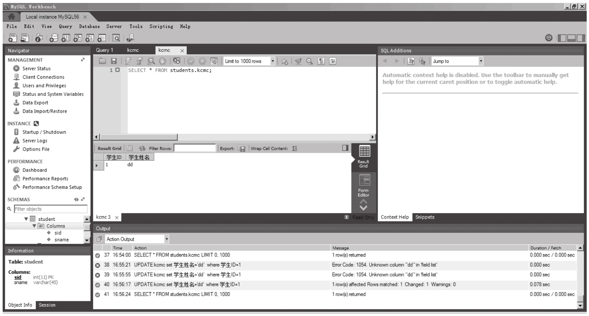
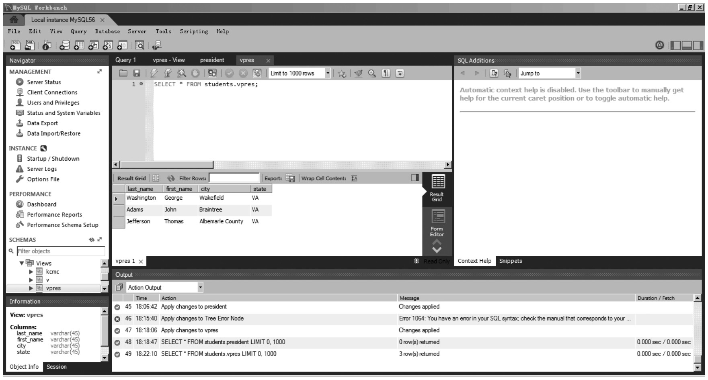
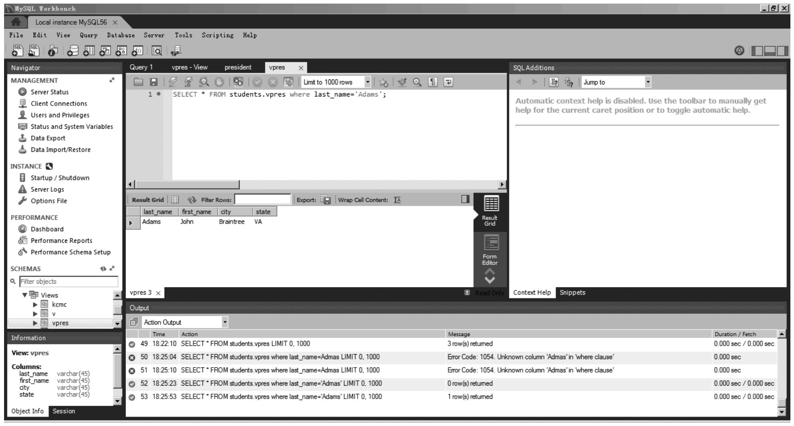
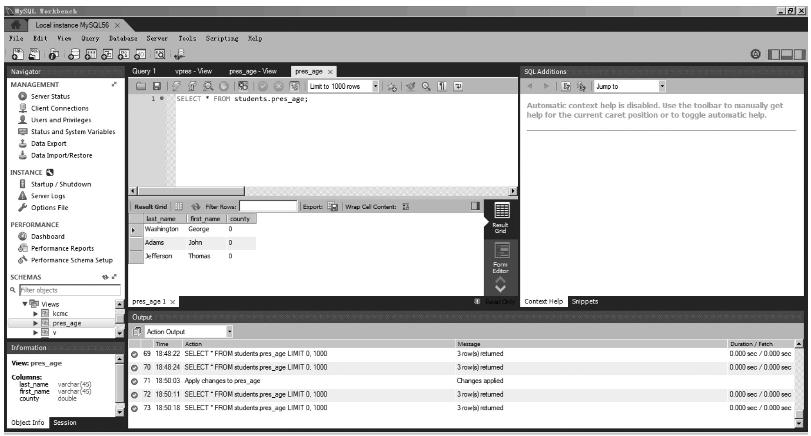
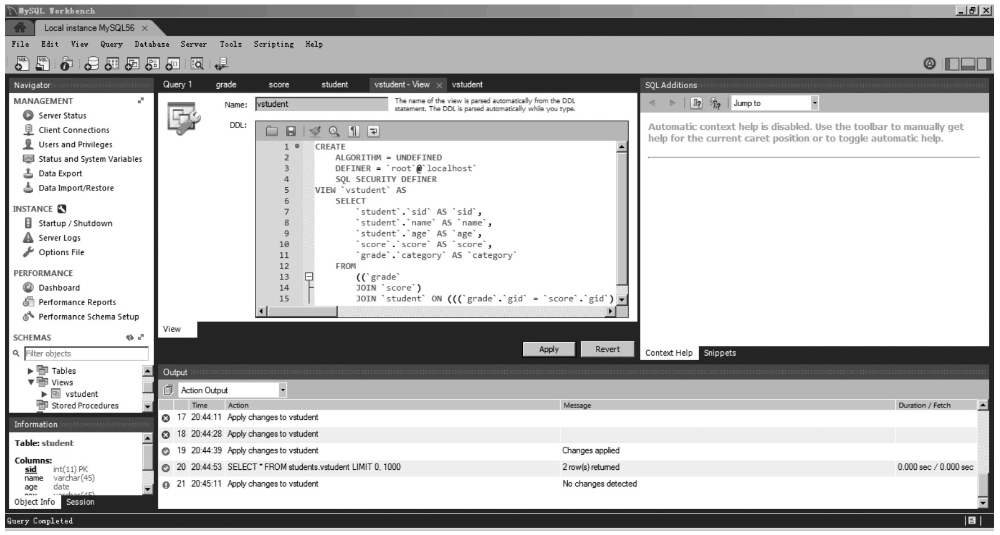
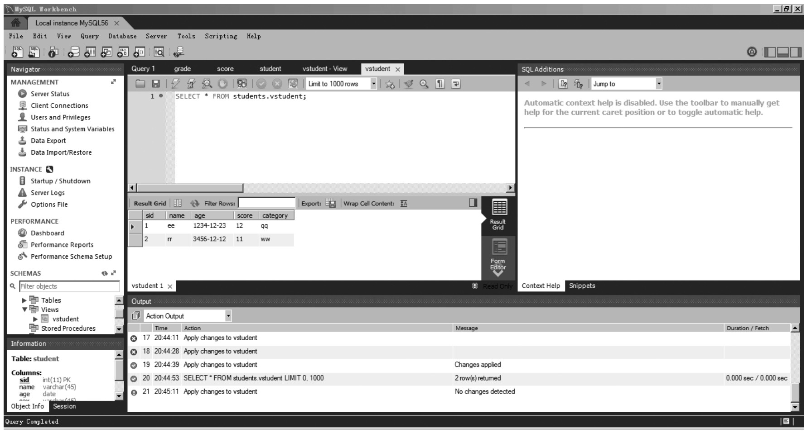
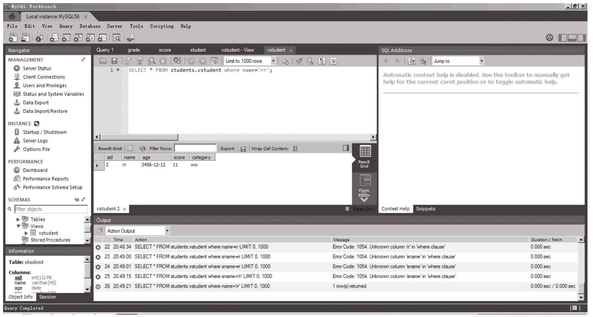

### 
  11.3 视图的使用

 本节视频教学录像：11分钟

视图被使用最多的地方就是查询，与普通数据表的SELECT查询没有太多区别，示例如下。

【范例11-8】

&#13;
    mysql>select * from kcmc;&#13;

因为视图是一种虚拟的数据表，它们的行为和数据表一样，但并不真正包含数据。它们是用底层（真正的）数据表或其他视图定义出来的“假”数据表，用来提供查看数据表数据的另一种方法，这通常可以简化应用程序。所以也可以使用SHOW TABLES的命令查找到该视图，并查看视图基本信息。

如果要选取某给定数据表的数据列的一个子集，把它定义为一个简单的视图是最方便的做法。

【范例11-9】

假设经常需要从 president 数据表选取 last_name、first_name、city 和 state 等几个数据列，但不想每次都必须写出所有这些数据列，如下所示。

&#13;
    SELECT last_name, first_name, city, state FROM president;&#13;

SELECT *的方法虽然简单，但用“*”检索出来的数据列不都是用户所想要的。解决这个矛盾的办法是定义一个视图，让它只包括用户所想要的数据列。

&#13;
    CREATE VIEW vpres AS&#13;
    SELECT last_name, first_name, city, state FROM president;&#13;

这个视图就像一个“窗口”，从中只能看到用户想看的数据列。这意味着用户可以在这个视图上使用SELECT *，而看到的将是用户自己在视图定义里给出的那些数据列。

&#13;
    mysql> SELECT * FROM vpres;&#13;
    +------------+---------------+---------------------+-------+&#13;
    | last_name | first_name | city | state |&#13;
    +------------+---------------+---------------------+-------+&#13;
    | Washington | George&#13;
    |Adams      |John&#13;
    |Jefferson  |Thomas&#13;
    |Madison    |James&#13;

如果用户在查询某个视图时还使用了一个 WHERE 子句，MySQL 将在执行该查询时把它添加到那个视图的定义上以进一步限制其检索结果。

&#13;
    mysql> SELECT * FROM vpres WHERE last_name = 'Adams';&#13;
    +-----------+-------------+-----------+-------+&#13;
    | last_name | first_name | city | state |&#13;
    +-----------+-------------+-----------+-------+&#13;
    | Adams | John | Braintree | MA |&#13;
    | Adams | John Quincy | Braintree | MA |&#13;
    +-----------+-------------+-----------+-------+&#13;

在查询视图时还可以使用 ORDER BY、LIMIT 等子句，其效果与查询一个真正的数据表时的情况 一样。在使用视图时，只能引用在该视图的定义里列出的数据列。也就是说，如果底层数据表里的某个数据列没在视图的定义里，在使用视图的时候就不能引用它。

&#13;
    mysql> SELECT * FROM vpres WHERE suffix <> '';&#13;
    ERROR 1054 (42S22): Unknown column 'suffix' in 'where clause'&#13;

在默认的情况下，视图里的数据列的名字与 SELECT 语句里列出的输出数据列相同。如果想明确地改用另外的数据列名字，需要在定义视图时在视图名字的后面用括号列出那些新名字。

&#13;
    mysql> CREATE VIEW vpres2 (ln, fn) AS&#13;
    -> SELECT last_name, first_name FROM president;&#13;

此后，当使用这个视图时，必须使用在括号里给出的数据列名字，而非 SELECT 语句里的名字。

&#13;
    mysql> SELECT last_name, first_name FROM vpres2;&#13;
    ERROR 1054(42S22)at line 1:Unknown column'last_name'in'field list'mysql>SELECT ln,fn FROM vpres2;&#13;
    +------------+---------------+&#13;
    | ln | fn |&#13;
    +------------+---------------+&#13;
    | Monroe | James |&#13;

视图可以用来自动完成必要的数学运算。

【范例11-10】

&#13;
    mysql> CREATE VIEW pres_age AS&#13;
    -> SELECT last_name, first_name, city, state,&#13;
    -> city+':'+state AS age&#13;
    -> FROM president;&#13;

这个视图包含一个 age 数据列，它被定义成一个运算，从这个视图选取该数据列将检索出这个运算的结果。

&#13;
    mysql> SELECT * FROM pres_age;&#13;

通过把年龄计算工作放到视图定义里完成，就用不着再在查询年龄值时写出那个公式了，有关的细节都隐藏在了视图里。同一个视图可以涉及多个数据表，这使得联结查询的编写和运行变得更容易。下面定义的视图对score、student 和 grade_event 数据表进行了联结查询。

【范例11-11】

&#13;
    mysql> CREATE VIEW vstudent AS&#13;
    -> SELECT student.sid, name, age, score, category&#13;
    -> FROM grade INNER JOIN score INNER JOIN student&#13;
    -> ON grade.gid = score.gid&#13;
    -> AND score.sid = student.sid;&#13;

当从这个视图选取数据时，MySQL 将执行相应的联结查询并从多个数据表返回信息。

&#13;
    mysql> SELECT * FROM vstudent;&#13;

这个视图可以轻而易举地根据名字检索出某个学生的考试成绩。

&#13;
    mysql> SELECT * FROM vstudent WHERE name = 'rr';&#13;

另外，查看视图的相关信息，还可以使用SHOW CREATE VIEW。

如果想要简单查看视图定义的结构，可以使用DESCRIBE命令。

