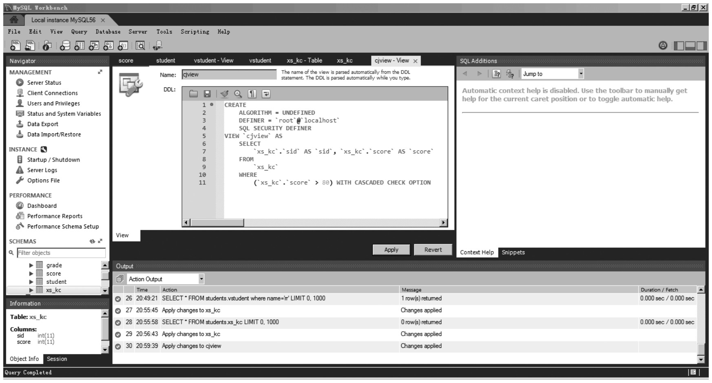
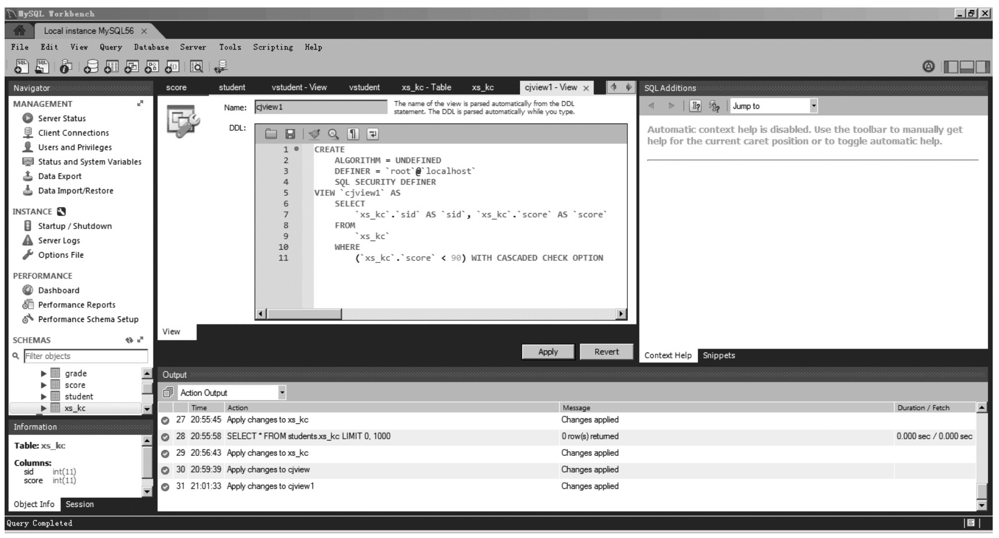
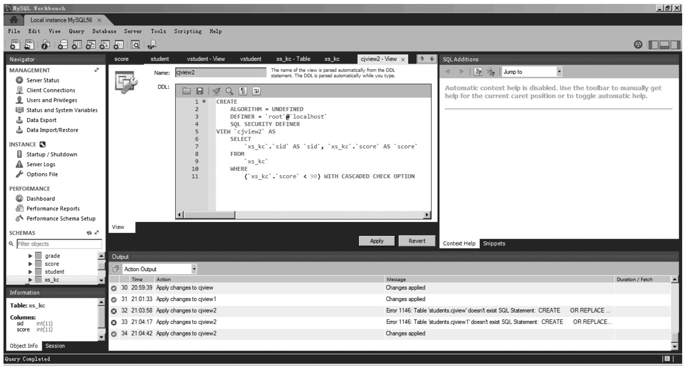
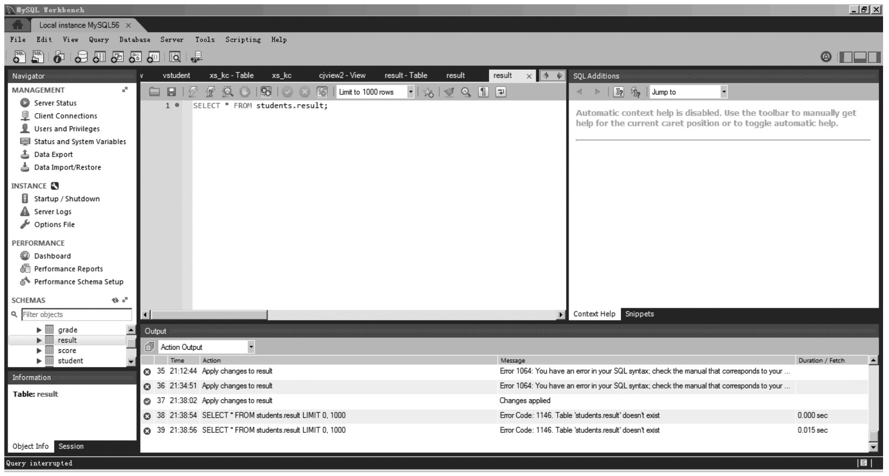
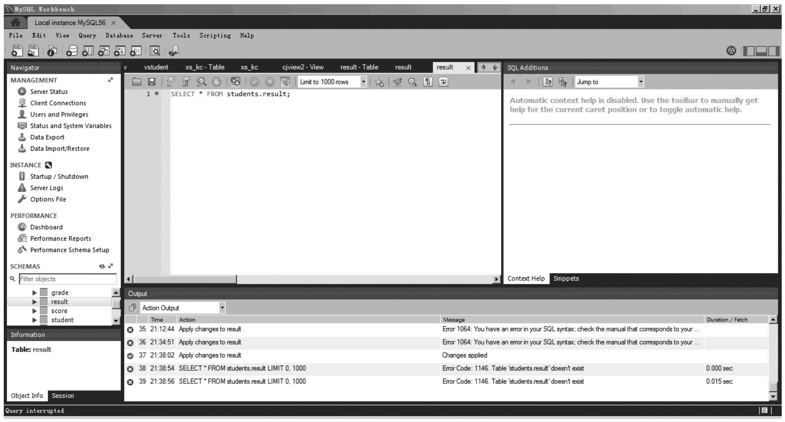

### 
  11.4 高手点拨

 本节视频教学录像：10分钟

创建视图时使用的WITH [CASCADED|LOCAL] CHECK OPTION参数决定了更新视图是否需要满足其他视图的条件。如果没有指定CASCADED或者是LOCAL，则默认是CASCADED。例如创建基于xs_kc的两层视图，分别赋予CASCADED和LOCAL参数，并进行更新操作。

【范例11-12】

首先创建的视图cjview、cjview1、cjview2，语句如下。

&#13;
    mysql>CREATE OR REPLACE VIEW cjview AS&#13;
    ->select * from xs_kc&#13;
    ->where score>80 WITH CHECK OPTION;&#13;
    Query OK, 0 rows affected (0.03 sec)&#13;

&#13;
    mysql>CREATE OR REPLACE VIEW cjview1 AS&#13;
    ->select * from cjview&#13;
    ->where score<90 WITH LOCAL CHECK OPTION;&#13;
    Query OK, 0 rows affected (0.03 sec)&#13;

&#13;
    mysql>CREATE OR REPLACE VIEW cjview2 AS&#13;
    ->select * from cjview&#13;
    ->where score<90 WITH CASCADED CHECK OPTION;&#13;
    Query OK, 0 rows affected (0.03 sec)&#13;

视图创建完毕后，分别对cjview1、cjview2进行UPDATE操作，更新操作将成绩设置为70。因为cjview1是WITH LOCAL CHECK OPTION，所以只要满足成绩<90即可更新，但是cjview2是WITH CASCADED CHECK OPTION，这个时候不仅仅满足成绩<90，还需要满足视图cjview的成绩>80的条件。所以更新会失败。运行结果如下。

&#13;
    mysql>update c jview2 set 成绩=60；&#13;
    ERROR 1369<HY000>:CHECK OPTION failed 'xscj.cjview2'&#13;
    Mysql>update cjview1 set 成绩=60；&#13;
    Query OK, 9 rows affected <0.05 sec>&#13;
    Rows matched: 9 changed: 9 Warnings: 0&#13;

另外一点需要说明的是，视图的定义有以下的限制。

⑴FROM子句中不能有子查询。

⑵SELECT不能指向系统或者用户的变量。

⑶SELECT不能指向PREPARED语法参数。

⑷定义中的表或视图必须存在。

⑸不能对临时表建视图，也不能建临时视图。

⑹视图定义中的表名必须已经存在。

⑺不能在触发器和视图之间建关联。

⑻ORDER BY可以用在视图定义中，但是如果访问视图的SELECT中使用的ORDER BY，则视图定义中的ORDER BY被忽略。

⑼对于临时表方式，会将视图的结果放置到临时表中，然后使用临时表执行SQL，这样的好处是在临时表建完之后，就会释放在原表上面的锁，这样可比MERGE方式更快地释放正在访问的表上的锁。

⑽对于UNDEFINED方式，是指由系统自己决定使用临时表方式还是MERGE方式，MERGER方式更高效，且临时表方式不能更新视图的数据。

⑾对于MERGE方式，实际上是把访问视图的SQL拼接到视图本身的SQL上面。要求视图的行和表的行之间是一一对应的，如果不存在这样的一一对应的关系，则会切换到临时表算法。包含以下关键字的SQL，不能使用merge方式。

①聚合函数（SUM，MIN，MAX，COUNT等）。

&#13;
    distinct&#13;
    group by&#13;
    having&#13;
    union或者union all&#13;

②常量视图。

另外，常规视图的纪录也是不能更新和删除的，不能更新和删除纪录的视图除了以上那些情况外，还包括以下情况。

●select中包含子查询。

&#13;
    join&#13;

●from一个不能更新的视图。

●from一个表的子查询。

●算法是临时表的视图。

如果视图还想要可以插入纪录，则必须满足以下条件。

⑴视图必须包含基表没有默认值的所有字段。

⑵视图列必须是简单的对应表的列，没有在上面进一步的处理。

需要注意的是，使用视图更新数据表时，视图并没有保存内容，只是引用数据。那么，更新视图，其实就是以引用的方式操作了真实表WITH CHECK OPTION，即对视图进行更新操作的时，需要检查更新后的值是否还是满足视图公式定义的条件。通俗点，就是所更新的结果是否还会在视图中存在。如果更新后的值不在视图范围内，就不允许更新；如果创建视图的时候，没有加上WITH CHECK OPTION，更新视图中的某项数据的话，MySQL并不会进行有效性检查，删掉了就删掉了。在视图中将看不到了。

另外，还有一个问题，就是使用有效性检查，实际意义是什么？不妨通过下面一个例子一起思考一下。

【范例11-13】

重新组织表的需求如下。

&#13;
    CREATE TABLE 'result' (`MATH_NO` INT(10) NOT NULL unsigned AUTO_INCREMENT PRIMARY KEY,'TEAMNO'INT(10)NOT NULL,&#13;
    'PLAYERNO' INT(10) NOT NULL,&#13;
    'WON' VARCHAR(10) NOT NULL,&#13;
    'LOST' VARCAHR(10) NOT NULL,&#13;
    'CAPTAIN' INT(10) NOT NULL COMMIT '就是PLAYERNO的另外名字',&#13;
    'DIVISION' VARCHAR(10) NOT NULL&#13;
    )ENGINE=MYISAM DEFAULT CHARSET=utf8 COMMIT='重新组的新表'AUTO_INCREMENT=1&#13;

针对每个表创建一个视图，将数据保存进去，语句如下。

&#13;
    CREATE VIEW teams(TEAMNO,PLAYERNO,DIVISION) AS SELECT  DISTINCT TEAMNO,CAPTAIN,DIVISION FROM result&#13;
    报错：#1050 - Table 'teams' already exists&#13;

说明：因为视图也是一种表，是虚拟表，不能与已有的表(视图)出现重名。

接下来，删掉表teams，再执行创建视图的代码。

通过上面例子，可以得出以下结论：将视图看成与表一样的东西，更加容易理解使用规则。下面的对比便于更好地理解。

⑴在使用视图的时候，就是与使用表的语法一样的。

⑵创建视图的时候，该视图的名字如果与已经存在的表重名的话，就会报错，不允许创建。视图就是一种特殊的表。

⑶创建视图的时候，可以这样使用CREATE VIEW teams(TEAMNO,PLAYERNO,DIVISION)，从而可以定义视图表的结构。

⑷在phpmyadmin中，左边的列表中将视图与表列在了一起。只有通过右侧的状态“View:teams”可以知道该表是视图表。

对于多表视图的可更新性有如下规定。

⑴首先必须是基于MERGE算法的表连接必须是内连接，视图中只有一个单表是可以被更新的。对于多表可更新视图，如果插入其中一个单表是可以的，删除记录是不允许的。

⑵WITH [CASCADED | LOCAL] CHECK OPTION决定了是否允许更新数据使记录不再满足视图的条件。

⑶这个选项和Oracle是类似的，LOCAL是只要满足本视图的条件就可以，CASCADE则是必须满足所有针对该表的所有视图的条件才行。如果没有明确是LOCAL还是CASCADE，则默认是CASCADE。

另外，视图在MySQL中的内部管理机制也值得一提，视图的记录都保存在information_schema数据库中的一个叫views的表中。具体某个视图的定义代码以及属于哪个数据库等信息可以从中看到理解视图的两种工作机制，语句如下。

&#13;
    select * from teams&#13;

针对上面语句，总结几个知识点。

⑴确认是视图的过程，teams也可以是表名。由于表与视图的物理机制不同。视图本身是不存储内容的。所以，在使用SQL的时候，MySQL辨别teams是一个视图还是表，是因为有一个查看目录的例程在做这件事。

⑵MySQL对处理视图的两种方法：替代方式和具体化方式。

①替换方式：视图名直接使用视图的公式替换掉了。针对上面视图teams，MySQL会使用该视图的公式进行替换，视图公式合并到了SELECT中。结果就是变成了如下SQL语句。

&#13;
    select*from(SELECT DISTINCT TEAMNO,CAPTAIN,DIVISION FROM result)&#13;

也就是最后提交给MySQL处理该SQL语句。

②具体化方式：MySQL先得到了视图执行的结果，该结果形成一个中间结果暂时存在内存中。之后，外面的SELECT语句就调用了这些中间结果(临时表)。

看起来都是要得到结果，形式上有区别，好像没体会到本质上的区别。两种方式又有什么样的不同呢？

替换方式将视图公式替换后，当成一个整体SQL进行处理了。具体化方式，先处理视图结果，后处理外面的查询需求。

替换方式可以总结为先准备，后执行。具体化方式总结理解为分开处理。哪种方式好？不知道。MySQL会自己确定使用哪种方式进行处理的。自己在定义视图的时候也可以指定使用何种方式。像以下这样使用。

&#13;
    CREATE ALGORITHM=merge VIEW teams as SELECT DISTINCT TEAMNO,CAPTAIN,DIVISION FROM result&#13;

ALGORITHM有3个参数分别是MERGE、TEMPTABLE、UNDEFINED。

有些书中提到，替换与具体化的方式的各自适用之处，可以这样理解：因为临时表中的数据不可更新。所以，如果使用参数是TEMPTABLE，无法进行更新。当参数定义是UNDEFINED(没有定义ALGORITHM参数)。MySQL更倾向于选择合并方式，是因为这种方式更加有效。

最后，额外提一下MySQL中的视图及性能问题。

视图是MySQL 5.0中增加的三大新功能之一（另外两个是存储过程与触发器），也是一般稍微“高级”一点的数据库所必需要有的功能。MySQL在定义视图上没什么限制，基本上所有的查询都可定义为视图，并且也支持可更新视图（当然只有在视图和行列与基础表的行列之间存在一一对应关系时才能更新），因此从功能上说MySQL的视图功能已经很完善了。

然而若要在应用中使用视图，还需要了解处理视图时的性能，而MySQL在这方面问题是比较大的，需要特别注意。首先要知道MySQL在处理视图时有两种算法，分别称为MERGE和TEMPTABLE。在执行“CREATE VIEW”语句时可以指定使用哪种算法。所谓MERGE是指在处理涉及到视图的操作时，将对视图的操作根据视图的定义进行展开，有点类似于C语言中的宏展开。

【范例11-14】

&#13;
    CREATE TABLE 'result' (&#13;
   'id' int(11) NOT NULL,&#13;
   'user_id' int(11) default NULL,&#13;
   'content' varchar(255) default NULL,&#13;
   PRIMARY KEY ('id'),&#13;
   KEY 'idx_comment_uid' ('user_id')&#13;
    ) ENGINE=InnoDB;&#13;

假设user_id < 10000的用户为VIP用户，可以创建一个视图来表示VIP用户的评论，语句如下。

&#13;
    CREATE VIEW vip_comment AS SELECT * FROM result WHERE user_id < 10000;&#13;

这时在操作vip_comment视图时使用的就是MERGE算法，语句如下。

&#13;
    mysql > EXPLAIN EXTENDED SELECT count(*) FROM vip_comment WHERE user_id < 0;&#13;
    +----+-------------+---------+-------+-----------------+-----------------+---------+------+------+--------------------------+&#13;
    |id|select_type|table |type |possible_keys |key|key_len|ref |rows|Extra&#13;
    +----+-------------+---------+-------+-----------------+-----------------+---------+------+------+--------------------------+&#13;
    | 1 | SIMPLE | comment | range | idx_comment_uid | idx_comment_uid | 5 | NULL |  10 | Using where;Using index|&#13;
    +----+-------------+---------+-------+-----------------+-----------------+---------+------+------+--------------------------+&#13;
    mysql> show warnings;&#13;
    +-------+------+------------------------------------------------------------------------------------------------------------------+&#13;
    |Level|Code|Message&#13;
    +-------+------+------------------------------------------------------------------------------------------------------------------+&#13;
    |Note |1003|select count(0)AS'count(*)'from'test'.'comment'where(('test'.'comment'.'user_id'<0)&#13;
    and ('test'.'comment'.'user_id' < 10000)) |&#13;
        +-------+------+------------------------------------------------------------------------------------------------------------------+&#13;

可以看到，对vip_comment的操作已经被扩展为对comment表的操作。

一般来说，在能够使用MERGE算法的时候MySQL处理视图上没什么性能问题，但并非在任何时候都能使用MERGE算法。事实上，只要视图的定义稍稍有点复杂，MySQL就没办法使用MERGE算法了。准确的说，只要视图定义中使用了某些SQL构造块就无法使用MERGE算法，例如包含聚合函数之类的（前面已提及）。

确实，在视图定义比较复杂的情况下，要对视图操作进行有效的优化是非常困难的。因此在这个时候，MySQL使用了一种以不变应万变的方法，即先执行视图定义，将其结果使用临时表保存起来，这样后续对视图的操作就转化为对临时表的操作。不能不说单从软件设计的角度看，这样的方法非常优雅，然而从性能角度，这一方法也非常差。

比如用户希望使用如下的视图来表示每个用户的评论数。

&#13;
    CREATE VIEW comment_count AS SELECT user_id, count(*) AS count FROM comment GROUP BY user_id;&#13;

使用这个视图的时候，我们可能心里有个小算盘。目前我们先用这个视图顶着，如果性能确实有问题，那我们就再做一张comment_count的表，其中就记下来每个用户的评论数。而我们现在先用这个视图是为了将来要是改的话会方便点（这也是视图，即教科书中所谓的外模式，存在的主要原因之一，另一主要原因是便于权限控制）。但是遇到了MySQL，我们的算盘铁定会失败。

来看一下指定user_id从comment_count选取记录时的执行策略。

【范例11-15】

&#13;
    mysql> explain select count(*) from comment_count where user_id = 90;&#13;
    +----+-------------+------------+-------+---------------+-----------------+---------+------+--------+-------------+&#13;
    |id|select_type|table   |type |possible_keys|key      |key_len|ref |rows |Extra   |&#13;
    +----+-------------+------------+-------+---------------+-----------------+---------+------+--------+-------------+&#13;
    | 1|PRIMARY   |<derived2>|ALL  |NULL      |NULL       |NULL  |NULL|  101|Using where|&#13;
    | 2|DERIVED   |comment  |index|NULL     |idx_comment_uid|5    |NULL|524833|Using index|&#13;
    +----+-------------+------------+-------+---------------+-----------------+---------+------+--------+-------------+&#13;
    2 rows in set (4.18 sec)&#13;

可以看出，MySQL首先是先执行comment_count的视图定义，将结果存储在临时表中（即DERIVED），然后再扫描这一临时表，选择出满足“user_id = 90”的那一条记录。这样，虽然最终只需要统计90号用户的评论数，并且comment表的user_id字段上也有索引，MySQL也会扫描整个comment表，并按user_id分组计算出所有用户的评论数。一般来说，这会使系统崩溃。这里面还要注意的是即使在进行EXPLAIN时，视图的物化也是要先执行的，因此若评论很多的话EXPLAIN也一样会很慢。

这个问题的根源是MySQL的查询优化本来就存在很多问题。对于上述的查询，要达到比较好的优化效果在数据库中一般是如下处理的。

⑴将对视图的操作转化为FROM子句中的子查询。

&#13;
    select * from (select user_id, count(*) as count from comment group by user_id) as comment_count where user_id=90;&#13;

⑵子查询提升。因为子查询中使用了GROUP BY，因此先将外面的条件作为提升后的HAVING条件。

&#13;
    select user_id, count(*) as count from comment group by user_id having user_id = 90;&#13;

⑶由于HAVING条件中不涉及聚集函数，转化为WHERE条件。

&#13;
    select user_id, count(*) as count from comment where user_id = 90 group by user_id;&#13;

⑷由于指定WHERE条件后，user_id已经是一个常数，根据常数GROUP BY没意义，因此去掉GROUP BY。

&#13;
    select user_id, count(*) as count from comment where user_id = 90;&#13;

一般从概念上要经过这四步转化，才能得到最后的优化语句。除第4步无法根据EXPLAIN输出和查询性能判断出MySQL是否进行这一优化外，前3类优化MySQL都不会进行。因此，MySQL要能够有效地处理上述查询还有很长的路要走。

相对来说PostgreSQL的查询优化能力就强得多，上面的查询在PostgreSQL中就能够产生上述优化后的最终执行计划。PostgreSQL比较关注查询优化估计与PostgreSQL的学院派风格或PostgreSQL中的Rule System有关。

