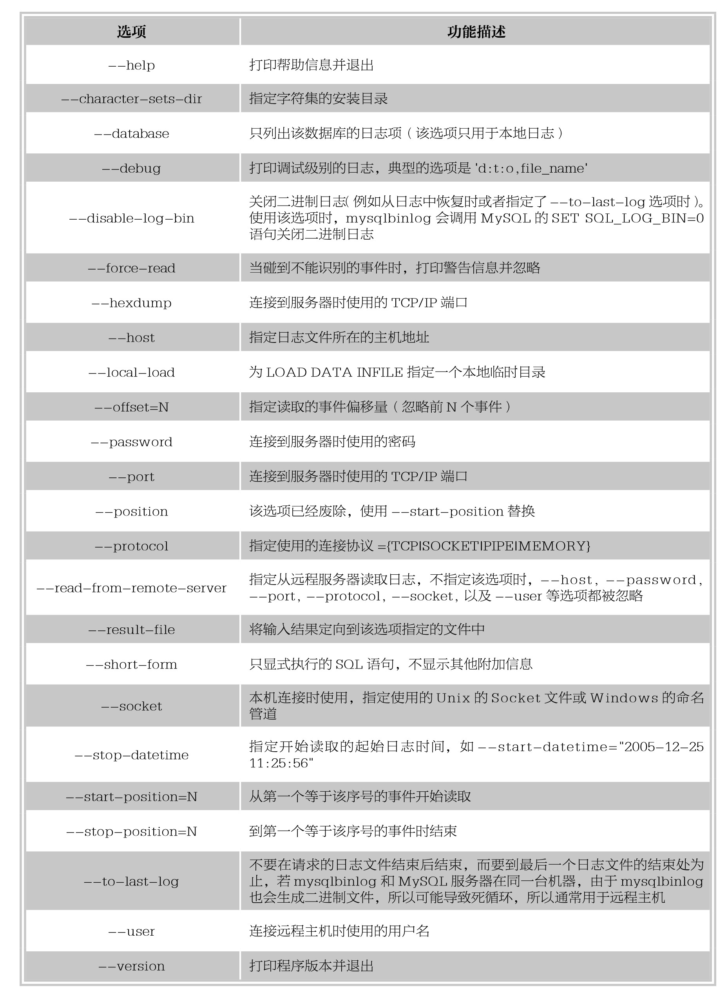

#### 
  12.1.4 各种备份与恢复方法的具体实现

⑴利用SELECT INTO OUTFILE实现数据的备份与还原。

①把需要备份的数据备份出来。

复制代码如下。

&#13;
    mysql>use hellodb;  //打开hellodb库&#13;
    mysql>select*from students;//查看students的属性&#13;
    mysql>select*from students where Age>30 into outfile‘/tmp/stud.txt';  //将年龄大于30的同学的信息备份出来&#13;

提示 
 备份的目录路径必须让当前运行MySQL服务器的用户mysql具有访问权限，备份完成之后需要把备份的文件从tmp目录复制走，要不就失去备份的目的了。回到tmp目录下查看刚才备份的文件。

&#13;
    [root@www～]# cd /tmp&#13;
    [root@www tmp]# cat stud.txt&#13;
    3Xie Yanke53M216&#13;
    4Ding Dian32M44&#13;
    6Shi Qing46M5\N&#13;
    13Tian Boguang33M2\N&#13;
    25Sun Dasheng100M\N\N&#13;
    [root@www tmp]#&#13;

会发现是个文本文件。所以不能直接导入数据库了。需要使用LOAD DATA INFILE恢复回到MySQL服务器端，删除年龄大于30的用户，模拟数据被破坏，代码如下。

&#13;
    mysql> delete from students where Age > 30;&#13;
    mysql> load data infile '/tmp/stud.txt' into table students;&#13;

②利用mysqldump工具对数据进行备份和还原。

mysqldump 常用来做温备，所以首先需要对想备份的数据施加读锁。

⑵施加读锁的方式。

①直接在备份的时候添加选项。

●lock-all-tables 是对要备份的数据库的所有表施加读锁。

●lock-table 仅对单张表施加读锁，即使是备份整个数据库，它也是在备份某张表的时候才对该表施加读锁，因此适用于备份单张表。

②在服务器端书写命令，代码如下。

&#13;
    mysql> flush tables with read lock; 施加锁，表示把位于内存上的表统统都同步到磁盘上去，然后施加读锁&#13;
    mysql> flush tables with read lock;释放读锁&#13;

但这对于InnoDB存储引擎来讲，虽然也能够请求到读锁，但是不代表它的所有数据都已经同步到磁盘上，因此当面对InnoDB的时候，要使用“mysql→ show engine innodb status;” 看看InnoDB所有的数据都已经同步到磁盘上，才进行备份操作。

⑶备份的策略：完全备份+增量备份+二进制日志。

演示备份的过程如下。

①先给数据库做完全备份。

复制代码如下。

&#13;
    [root@www～]# mysqldump -uroot --single-transaction --master-data=2 --databases hellodb > /backup/hellodb_`date+%F`.sql&#13;

--single-transaction: 基于此选项能实现热备InnoDB表，因此，不需要同时使用--lock-all-tables；

--master-data=2：记录备份那一时刻的二进制日志的位置，并且注释掉，1是不注释的；

--databases hellodb：指定备份的数据库。

然后回到MySQL服务器端。

②回到MySQL服务器端更新数据。

复制代码如下。

&#13;
    mysql> create table tb1(id int); 创建表&#13;
    mysql>insert into tb1 values(1),(2),(3); 插入数据，这里只做演示，随便插入了几个数据&#13;

③先查看完全备份文件里边记录的位置。

复制代码如下。

&#13;
    [root@www backup]# cat hellodb_2013-09-08.sql | less&#13;
    --CHANGE MASTER TO MASTER_LOG_FILE='mysql-bin.000013',MASTER_LOG_POS=15684;记录了二进制日志的位置&#13;

④在回到服务器端。

复制代码如下。

&#13;
    mysql> show master status; 显示此时的二进制日志的位置，从备份文件里边记录的位置到我们此时的位置，即为增量的部分&#13;
    +------------------+----------+--------------+------------------+&#13;
    |File      |Position|Binlog_Do_DB|Binlog_Ignore_DB|&#13;
    +------------------+----------+--------------+------------------+&#13;
    |mysql-bin.000004|   15982|       |         |&#13;
    +------------------+----------+--------------+------------------+&#13;

⑤做增量备份。

复制代码如下。

&#13;
    [root@www backup]# mysqlbinlog --start-position=15694 --stop-position=15982&#13;
    /mydata/data/mysql-bin.000013 > /backup/hellodb_'date +$F_%H'.sql&#13;

⑥再回到服务器。

复制代码如下。

&#13;
    mysql> insert into tb1 values (4),(5); 再插入一些数值&#13;
    mysql>drop database hellodb; 删除hellodb库&#13;

⑦导出这次的二进制日志。

复制代码如下。

&#13;
    [root@www backup]#mysqlbinlog--start-position=15982/mydata/data/mysql-bin.000013查看删除操作时二进制日志的位置&#13;
    [root@www backup]#mysqlbinlog--start-position=15982--stop-position=16176/mydata/data/mysql-bin.000013>/tmp/hellodb.sql //导出二进制日志&#13;

⑧先让MySQL离线。

回到服务器端，复制代码如下。

&#13;
    mysql>set sql_log_bin=0; 关闭二进制日志&#13;
    mysql> flush logs; 滚动下日志&#13;

⑨模拟数据库损坏。

复制代码如下。

&#13;
    mysql> drop database hellodb;&#13;

⑩开始恢复数据。

复制代码如下。

&#13;
    [root@www]#mysql</backup/hellodb_2013-09-08.sql //导入完全备份文件&#13;
    [root@www ]# mysql < /backup/hellodb_2013-09-08_05.sql //导入增量备份文件&#13;
    [root@www ]# mysql< hellodb.sql //导入二进制文件&#13;

验证完成，显示结果为所预想的那样。

提示 
 ⑴真正在生产环境中，应该导出的是整个MySQL服务器中的数据，而不是单个库，因此应该使用-- all- databases。 
 ⑵在导出二进制日志的时候，可以直接复制文件即可，但是要注意的是，备份之前滚动下日志。 
 ⑶利用LVM快照实现几乎热备的数据备份与恢复。

⑷策略。完全备份+二进制日志。

①准备。

注：事务日志必须跟数据文件在同一个LVM上。

②创建lvm

Lvm的创建这里不再详述，想了解可单击http://www.jb51.net/LINUXjishu/105937.html。

③修改MySQL主配置文件存放目录内的文件的权限与属主属组，并初始化MySQL。

复制代码如下。

&#13;
    [root@www～]#mkdir/mydata/data      //创建数据目录&#13;
    [root@www～]#chown mysql:mysql/mydata/data //改属组属主&#13;
    [root@www～]#&#13;
    [root@www～]#cd/usr/local/mysql/  //必须站在此目录下&#13;
    [root@www mysql]#scripts/mysql_install_db--user=mysql--datadir=/mydata/data //初始化mysql&#13;

④修改配置文件。

复制代码如下。

&#13;
    vim /etc/my.cof&#13;
    datadir=/mydata/data 添加数据目录&#13;
    sync_binlog=1 开启此功能&#13;

⑤启动服务。

复制代码如下。

&#13;
    [root@www mysql]# service mysqld start&#13;
    mysql>set session sql_log_bin=0; 关闭二进制日志&#13;
    mysql>source/backup/all_db_2013-09-08.sql 读取备份文件&#13;

⑥回到MySQL服务器。

复制代码如下。

&#13;
    mysql> FLUSH TABLES WITH READ LOCK; 请求读锁&#13;
    注：不要退出，另起一个终端：&#13;
    mysql>SHOW MASTER STATUS;     查看二进制文件的位置&#13;
    +------------------+----------+--------------+------------------+&#13;
    |File      |Position|Binlog_Do_DB|Binlog_Ignore_DB|&#13;
    +------------------+----------+--------------+------------------+&#13;
    |mysql-bin.000004|   107|       |         |&#13;
    +------------------+----------+--------------+------------------+&#13;
    1 row in set (0.00 sec)&#13;
    mysql>FLUSH LOGS; 建议滚动下日志。这样备份日志的时候就会很方便了&#13;

⑦导出二进制文件，创建个目录单独存放。

复制代码如下。

&#13;
    [root@www～]# mkdir /backup/limian&#13;
    [root@www～]# mysql -e 'show master status;' > /backup/limian/binlog.txt&#13;
    [root@www～]#&#13;

⑧为数据所在的卷创建快照。

复制代码如下。

&#13;
    [root@www～]# lvcreate -L 100M -s -p r -n mysql_snap /dev/myvg/mydata&#13;

回到服务器端，释放读锁，复制代码如下。

&#13;
    mysql> UNLOCK TABLES;&#13;
    [root@www～]# mount /dev/myvg/mysql_snap /mnt/data&#13;
    [root@www data]# cp * /backup/limian/&#13;
    [root@www data]#lvremove /dev/myvg/mylv_snap&#13;

⑨更新数据库的数据，并删除数据目录先的数据文件，模拟数据库损坏。

复制代码如下。

&#13;
    mysql> create table limiantb(id int,name CHAR(10));&#13;
    mysql> insert into limiantb values (1,'tom');&#13;
    [root@www data]# mysqlbinlog --start-position=187 mysql-bin.000003 > /backup/limian/binlog.sql&#13;
    [root@www backup]# cd /mydata/data/&#13;
    [root@www data]# rm-rf*&#13;
    [root@www～]# cp -a /backup/limian/* /mydata/data/&#13;
    [root@www data]# chown mysql:mysql *&#13;

⑩测试。

启动服务，代码如下。

&#13;
    [root@www data]# service mysqld start&#13;
    [root@www data]# mysql 登录测试&#13;
    mysql> SHOW DATABASES;&#13;
    mysql> SET sql_log_bin=0&#13;
    mysql> source/backup/limian/binlog.sql; #二进制恢复&#13;
    mysql>SHOW TABLES;    #查看恢复结果&#13;
    mysql>SET sql_log_bin=1; #开启二进制日志&#13;

技巧 
 此方式实现了接近于热备的方式备份数据文件，而且数据文件放在LVM中可以根据数据的大小灵活改变lVM的大小，备份的方式也很简单。

最后，需要详细说一下基于Xtrabackup做备份恢复。

官方站点：www.percona.com

优势如下。

①快速可靠地进行完全备份。

②在备份的过程中不会影响到事务。

③支持数据流、网络传输、压缩，所以它可以有效地节约磁盘资源和网络带宽。

⑸可以自动备份校验数据的可用性。

安装Xtrabackup，代码如下。

&#13;
    [root@www～]# rpm -ivh percona-xtrabackup-2.1.4-656.rhel6.i686.rpm&#13;

其最新版的软件可从 http://www.percona.com/software/percona-xtrabackup/ 获得。注意：在备份数据库的时候，应该具有权限，但需要注意的是应该给备份数据库时的用户最小的权限，以保证安全性。

使用Xtrabackup的前提：应该确定采用的是单表一个表空间，否则不支持单表的备份与恢复。在配置文件里边的mysqld段加上。

&#13;
    innodb_file_per_table = 1&#13;

Xtrabackup的备份策略为：完全备份+增量备份+二进制日志。

准备个目录用于存放备份数据，代码如下。

&#13;
    [root@www～]# makdir /innobackup&#13;

做完全备份，代码如下。

&#13;
    [root@www～]# innobackupex --user=root --password=mypass /innobackup/&#13;

这一步的操作中需要注意几点如下。

①只要在最后一行显示 innobackupex: completed OK!，就说明备份是正确的。

②另外要注意的是每次备份之后，会自动在数据目录下创建一个以当前时间点命名的目录用于存放备份的数据，代码如下。

&#13;
    [root@www 2013-09-12_11-03-04]# ls&#13;
    backup-my.cnf ibdata1 performance_schema xtrabackup_binary xtrabackup_checkpoints&#13;
    hellodb mysql test xtrabackup_binlog_info xtrabackup_logfile&#13;
    [root@www 2013-09-12_11-03-04]#&#13;

xtrabackup_checkpoints ：备份类型、备份状态和LSN(日志序列号)范围信息。

xtrabackup_binlog_info ：MySQL服务器当前正在使用的二进制日志文件及至备份这一刻为止二进制日志事件的位置。

xtrabackup_logfile ：非文本文件，Xtrabackup自己的日志文件。

xtrabackup_binlog_pos_innodb ：二进制日志文件及用于InnoDB或XtraDB表的二进制日志文件的当前位置。

backup-my.cnf ：备份时数据文件中关于MySQLD的配置。

回到MySQL服务器端对数据进行更新操作，代码如下。

&#13;
    mysql> use hellodb;&#13;
    mysql> delete from students where StuID>=24;&#13;

Xtrabackup的增量备份，代码如下。

&#13;
    innobackupex--user=root--password=mypass--incremental/innobackup/--incremental-basedir=/inn obackup/2013-09-12_11-03-04/&#13;

--incremental：指定备份类型。

--incremental-basedir=：指定这次增量备份是基于哪一次备份的，这里是完全备份文件,这样可以把增量备份的数据合并到完全备份中去。

用如下方法进行第二次增量，先去修改数据，代码如下。

&#13;
    mysql> insert into students (Name,Age,Gender,ClassID,TeacherID) values ('tom',33,'M',2,4);&#13;
    innobackupex --user=root --password=mypass --incremental /innobackup/ --incremental-basedir=/in nobackup/2013-09-12_11-37-01/&#13;

这里只需要把最后的目录改为第一次增量备份的数据目录即可。

最后一次对数据更改但是没做增量备份，代码如下。

&#13;
    mysql> delete from coc where id=14;&#13;

把二进制日志文件备份出来，(因为最后一次修改，没做增量备份，要依赖二进制日志做时间点恢复)，代码如下。

&#13;
    [root@www data]# cp mysql-bin.000003 /tmp/&#13;

模拟数据库崩溃，代码如下。

&#13;
    [root@www data]# service mysqld stop&#13;
    [root@www data]# rm -rf *&#13;

恢复前准备如下。

①对完全备份做数据同步，代码如下。

&#13;
    [root@www～]# innobackupex --apply-log --redo-only /innobackup/2013-09-12_11-03-04/&#13;

②对第一次增量做数据同步，代码如下。

&#13;
    innobackupex --apply-log --redo-only /innobackup/2013-09-12_11-03-04/ --incremental-basedir=/innobackup/2013-09-12_11-37-01/&#13;

③对第二次增量做数据同步，代码如下。

&#13;
    innobackupex --apply-log --redo-only /innobackup/2013-09-12_11-03-04/ --incremental-basedir=/inn obackup/2013-09-12_11-45-53/&#13;

--apply-log 的意义在于把备份时没做错的事务撤销，已经做错的但还在事务日志中的应用到数据库。

需要注意的是，对于Xtrabackup来讲，它是基于事务日志和数据文件备份的，备份的数据中可能会包含尚未提交的事务或已经提交但尚未同步至数据库文件中的事务，还应该对其做预处理，把已提交的事务同步到数据文件，未提交的事务要回滚。因此其备份的数据库，不能立即拿来恢复。

预处理的过程如下。

首先，对完全备份文件只把已提交的事务同步至数据文件，要注意的是有增量的时候，不能对事务做数据回滚，不然增量备份就没有效果了。

然后，把第一次的增量备份合并到完全备份文件内，以此类推，把后几次的增量都合并到前一次合并之后的文件中，这样只要拿着完全备份+二进制日志，就可以做时间点恢复。

数据恢复，代码如下。

&#13;
    [root@www～]# service mysqld stop&#13;
    [root@www data]#rm-rf* 模拟数据库崩溃&#13;
    [root@www～]# innobackupex --copy-back /innobackup/2013-09-12_11-03-04/&#13;

--copy-back数据库恢复，后面跟上备份目录的位置。

检测，代码如下。

&#13;
    [root@www～]# cd /mydata/data/&#13;
    [root@www data]# chown mysql:mysql *&#13;
    [root@www data]#service mysqld start&#13;

另外，需要值得一提的是，mysqldump 无法实现不完全恢复，有点像Oracle的没开归档模式。另一种把库所在的目录打个包，类似于Oracle归档的一种，开启二进制日志，可以实现不完全恢复，恢复到任意时间点。

&#13;
    vi /etc/my.cnf&#13;
    log-bin=binary-log&#13;

重启MySQL数据库，然后在/var/lib/mysql目录下就可以看到二进制日志binary-log.000001my.cnf记载了 MySQL数据的存放位置。

总结：也就是说mysqlbinlog是一种辅助，如果需要不完全恢复，则需要借助mysqlbinlog来恢复。

mysqldump备份整个数据库，代码如下。

&#13;
    mysqldump -u root -ppassword databasename >data.sql&#13;
    //输入root密码即可&#13;

例如：在命令行输入如下代码。

&#13;
    mysqldump -uroot -p123456 bugs>data.sql&#13;

备份某个或多个表，代码如下。

&#13;
    mysqldump -u root -p databasename table1name table2name >data.sql&#13;
    //输入root密码即可&#13;

只备份数据结构，代码如下。

&#13;
    mysqldump -u root -p databasename –no-data >data.sql（未必好用，需要验证）//输入root密码即可&#13;

恢复代码如下。

&#13;
    mysql -u root -p –database=databasename&#13;
    //输入root密码即可&#13;

导入数据库常用source 命令，进入MySQL数据库控制台，如mysql -u root–p。

&#13;
    mysql>use 数据库&#13;

然后使用source命令，后面参数为脚本文件（如这里用到的.sql）。

&#13;
    mysql>source d:\wcnc_db.sql&#13;

经过验证此种方法可以恢复某个数据库里的所有数据和某些表。

MySQL提供了mysqlbinlog命令来查看日志文件，如mysqlbinlog xxx-bin.001 | more。在记录每条变更日志的时候，日志文件都会把当前时间给记录下来，以便进行数据库恢复。

关于日志文件的停用，可以使用SET SQL_LOG_BIN=0命令停止使用日志文件，然后可以通过SET SQL_LOG_BIN=1命令来启用。

如果遇到灾难事件，应该用最近一次制作的完整备份恢复数据库，然后使用备份之后的日志文件把数据库恢复到最接近现在的可用状态。

使用日志进行恢复时需要依次进行，即最早生成的日志文件要最先恢复。

&#13;
    mysqlbinlog xxx-bin.00001 | mysql –u root –p&#13;
    mysqlbinlog xxx-bin.00002 | mysql –u root –p&#13;

mysqlbinlog的输出是可重复执行的，可以直接作为MySQL程序的输入，若服务器崩溃后，可以利用mysqlbinlog的这个功能对二进制日志进行恢复，如mysqlbinlog binlog.000001 | mysql。此外，也可以将mysqlbinlog的输出重定向到一个文件中，删除不需要的SQL后再交给MySQL去执行。需要注意的是，在恢复过程中，不要将多个日志文件同时交给不同的MySQL客户端执行，因为恢复时需要保持二进制日志中的SQL语句的执行顺序。下边是一种可选的方式：mysqlbinlog binlog.000001 binlog.000002 | mysql，或者将多个二进制文件拷贝到单个文件再执行。

此外，mysqlbinlog还提供了读取远程机器的二进制日志的功能，其用法比较简单，只需要指定--read-from-remote-server选项即可，当然，远程主机的连接信息也是必要的，包括--host、--password、 --port、--protocol、--socket以及 –user等。

下边是一个二进制文件的打印示例。

&#13;
    # at 4&#13;
    #070813 14:16:36 server id 1 log_pos 4   Query thread_id=2  exec_time=0  error_code=0&#13;
    use config_center3;&#13;
    SET TIMESTAMP=1186985796;&#13;
    UPDATE t_client_info SET f_sync = 1, f_version=13, f WHERE f_ip_addr = '192.168.64.49';&#13;

上述输出包括如下要素：

●Position：位于文件中的位置，即第一行的“#at 4”和第二行的“log_pos 4”，说明该事件记录从文件第4字节开始。

●Timestamp：事件发生的时间戳，即第二行的“#070813 14:16:36”

●Exec_time：事件执行花费的时间。

●Error_code：错误码。

●Type：事件类型。

mysql通过C++的类来描述事件的基本类型 log event，在这里我们可以通过mysql源码的log_event.cc来详细了解 各种各样的event事件类型。log event是一个描述事件的基本类型，更加细致的log event 组成了基本的log event，即log event是可派生的，并派生处了一些描述事件信息更详细的子事件类型。比如row event就是一个母事件类型。在mysql源码中是通过一系列枚举整数值来描述各个事件的，如下所示：

&#13;
    enum Log_event_type {&#13;
   UNKNOWN_EVENT= 0,&#13;
   START_EVENT_V3= 1,&#13;
   QUERY_EVENT= 2,&#13;
   STOP_EVENT= 3,&#13;
   ROTATE_EVENT= 4,&#13;
   INTVAR_EVENT= 5,&#13;
   LOAD_EVENT= 6,&#13;
   SLAVE_EVENT= 7,&#13;
   CREATE_FILE_EVENT= 8,&#13;
   APPEND_BLOCK_EVENT= 9,&#13;
   EXEC_LOAD_EVENT= 10,&#13;
   DELETE_FILE_EVENT= 11,&#13;
   NEW_LOAD_EVENT= 12,&#13;
   RAND_EVENT= 13,&#13;
   USER_VAR_EVENT= 14,&#13;
   FORMAT_DESCRIPTION_EVENT= 15,&#13;
   XID_EVENT= 16,&#13;
   BEGIN_LOAD_QUERY_EVENT= 17,&#13;
   EXECUTE_LOAD_QUERY_EVENT= 18,&#13;
   TABLE_MAP_EVENT = 19,&#13;
   PRE_GA_WRITE_ROWS_EVENT = 20,&#13;
   PRE_GA_UPDATE_ROWS_EVENT = 21,&#13;

