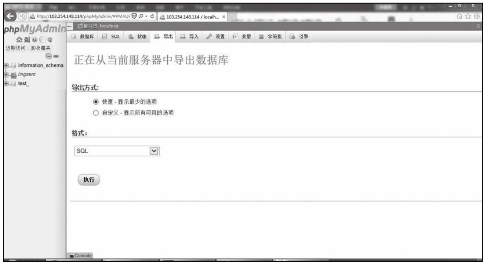
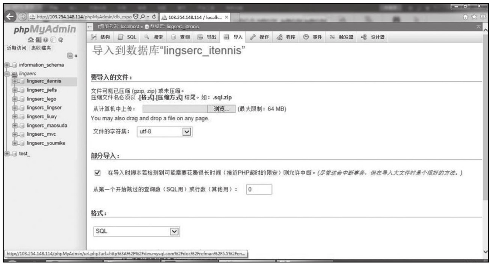
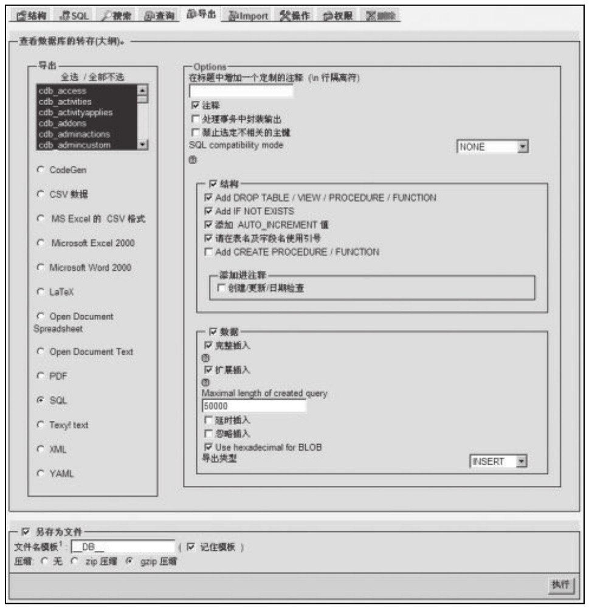

### 
  12.2 通过phpMyAdmin实现备份和恢复

 本节视频教学录像：6分钟

前面第3章已经介绍了数据库MySQL的管理工具phpMyAdmin，数据库管理员可以通过Web控制和操作数据库。其功能非常全面，包括数据库管理、数据对象管理、用户管理、数据备份恢复、数据库管理、数据管理等，因此成为众多数据库管理员维护数据库的首选工具。下面详细介绍数据的备份和恢复。

phpMyAdmin提供的数据库备份恢复是通过导入导出功能来实现的，支持导出成CSV、Excel、SQL等多种格式，SQL兼容性允许导出其他数据库语法的SQL语句，支持的数据库包括Oracle、DB2、SQL Server等，为数据在异构数据库之间的迁移提供了便利。进入phpMyAdmin网页管理界面后选择“导出”按钮后，进入数据导出页面，如下图所示。

导出方式分为快速和自定义两种。无论哪种方式都需要首先在左侧选择要导出的数据库。然后再选择导出的数据格式。最后单击“执行”按钮完成数据导出。

导入数据的操作也非常简单，从管理主页进入导入页面后，单击“浏览”按钮，选择需要导入的文件，然后单击“执行”按钮，即可完成导入操作。导入界面如下图所示。

通过phpMyAdmin实现备份和恢复的方法总结如下（基于phpMyAdmin Version 3.1.1，虽然phpMyAdmin版本不断变化，但是这些基本的操作还是保持不变的）。

⑴数据备份。

①打开浏览器，用账号和密码登录phpMyAdmin。

②在phpMyAdmin的左边，可以看到显示的数据库，单击选择要备份的数据库。

③然后就可以在phpMyAdmin右框架的顶部看到“export”，单击它。

④之后可以看到一个多行的选择区域，在该区域可以选择要备份的表，如果不选择表或者选择所有的表，phpMyAdmin会备份整个数据库。

⑤在左边的“export”中选择选中“SQL”，右边如下图设置。

备份后在本地得到.gz格式的文件，备份到此成功。

⑵恢复过程。

①打开浏览器，用账号和密码登录phpMyAdmin，建立同名的数据库及同名的用户和密码。

②在phpMyAdmin的左框架，单击刚才建立的同名数据库。

③在phpMyAdmin右框架的顶部，可以看到“import”，单击它。

④在文本框下面应该有一个文件选择框，单击它，找到数据库备份文件，然后单击“Go”。

⑤如果没有显示出错信息，那么恢复就已经完成了。

