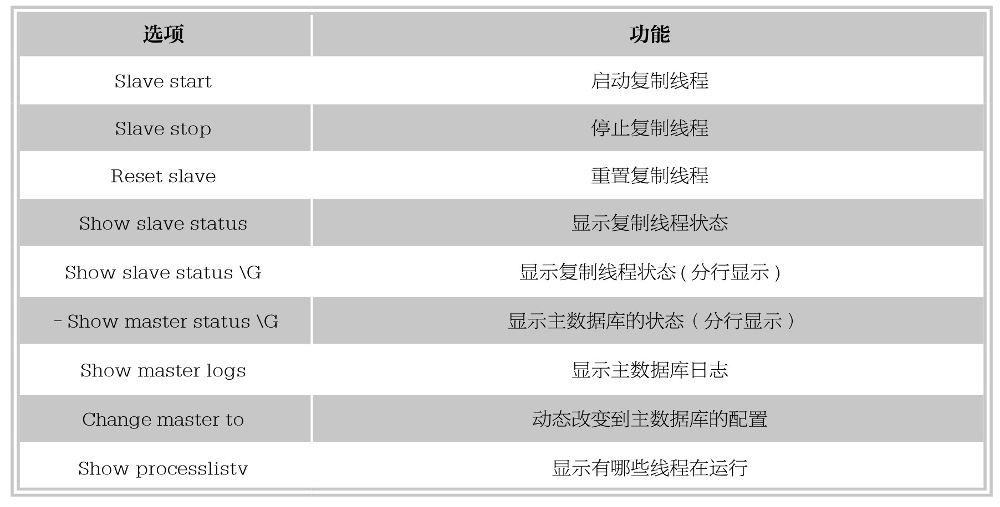

### 
  13.3 控制从服务器的操作

 本节视频教学录像：7分钟

13.2节中介绍了主服务器的具体实现过程，本节将介绍从服务器的具体操作。

将主服务器中备份的文件xscj _dump.txt复制到从服务器上，然后执行以下操作。

&#13;
    C:\Users\salonwang>mysqldump -uroot -p -h localhostxscj<c:\xscj _dump.txt&#13;
    Enter password: ***&#13;
    --MySQL dump 10.13 Distrib 5.6.22,for Win64(x86_64)--&#13;
    --Host:localhost  Database:xscj&#13;
    -- ------------------------------------------------------&#13;
    --Server version     5.6.22-log&#13;
    /*!40101 SET @OLD_CHARACTER_SET_CLIENT=@@CHARACTER_SET_CLIENT */;&#13;
    /*!40101 SET @OLD_CHARACTER_SET_RESULTS=@@CHARACTER_SET_RESULTS */;&#13;
    /*!40101 SET @OLD_COLLATION_CONNECTION=@@COLLATION_CONNECTION */;&#13;
    /*!40101 SET NAMES utf8 */;&#13;
    /*!40103 SET @OLD_TIME_ZONE=@@TIME_ZONE */;&#13;
    /*!40103 SET TIME_ZONE='+00:00' */;&#13;
    /*!40014 SET @OLD_UNIQUE_CHECKS=@@UNIQUE_CHECKS, UNIQUE_CHECKS=0 */;&#13;
    /*!40014 SET @OLD_FOREIGN_KEY_CHECKS=@@FOREIGN_KEY_CHECKS, FOREIGN_KEY_CHECKS=0*/;&#13;
    /*!40101 SET @OLD_SQL_MODE=@@SQL_MODE, SQL_MODE='NO_AUTO_VALUE_ON_ZERO'*/;&#13;
    /*!40111 SET @OLD_SQL_NOTES=@@SQL_NOTES, SQL_NOTES=0 */;&#13;
    /*!40000 ALTER TABLE 'trainperson_advice' ENABLE KEYS */;&#13;
    UNLOCK TABLES;&#13;
    /*!40103 SET TIME_ZONE=@OLD_TIME_ZONE */;&#13;
    /*!40101 SET SQL_MODE=@OLD_SQL_MODE */;&#13;
    /*!40014 SET FOREIGN_KEY_CHECKS=@OLD_FOREIGN_KEY_CHECKS */;&#13;
    /*!40014 SET UNIQUE_CHECKS=@OLD_UNIQUE_CHECKS */;&#13;
    /*!40101 SET CHARACTER_SET_CLIENT=@OLD_CHARACTER_SET_CLIENT */;&#13;
    /*!40101 SET CHARACTER_SET_RESULTS=@OLD_CHARACTER_SET_RESULTS */;&#13;
    /*!40101 SET COLLATION_CONNECTION=@OLD_COLLATION_CONNECTION */;&#13;
    /*!40111 SET SQL_NOTES=@OLD_SQL_NOTES */;&#13;
    -- Dump completed on 2015-03-25 14:27:07&#13;

修改从服务器的数据库配置文件，配置如下内容。

&#13;
    Server-id=2 ####设置从服务器的id号&#13;
    Master-host=10.212.103.95 ####设置主服务器的ip&#13;
    Master-user=rep_user ####设置连接主服务器的用户名&#13;
    Master-password=123456 ####设置连接主服务器的密码&#13;
    Replicate-do-db=xscj ####设置你要同步的数据库，可以设置多个&#13;
    Master-port= <port>配置端口号&#13;

重新启动slave，在Slave主机的MySQL重执行如下命令，关闭Slave服务。

&#13;
    Mysql>stop slave;&#13;
    Query OK, 0 rows affected (0.03 sec)&#13;

设置Slave实现复制相关的信息，执行以下命令。

&#13;
    mysql> change master to&#13;
    ->mster_host='10.212.103.113',&#13;
    ->master_user='rep_user',&#13;
    ->master_password='123456',&#13;
    ->master_log_file=' binary_log.000067',&#13;
    ->master_log_pos=120;&#13;
    Query OK,0 rows affected,0warnings(0.34 sec)&#13;

输入：“show slave status \G”用于提供有关从属服务器线程的关键参数的信息。

&#13;
    Mysql>show slave status\G&#13;
    *************************** 1.row ***************************&#13;
    Slave_IO_State: Waiting for master to send event&#13;
    Master_Host: 10.212.103.113&#13;
    Master_User: rep_user&#13;
    Master_Port: 4331&#13;
    Connect_Retry: 60&#13;
    Master_Log_File: binary_log.000067&#13;
    Read_Master_Log_Pos: 120&#13;
    Relay_Log_File: binary_log.000067&#13;
    Relay_Log_Pos: 235&#13;
    Relay_Master_Log_File: mysql-bin.005152&#13;
    Slave_IO_Running: Yes&#13;
    Slave_SQL_Running: Yes&#13;
    Replicate_Do_DB:&#13;
    Replicate_Ignore_DB:&#13;
    Replicate_Do_Table:&#13;
    Replicate_Ignore_Table:&#13;
    Replicate_Wild_Do_Table:&#13;
    Replicate_Wild_Ignore_Table:&#13;
    Last_Errno: 0&#13;
    Last_Error:&#13;
    Skip_Counter: 0&#13;
    Exec_Master_Log_Pos: 98&#13;
    Relay_Log_Space: 235&#13;
    Until_Condition: None&#13;
    Until_Log_File:&#13;
    Until_Log_Pos: 0&#13;
    Master_SSL_Allowed: No&#13;
    Master_SSL_CA_File:&#13;
    Master_SSL_CA_Path:&#13;
    Master_SSL_Cert:&#13;
    Master_SSL_Cipher:&#13;
    Master_SSL_Key:&#13;
    Seconds_Behind_Master: 0&#13;
    1 row in set (0.00 sec)&#13;

监控从服务器的状态：从以上信息上首先查看参数Slave_IO_Running和Slave_SQL_Running这两个进程状态是否为“yes”。Slave_IO_Running表明此进程是否能够使从服务器到主服务器上正确地读取BINLOG日志，并写入到从服务器的中继日志中；Slave_SQL_Running则表明此进程能否读取并执行中继日志中的BINLOG信息。

从数据库常用命令如下表所示。

技巧 
 在从机执行“show slave status \G;”命令中如果出现“Last_IO_Error发生2013的错误代码”，主要原因是网络问题，需要检查主机创建的用户是否授予远程连接的权限，另外需要查看是否有防火墙设置或者网络的其他故障。

