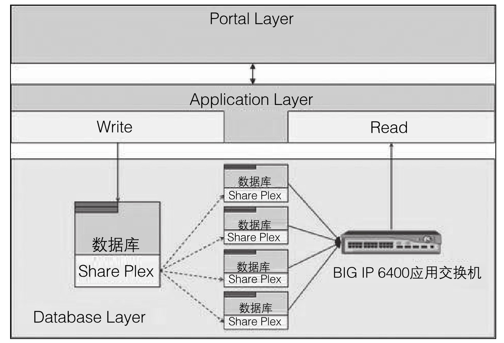

#### 
  15.2.2 MySQL读写分离

读写分离架构是利用数据库的复制技术（详见第14章），将读和写分布在不同的处理节点上，从而达到提高可用性和扩展性的目的。主数据库提供写操作，从数据库提供读操作，在很多系统中，更多地是读操作。当主数据库进行写操作时，数据要同步到从数据库，这样才能有效保证数据库完整性。MySQL也有自己的同步数据技术。MySQL通过二进制日志来复制数据，主数据库同步到从数据库后，从数据库一般由多台数据库组成，这样才能达到减轻压力的目的。读操作应根据服务器的压力分配到不同服务器，而不是简单的随机分配。MySQL提供了MySQL Proxy 实现读写分离操作。

目前较为常见的MySQL读写分离分为以下两种。

⑴基于程序代码内部实现。

在代码中根据SELECT、INSERT进行路由分类，这类方法也是目前生产环境中应用最广泛的。

⑵基于中间代理层实现。

代理位于客户端和服务器之间，代理服务器收到客户端请求后通过判断转发到后端数据库。下图是eBay 读写分离的结构图，通过 Share Plex 近乎实时的复制数据到其他数据库节点，再通过特定的模块检查数据库状态，并进行负载均衡、读写分离，极大地提高了系统可用性。

