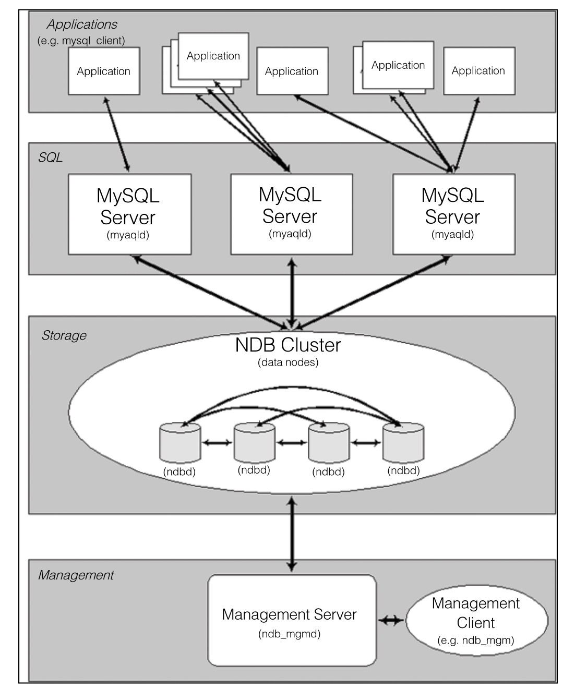

#### 
  15.2.3 MySQL集群

MySQL Cluster技术在分布式系统中为MySQL数据提供了冗余特性，增强了安全性，使得单个MySQL服务器故障不会对系统产生巨大的负面效应，系统的稳定性得到保障。

MySQL Cluster采用Shared-Nothing（无共享）架构。MySQL Cluster主要利用了NDB存储引擎来实现，NDB存储引擎是一个内存式存储引擎，要求数据必须全部加载到内存之中。数据被自动分布在集群中的不同存储节点上，每个存储节点只保存完整数据的一个分片(Fragment)。同时，用户可以设置同一份数据保存在多个不同的存储节点上，以保证单点故障不会造成数据丢失。

MySQL Cluster需要有一组计算机，每台计算机的角色可能是不一样的。MySQL Cluster按照节点类型可以分为3种：管理节点（对其他节点进行管理）、数据节点（存放Cluster中的数据，可以有多个）和SQL节点（存放表结构，可以有多个）。Cluster中的某计算机可以是某一种节点，也可以是2种或3种节点的集合。这3种节点只是在逻辑上的划分，所以它们不一定和物理计算机是一一对应的关系。多个节点之间可以分布在不同的地理位置，因此也是一个实现分布式数据库的方案，如下图所示。

MySQL集群的出现很好地实现了数据库的负载均衡，减少了数据中心节点的压力和大数据量处理，当数据库中心节点出现故障时，集群会采用一定策略切换到其他备份节点上，有效地屏蔽了故障问题，单节点的失效不会影响整个数据库对外提供服务。而且通过采用数据库集群架构，主从数据库之间时刻都在进行数据的同步冗余，数据库是多点的、分布式的，良好地完成了数据库数据的备份，避免了数据损失。

