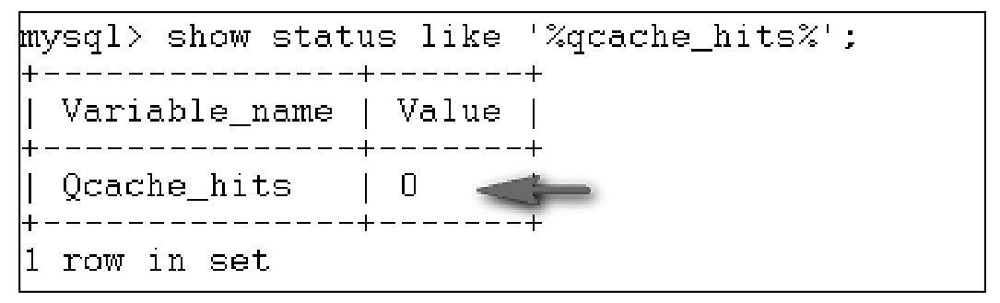
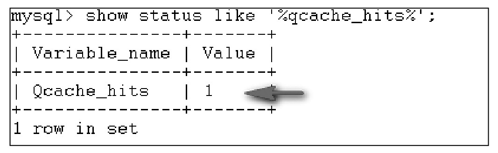

#### 
  16.1.2 MySQL查询缓存的工作原理

当MySQL收到传入的SQL语句时，它首先和之前已经解析过的SQL语句进行比对，如果发现相同，则返回已缓存数据。前面已经讲过，这里的相同一定是完全相同的，而且是逐字节相同，下面两个语句是不同的。

&#13;
    01 SELECT课程名FROM KC;&#13;
    02 select课程名from kc;&#13;

因为大小写的缘故，两条SQL语句被认为是不同的，它们的缓存是不能共享的。另外，如果一条SQL语句是另外一条SQL语句的子串，类似下面的情形，第02行的语句就不会被缓存；如果SQL语句是存储过程、触发器或者事件内部的一条语句，同样也不会被缓存。查询缓存也受到权限的影响，对于没有权限访问数据库中数据的用户，即使输入了同样的SQL语句，缓存中的数据也是无权访问的。

&#13;
    01 SELECT课程名FROM KC where 学分in(&#13;
    02 SELECT学分FROM KC&#13;
    03 );&#13;

当传入的SQL语句被认为是存在缓存的情况下，系统会修改MySQL的一个状态变量Qcache_hits，并将其值增加1，可以运行语句来查看Qcache_hits的值，其结果如下图所示。

图中Qcache_hits的值为0,表示目前缓存的命中率为0,一旦缓存生效,该值会大于1。例如，先输入如下SQL语句。

&#13;
    01 SELECT * FROM KC&#13;

查看Qcache_hits的值为0，等再次输入和01一样的SQL语句后，Qcache_hits的值变为下图。

由于InnoDB类型的表是支持事务操作的，当使用InnoDB类型的表时，包含在事务中的查询缓存也是会工作的。从MySQL 5.6版本之后，包含在视图中的查询结果也是会被缓存的。

查询缓存不会存储有不确定结果的查询。因此，任何一个包含不确定函数（比如NOW()或CURRENT_DATE()）的查询不会被缓存。同样地，CURRENT_USER()或CONNECTION_ID()这些由不同用户执行，将会产生不同的结果的查询也不会被缓存。事实上，查询缓存不会缓存引用了用户自定义函数、存储函数、用户自定义变量、临时表、MySQL 数据库中的表、INFORMATION_SCHEMA数据库中的表、performance_schema数据库中的表或者任何一个有列级权限的表的查询。

下面这些形式的查询也不会缓存。

&#13;
    01 SELECT...LOCK IN SHARE MODE&#13;
    02 SELECT...FOR UPDATE&#13;
    03 SELECT...INTO OUTFILE...&#13;
    04 SELECT...INTO DUMPFILE...&#13;
    05 SELECT*FROM...WHERE autoincrement_col IS NULL&#13;

对于第05行所示的查询形式，autoincrement_col是自增列，是按照ODBC工作方法工作的，MySQL对于这种情况也是不会缓存结果集的。另外，如果在事务中使用了序列化隔离级别的表达式也是不能够被缓存的。

