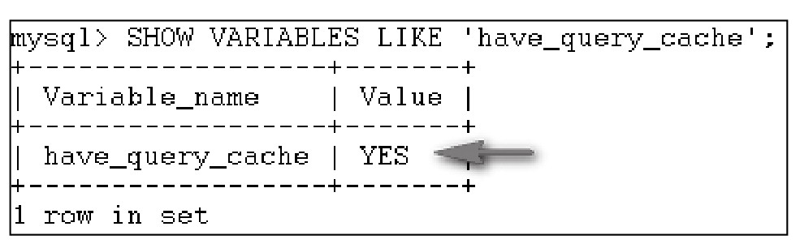
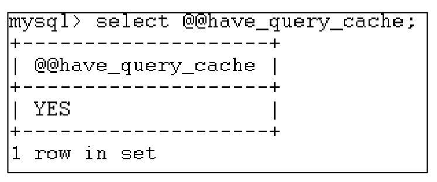
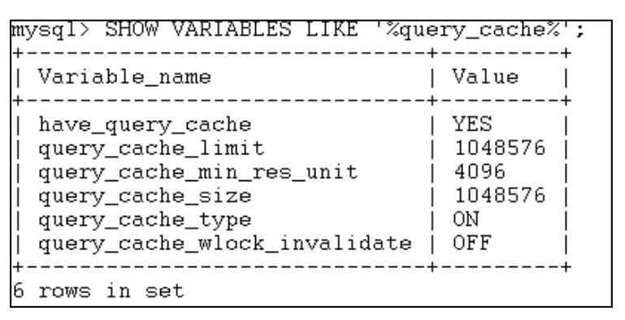
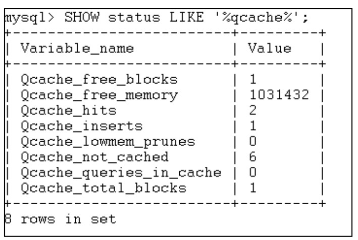

#### 
  16.1.3 查看MySQL的缓存信息

输入下面的语句。

默认情况下MySQL的查询缓存是被打开的，可以通过查询MySQL的系统变量来查看mysqld是否支持缓存，输入下面的语句来查看查询缓存的支持与否。

&#13;
    01 SHOW VARIABLES LIKE'have_query_cache';&#13;

运行后，显示结果如下图所示，“Yes”表示缓存是支持的。

当然，也可以使用select @@have_query_cache;方法来查看缓存是支持，运行效果如下。

输入下面的语句。

&#13;
    01 SHOW VARIABLES LIKE'%query_cache%';&#13;

显示结果如下。

●Have_query_cache前面已经讲过了。

●query_cache_limit可缓存的最大结果集(字节数) 大于此值的结果集不会被缓存,如果结果集大于此值，则MySQL增加 Qcache_not_cached状态值。

●query_cache_min_res_unit是为了避免Qcache碎片，需要平衡query_cache_min_res_unit大小和服务器保存查询结果时分配的块的数量，如果此值较小，那么会节省内存，但是这会使系统频繁分配内存块(占有CPU)，若块体积过大，则会造成较多的内存碎片(占有内存)。这里来解释一下Qcache碎片：当查询进行的时候，MySQL把查询结果保存在查询缓存中，但如果要保存的结果比较大，超过query_cache_min_res_unit的值，这时候MySQL将一边检索结果，一边进行保存结果，所以有时候并不是把所有结果全部得到后再进行一次性保存，而是每次分配一块 query_cache_min_res_unit 大小的内存空间保存结果集，使用完后，接着再分配一个这样的块，如果还不不够，接着再分配一个块，依此类推。也就是说，有可能在一次查询中，MySQL要进行多次内存分配的操作。当一块分配的内存没有完全使用时，MySQL会把这块内存Trim掉，把没有使用的那部分归还以重复利用。比如，第一次分配10 KB,只用了9 KB，剩1 KB，第二次连续操作，分配10 KB，用了8 KB，剩2 KB，这两次连续操作共剩下的1 KB+2 KB=3 KB，不足以做个一个内存单元分配，这时候内存碎片便产生了，也就是Qcache碎片。

●query_cache_size 显示查询缓存的大小，因为查询缓存本身的数据结构要占用大约40KB（不同系统会有差异），因此其值要大于40 KB。

●query_cache_type表示是否启用缓存。

●query_cache_wlock_invalidate 是否允许在其他连接处于lock状态时，使用缓存结果,默认为off。

&#13;
    01 SHOW STATUS LIKE'%qcache%';&#13;

显示结果如下。

●Qcache_free_blocks 缓存空闲的内存块。

●Qcache_free_memory 在query_cache_size设置的缓存中的空闲的内存。

●Qcache_hits前面已经讲过，表示缓存的命中次数。

●Qcache_inserts表示查询缓存区此前总共缓存过多少条查询命令的结果。

●Qcache_lowmem_prunes表示查询缓存区已满而从其中溢出和删除的查询结果的个数。

●Qcache_not_cached 见上文的query_cache_limit，表示没有进入查询缓存区的查询命令个数。

●Qcache_queries_in_cache查询缓存区当前缓存着多少条查询命令的结果。

●Qcache_total_blocks 表示缓存总的内存块。

