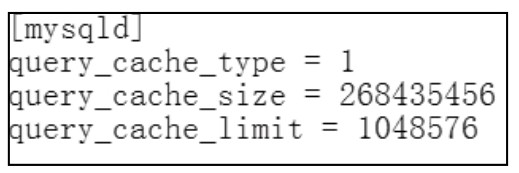
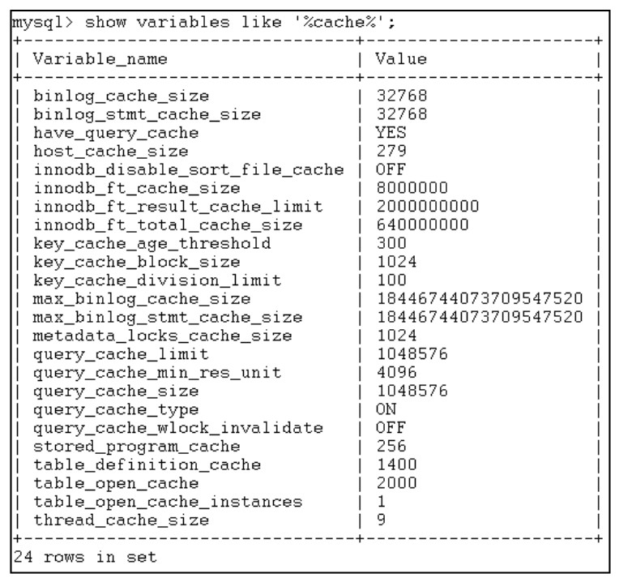

#### 
  16.2.1 配置查询缓存

查询缓存的配置可以通过设置系统环境变量来完成，设置环境变量一般有两种方式：一种是在配置文件中设置；第二种是在命令行中设置。

1.选项文件的配置

在Windows中MySQL的选项文件一般保存在下面几个位置。

(1) Windows安装目录下my.ini，通常Windows安装目录为C:\windows,可以通过查看环境变量WINDIR来获取Windows安装目录，语句如下。

&#13;
    01 c:\>echo %windir%;&#13;

(2) C:\my.cnf。

(3) INSTALLDIR\my.ini，INSTALLDIR表示MySQL的安装目录。

在Unix系统中，选项文件一般保存到下面几个位置。

(1) /etc/my.cnf。

(2) $mysql_home/my.cnf。

(3)～/.my.cnf。

下图所示是一个使用选项文件配置的示例，query_cache_type的值可以设置为0、1或者2，0代表不使用缓冲，1 代表使用缓冲，2 代表根据需要使用。

其中，query_cache_type的值还可以是ON、OFF或者DEMAND，ON表示打开查缓存，OFF表示关闭缓存，DEMAND的功能和2是相同的。

2.命令行的配置

通过命令行来调整系统的参数更加灵活，大多数情况下采用SET命令。通过前面的学习，知道show variables命令可以查看系统变量，效果如下图所示。

通过SET命令可以设置全局系统变量和会话系统变量，下面是设置全局和会话系统变量的例子。

&#13;
    01 set global query_cache_size=5000;&#13;
    02 set session query_cache_size=5000;&#13;

需要说明的时，上面这个例仅在说明global系统变量和session系统变量的设置方法，实际上query_cache_size被MySQL认为是global系统变量，是无法设置成session的。

可以取消当前用户会话的缓存，语句如下。

&#13;
    01 mysql>set session query_cache_type=off;&#13;

要控制可以被缓存的具体查询结果的最大值，应设置query_cache_limit变量，默认值是1 MB。通过下面的指令来设置query_cache_limit的值为1 MB。

&#13;
    01 mysql>set global query_cache_limit=1048576;&#13;

当查询执行时，最新的结果数据块根据实际数据大小来确定，因此可以释放不使用的内存。根据服务器执行查询的类型，会发现调整query_cache_min_res_unit变量的值是有用的。query_cache_min_res_unit默认值是4KB。这应该适合大部分情况。

如果有大量返回小结果数据的查询，默认数据块大小可能会导致内存碎片，显示为大量空闲内存块。由于缺少内存，内存碎片会强制查询缓存并从缓存内存中修整（删除）查询。这时，应该减少query_cache_min_res_unit变量的值。空闲块和由于内存调整而移出的查询的数量通过Qcache_free_blocks和Qcache_lowmem_prunes变量的值体现出来。

