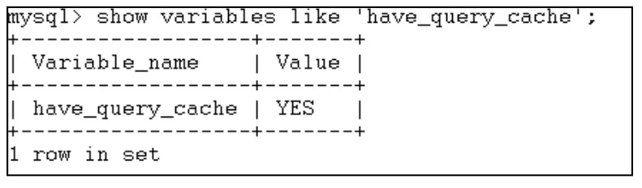
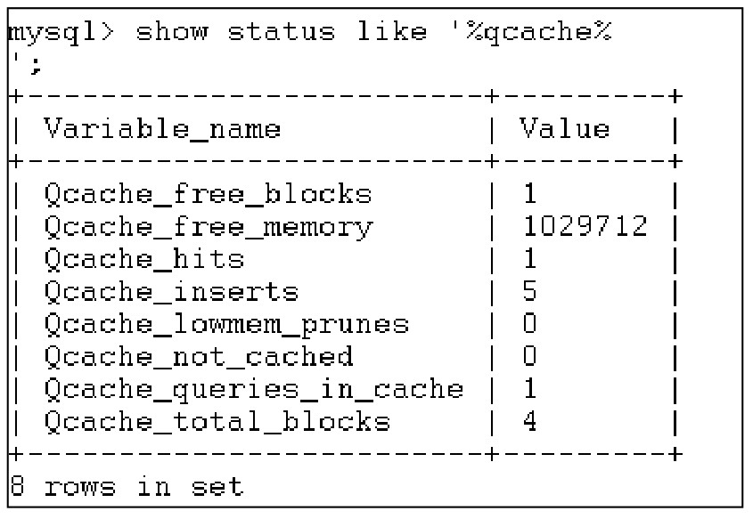

#### 
  16.2.3 查询缓存的维护

在使用MySQL数据库的时候,可以通过have_query_cache来查看当前的服务器是否支持查询缓存,这些在上面已经讲过,如果其值是YES，就表示查询缓存时生效的，如下图所示。

当查询缓存工作一定时间后，通过SHOW STATUS来监控缓存的性能，使用方法如下。

上图各个参数的含义在前面已经讲过。查询缓存的长时间工作可能会产生内存碎片，在讲解query_cache_min_res_unit时说明过这种情况，这时候，可以通过使用FLUSH QUERY CACHE语句来清理查询缓存碎片，执行该语句后，系统只会清除缓存碎片，并不会清除缓存的查询结果，这样就可以继续使用查询缓存，提高内存使用性能。执行FLUSH QUERY CACHE语句效果如下。

如果想要从内存清除查询结果的缓存，就可以利用RESET QUERY CACHE语句和 FLUSH TABLES语句来完成这样的工作。执行RESET QUERY CACHE效果如下。

执行FLUSH TABLES效果如下。

