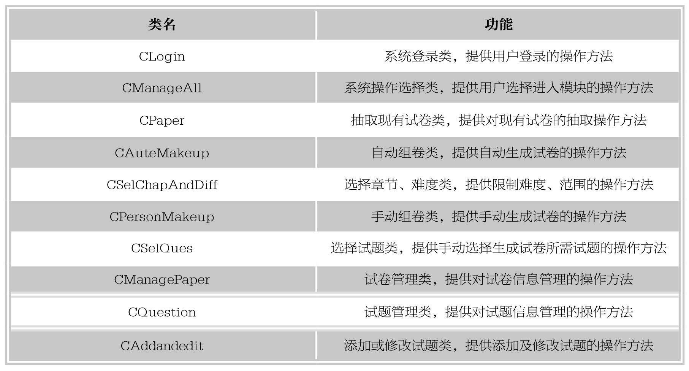
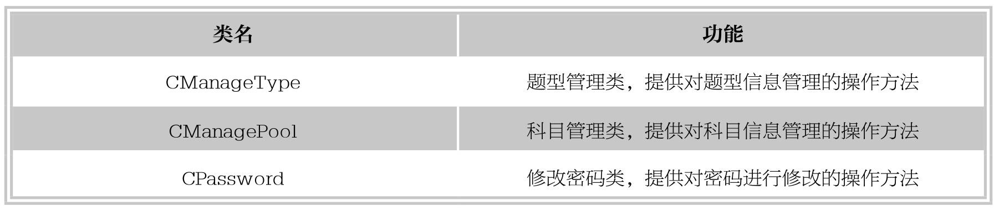
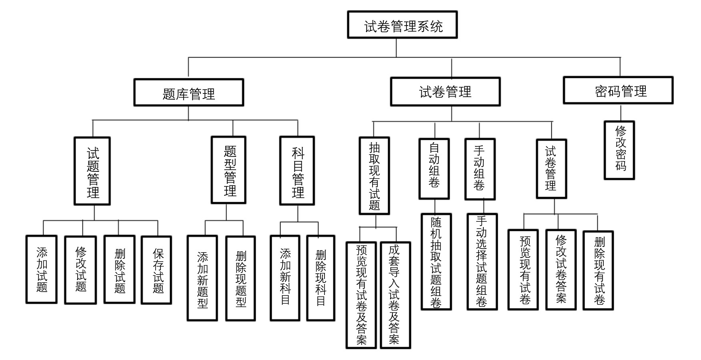

### 
  18.3 总体设计

 本节视频教学录像：4分钟

本系统采用传统的三层结构，即表现层、业务逻辑层和数据访问层。表现层用于显示数据和接收用户输入的数据，为用户提供一种交互式操作的界面。业务逻辑层是用户层和数据访问层之间的职能接口，负责处理用户输入的信息，或者将这些信息发送给数据访问层进行保存，或者调用数据访问层中的函数再次读出数据。业务逻辑层的实现要由13个类完成，类名及类的功能描述如下表所示。

系统数据库访问操作采用ADO技术，在进行代码设计时，把数据库操作的代码单独写在一个自定义的ado.cpp文件里，包括CADODatabase和CADORecordset两个类分别实现对数据库和记录集的操作，并将这些操作封装在两个类中。

系统总体设计的结构图如下图所示。

