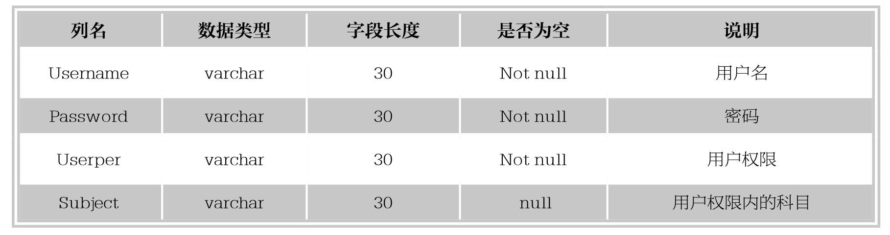
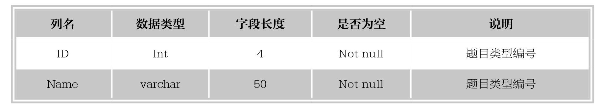
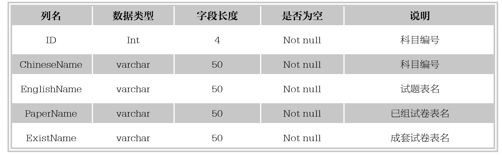
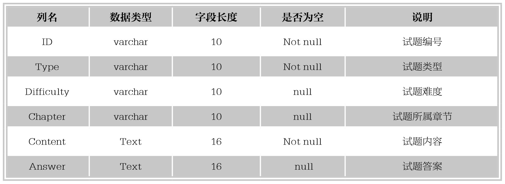
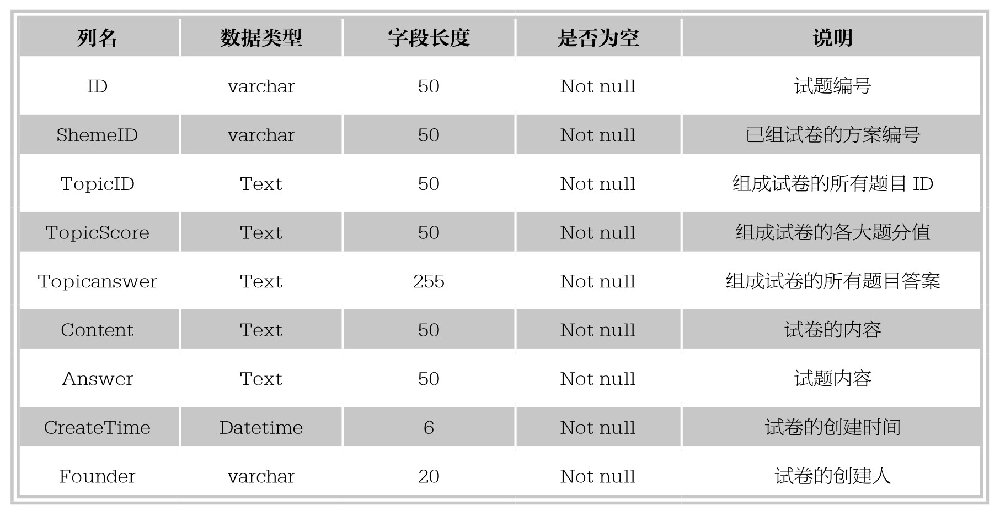
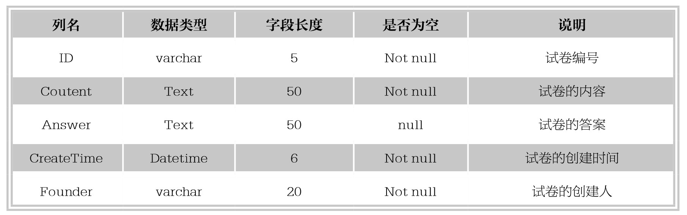

#### 
  18.4.1 数据表详细信息

为了是该系统的个数据表的含义更加清晰，对其作如下功能描述。

1.用户登录信息表（tbLogin表）

用户登录信息表记录用户的登录信息，如下表所示。

2.题目类型信息表（tbType表）

题目类型信息表记录类型信息，如下表所示。

3.科目信息表（tbTableName表）

科目信息表记录每个科目对应的试题表和试卷表名，如下表所示。

4.试题信息表（tb*表）

试题信息表记录试题信息，其中“*”表示数字，各科目的试题表名为“tb+该科目编号”。具体信息如下表所示。

表中ID字段为10为数字串，ID的组成方式举例如下：0203110003号试题，02为题型编号、03为难度编号、11为所属章节编号、0003为题目的序号。

5.已组试卷信息表（tbPaper*表）

已组试卷信息表记录已组试卷信息，其中“*”表示数字，各科目的已组试卷表名为“tbPaper+该科目编号”。表详细信息如下表所示。

其中ShemeID（方案ID）为最长40位的数字串，ID为最长44位的数字串，ID=ShemeID+4位编号。ID的组成方式举例如下：0140031005100005，其中0140为01题型的试题40道，0310为03题型的10道，0510为05题型的10道，方案为01400310051的第5套试卷。

6.成套试卷信息表（tbExist*表）

成套试卷信息表记录成套试卷信息，其中“*”表示数字，各科目的成套试卷表名为“tbExist+该科目编号”。该表详细信息如下表所示。

