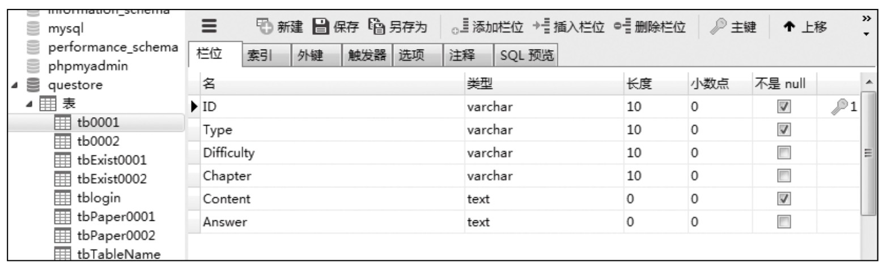
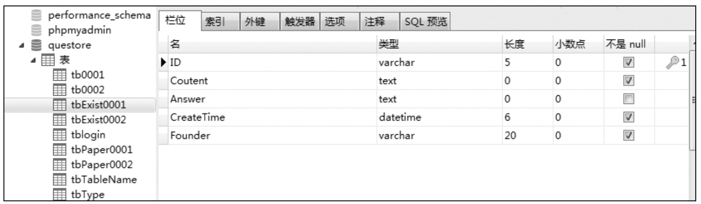
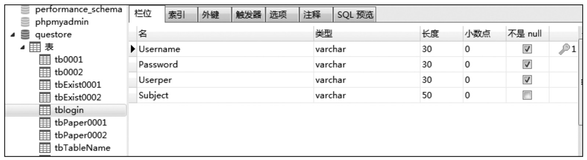
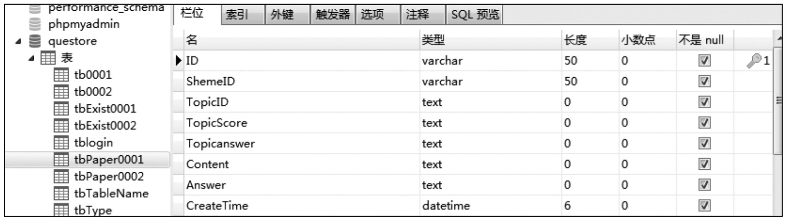
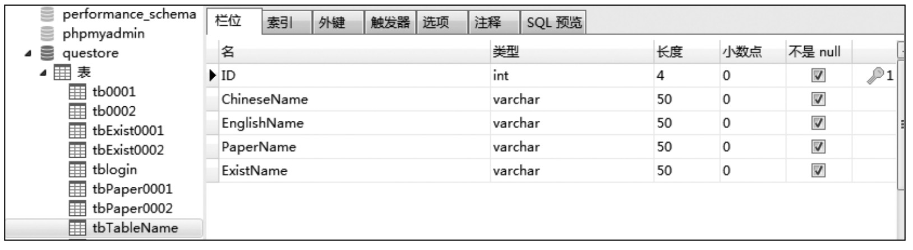
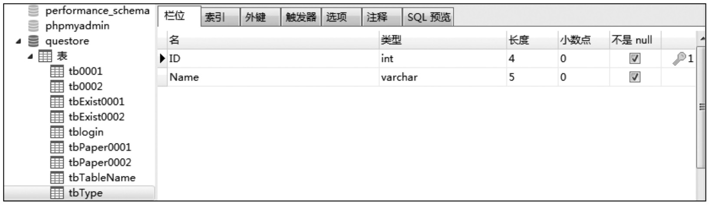

#### 
  18.4.2 数据库实现

本项目数据库选用MySQL，并选用图形化工具Navicat for MySQL进行数据库实现的相关操作。下面简单介绍数据库的实现。

1.创建数据库

打开Navicat for MySQL，并连接到MySQL，在左侧空白处右键单击选择“新建数据库”，数据库名为QUEStore。

2.在数据库中创建表

这边假设目前有两个不同的科目，现在为该系统创建表。具体步骤如下。

展开数据库QUEStore，选中“表”右键单击，然后选择“新建表”，表名为“tb0001”，如下图所示。

同样创建表“tb0002”，其表结构和“tb0001”一样，如上图所示。

展开数据库QUEStore，选中“表”右键单击，然后选择“新建表”，表名为“tbExist0001”，如下图所示。

同样创建表“tbExist0002”，其表结构和“tbExist0001”一样，如上图所示。

展开数据库QUEStore，选中“表”右键单击，然后选择“新建表”，表名为“tbLogin”，如下图所示。

展开数据库QUEStore，选中“表”右键单击，然后选择“新建表”，表名为“tbPaper0001”，如下图所示。

同样创建表“tbPaper0002”，其表结构和“tbPaper0001”一样，如上图所示。

展开数据库QUEStore，选中“表”右键单击，然后选择“新建表”，表名为“tbTableName”，如下图所示。

展开数据库QUEStore，选中“表”右键单击，然后选择“新建表”，表名为“tbType”，如下图所示。

