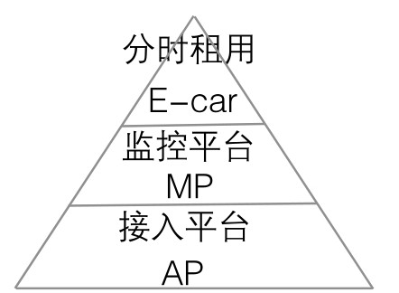

#### 
  19.1.1 项目背景

分时租车是租车行业新兴的一种租车模式。意指以小时或天计算提供汽车的随取即用租赁服务，消费者可以按个人用车需求和用车时间预订租车的小时数，其收费将按时间、里程等因素来计算。该方式首先由Zipcar公司于1999年在美国马萨诸塞州剑桥市推出。进入21世纪后，“分时租车”的理念和操作方法正在以强劲的势头重建汽车使用新行规，并向全球蔓延，2011年进入中国大陆地区。

20世纪90年代，一些注重环境保护的欧洲企业开始推行汽车分享的理念，认为没有必要人人拥有汽车，否则对环境将是一个巨大的灾难。为了提高汽车的使用效率，他们倡导由若干个消费者共同使用一辆汽车。在这种背景下，全球第一家分时租车公司Zipcar于1999年在美国马萨诸塞州剑桥市孕育而生，然后逐步向加拿大及欧洲蔓延。

最早出现关于分时租车消息的是国际汽车租赁公司安飞士(Avis)，主要分为1小时、2小时、4小时、6小时共4种方式，提供的租车车型目前仅有Smart。随后在杭州 、武汉等地也出现了分时租车业务。

2013年3月7日，上海国际汽车城与上海通用汽车签署共享示范推广战略合作协议，国际汽车城相关负责人透露，将推出电动汽车分时租赁举措，并力争在2013年4月能开始电动车共享的试点，这种模式可以让市民以低成本享受电动汽车。市民像使用公共租赁自行车一样，在租车点刷一下卡，开车上班、购物。到了目的地后停在固定停车点，刷卡还车后该车辆就可以提供给另外有需要的人使用。这种业务具体操作模式拟参考上海已有的自行车租赁，租车车主可刷卡取车，分时租赁，这样可以让很多市民使用起来，对电动汽车慢慢熟悉。

2014年7月国务院办公厅在国办发〔2014〕35号文《以关于加快新能源汽车推广应用的指导意见》中强调，要在个人使用新能源汽车领域，探索分时租赁、车辆共享、整车租赁以及按揭购买新能源汽车等创新模式。

电动汽车分时租赁也得到了地方政府的大力支持。比如北京市科委在2014年已将分时租赁列为2015年支持重点项目，并设立了为数不少的分时租赁经营指标。上海市则由上海国际汽车城运营有限公司获得经营分时租赁的牌照，在试验、准备上线EVCARD（电动汽车分时租赁），先期使用的车辆主要为荣威E50纯电动汽车。其他城市，如杭州、武汉、深圳、绍兴、宁波、盐城、重庆等，也已推出或在积极准备上线这类项目。大多数城市都以先开展电动汽车长租、团租等传统租赁形式为基础，不断为开展电动汽车分时租赁运营所需的平台技术开发、车队运营、管理服务等经验、条件做好准备。

国内几家发展较早的汽车共享运营企业有北京的易多、杭州的车纷享、北京的易卡先锋等，目前发展较快的有上海的EVCARD、北京的易约车、杭州的左中右等电动汽车分时租赁。

构建合适的电动汽车的分时租用是当下市场迫切需要的。假设该软件系统依托与监控平台和接入平台，利用监控平台完成对车辆的控制、监管等，而监控平台则运行与接入平台之上。其结构如下图所示。

下面是本项目中涉及的一些术语和定义：

⑴MP（Monitoring Platform for Electric Vehicle，电动汽车管理平台）；又称监控平台：通过AP用以完成对接入AP的所有车辆的信息管理和车辆控制。

⑵AP（Access Platform for Electric Vehicle，接入平台）：通过在汽车上加装终端设备（以下简称车载终端）采集车辆信息，终端设备通过TCP/IP将车辆信息发送到平台，平台和车辆终端通过道路运输车辆卫星定位系统北斗兼容车载终端通信协议技术规范（以下简称808协议）进行通信。

⑶车主：实际购买车辆的人，车辆所属权人。

⑷停车场管理员：别名租用管理者，完成日常的车辆保洁、下发车钥匙、收钥匙、验收车辆（刮蹭、划痕、故障等）、充电管理、场地看管等工作。

⑸实际租车用户：别名驾驶员，实际驾驶车辆的人员。

⑹租户：对车主的车辆实施租用，可能是商户、公司、团队、个人等，甚至是驾驶员。

⑺E-CAR（Electric Car Sharing Rental）：指电动汽车分时租用系统。

