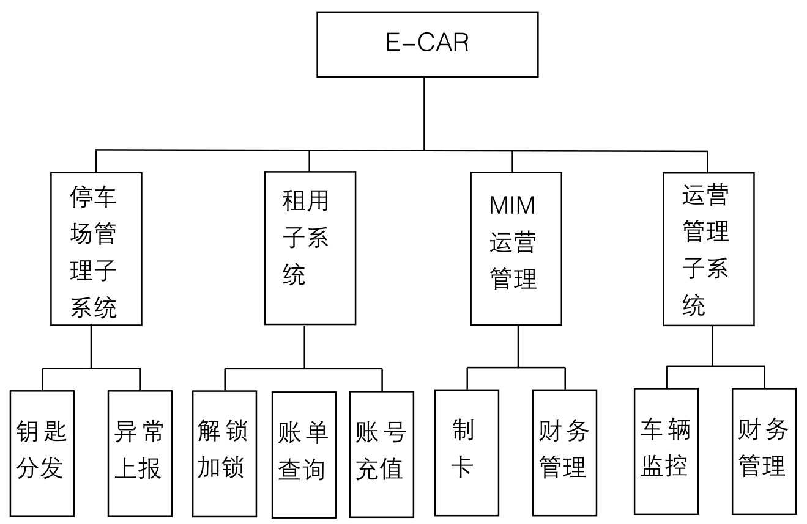
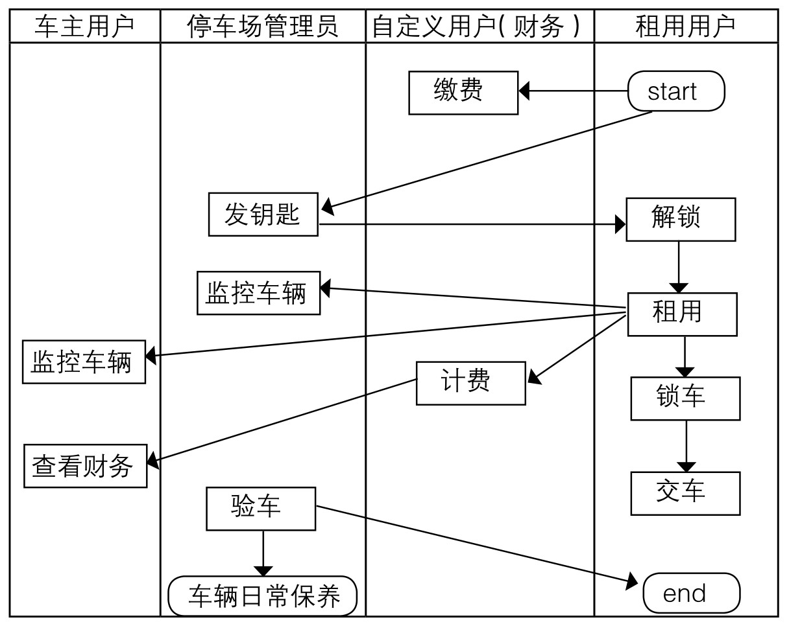
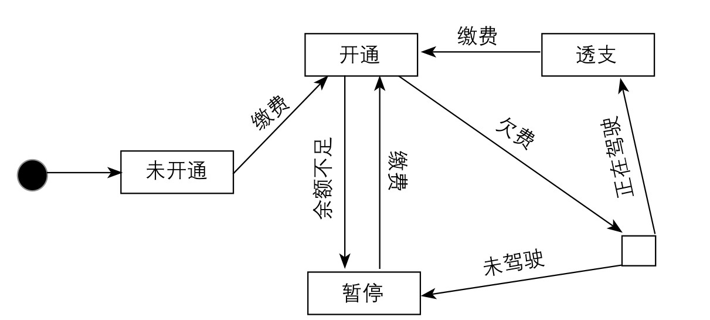
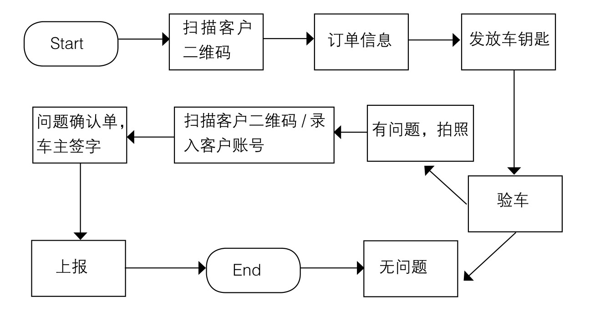
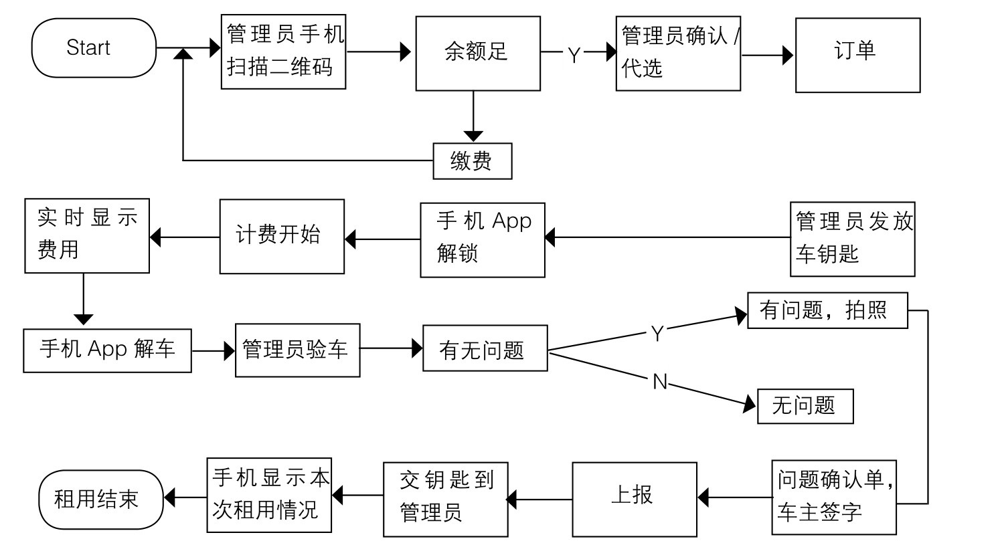

#### 
  19.1.4 功能需求

分时租用系统包括：停车场管理子系统、租用子系统、运营管理子系统、MIM运营管理，其结构如下图所示。

E-CAR系统用户包括：超级用户、系统用户、车主（运营）用户、停车场管理员用户、自定义用户、业务代理用户、租用用户。具体参见用户及权限要求。

车主可以将车辆租用给租用用户。租用的方式有两种，一种是租用用户可以是具有一定担保能力的担保人担保的个人或者是个体户、企业等。车主将被租车辆交给停车场管理员进行车辆日常维护和租用管理。另一种是车主找代理用户来代理租用业务，代理用户的具体业务过程和车主自己租用给租用用户的过程相同。

通过E-CAR能够完成4个子系统的功能：停车场管理子系统、租用子系统、运营管理子系统、MIM运营管理。停车场管理子系统供停车场管理员使用，租用子系统供租用用户使用，运营管理子系统供车主、代理用户和他们定义的其他用户（自定义用户，如财务管理用户）使用。其业务流程如下图所示。

停车场管理完成车辆的日常保养、维护和车辆的租用。日常保养就是保洁工作；维护就是充电和故障上报；车辆的租用过程如下：管理员首先在手机上安装E-CAR APP，当客户（租用者）前来租车时，扫描客户的准驾卡上的二维码，判断客户账户余额是否够用（默认500元人民币），余额接近报警值报警给租户。准驾卡状态如下图所示。

其业务流程如下图所示。

