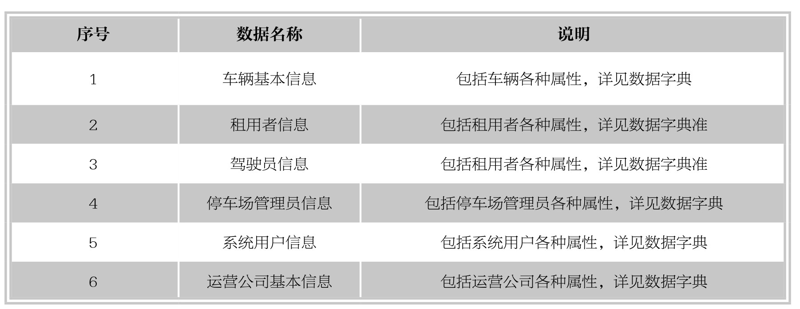
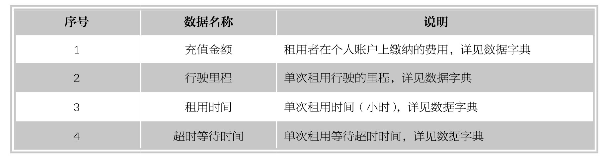
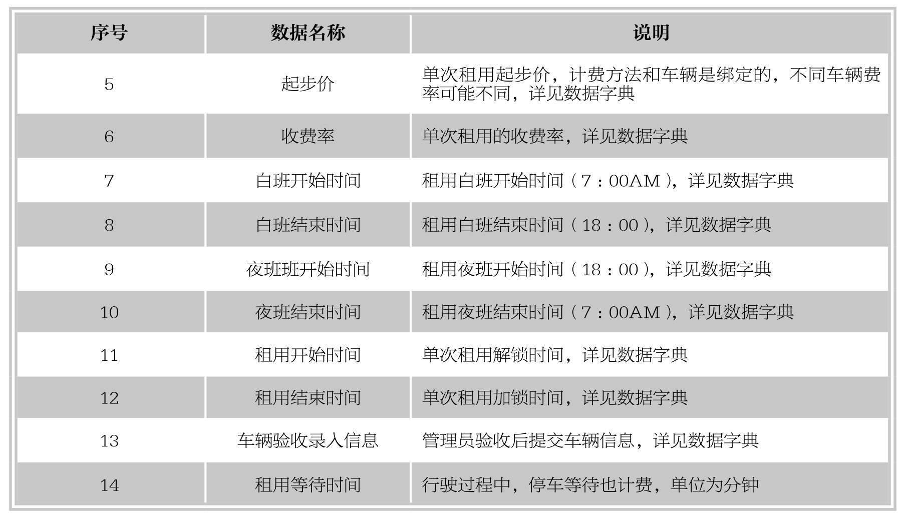
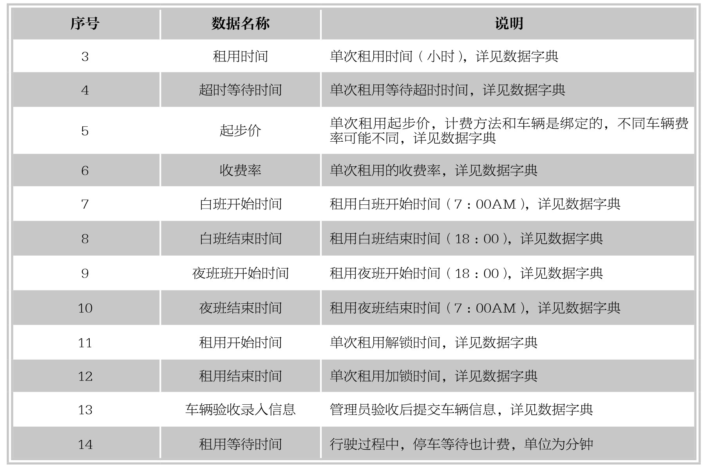
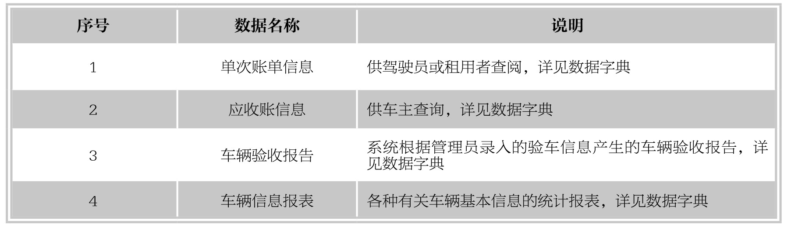
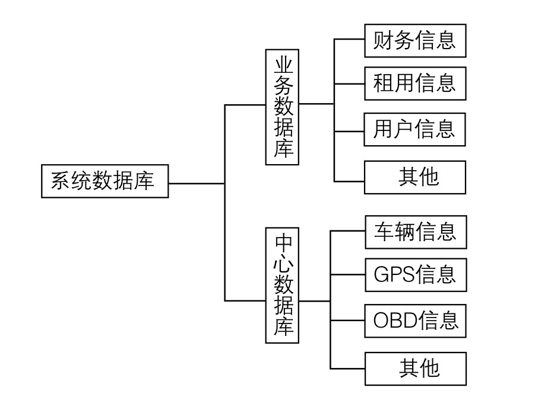
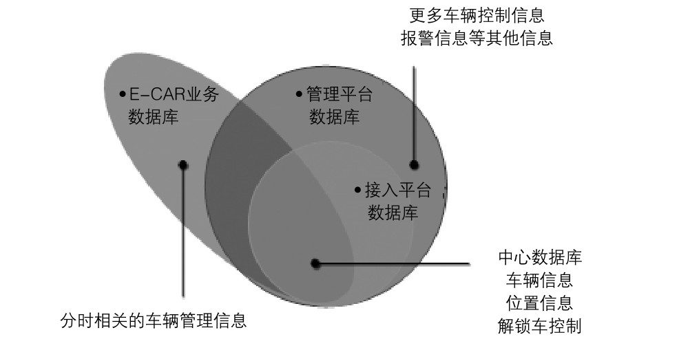

#### 
  19.1.5 数据说明

1.静态数据

2.动态数据

3.输入数据

4.输出数据

5.数据库介绍

系统采用MySQL 5.5以上数据库。

数据库分两大部分：业务数据库和中心数据库；中心数据库用来保存所有车量基本信息、车辆位置信息等监控平台直接采集的数据。业务数据库用来保存除监控平台以外的其他业务数据，其关系如下图所示。

中心数据库由MP负责建立和维护，接入平台把采集的GPS（位置）信息、控制信息等保存中心数据库中。E-CAR的数据库由三部分构成：自建的业务数据库部分、车辆管理数据库部分、中心数据库部分。其关系如下图2所示,中心数据库是MP、AP和E-CAR的交集。MP的数据库包含了AP数据库，E-CAR的数据库包含了部分MP的数据库和中心数据库。

