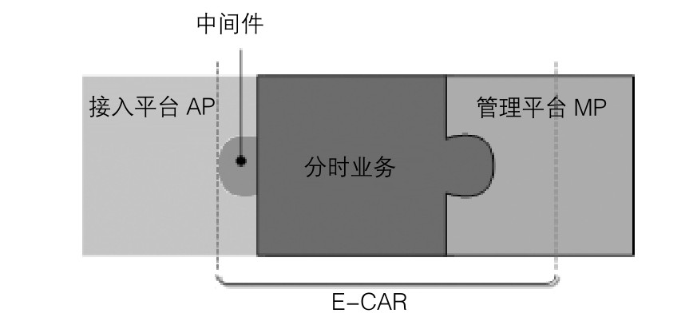

#### 
  19.1.6 软件接口说明

E-CAR系统必须把自己的业务系统和MP及AP系统结合才能完成所有E-CAR的功能，如下图所示。换句话说，E-CAR必须使用MP的部分功能来完成车辆的监控，使用AP的部分功能来完成车辆的控制。下图中虚线中间部分为E-CAR系统的组成。除了大部分是E-CAR自身的分时租用业务外，一部分调用AP，另一部则调用MP。

E-CAR和AP交互部分，采用中间件技术。E-CAR和中间件基于HTTP，自定义协议通信；中间件和AP之间通过基于Socket的808协议通信。中间件自行定义。

E-CAR和MP调用部分，则考虑将MP的部分代码集成到E-CAR中，另外，E-CAR访问中心数据库（参照“3.3数据库介绍”），则自行编写数据库操作模块来完成。中心数据库的名称为：“newroad”,用户名称为“newroad”，密码为“newroad”。结构如表6.3.1-表6.3.2所示。

