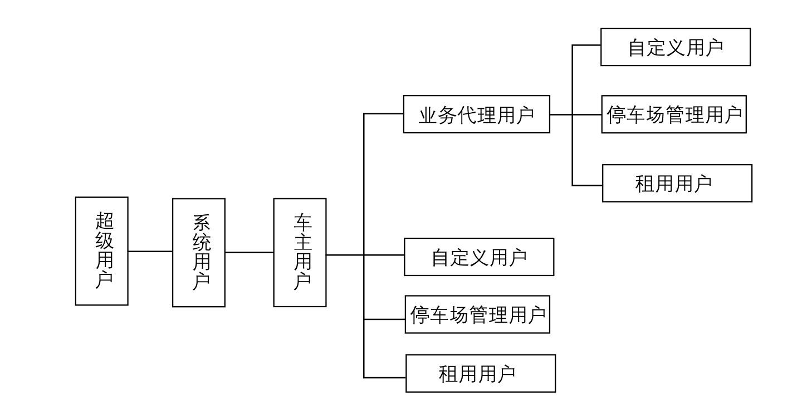

#### 
  19.1.7 用户及权限要求

用户构成如下图所示。

⑴超级用户：拥有系统所有权限。系统中权限最高的，完成系统部署、初始化、创建其他系统用户等工作。

⑵系统用户：完成日常的系统维护工作，同时可创建车主用户。其权限由超级用户指定，或由具有权限分配的管理员指定。

⑶车主用户：又称运营用户，车辆的所有者。由系统用户创建，可以创建租用用户和业务代理用户，是租车业务的经营者，管理日常租车业务。

⑷停车场管理用户：由车主用户创建的，完成日常的车辆保洁、下发车钥匙、收钥匙、验收车辆、充电管理、场地看管等工作。

⑸业务代理用户：代理车主业务的用户。可以创建租用用户，管理车主授权的租车业务。

⑹租用用户：实际租车人，不能创建其他用户，只能使用其创建人赋予的业务功能。

⑺自定义用户：超级用户、系统用户、车主用户、代理用户都可以自己建立“自定义用户”，来完成创建者赋予的权限，比如财务人员可分配财务处理相关权限的自定义用户。

⑻系统采用DAC（Discretionary Access Control）的方式设计权限。用户按照图名的层级关系创建和设置权限。上级用户可以建立新用户，可以自定义用户，可以把拥有的权限分配给子用户。在分配权限时，上级用户先创建权限角色，之后分配角色到子用户。

