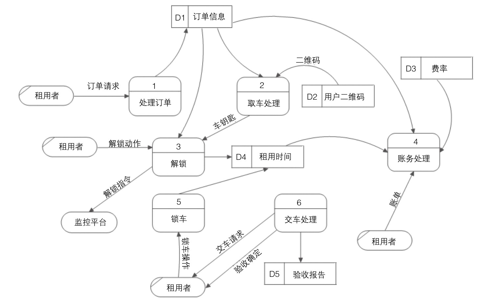
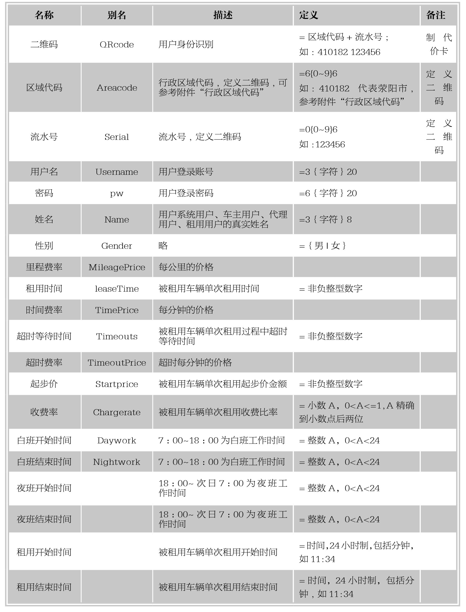
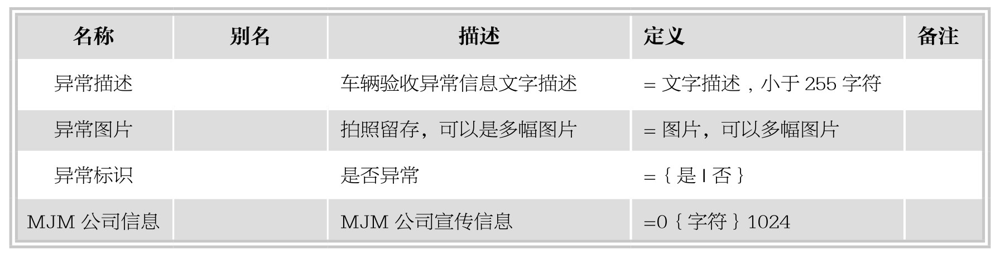
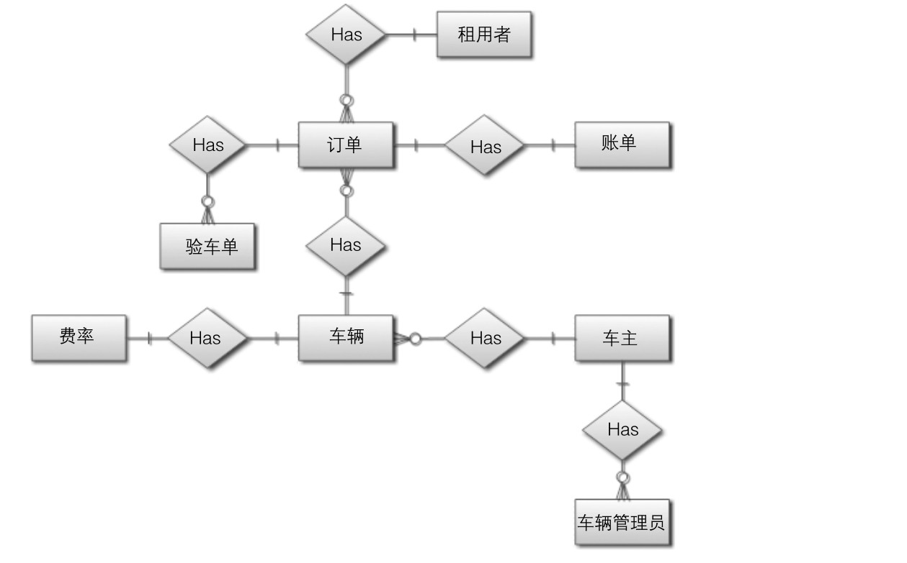
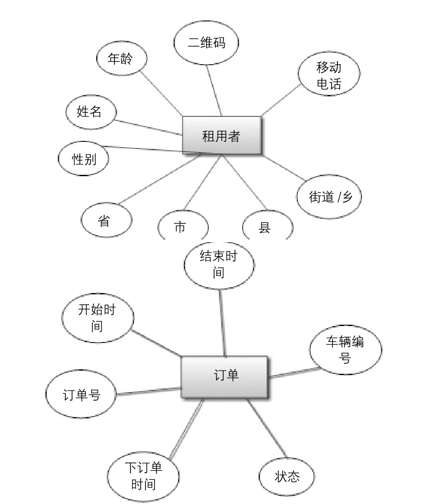
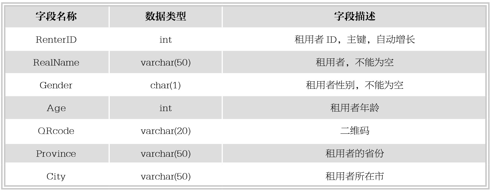
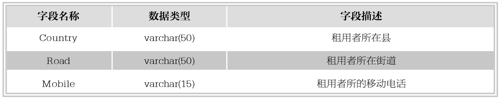
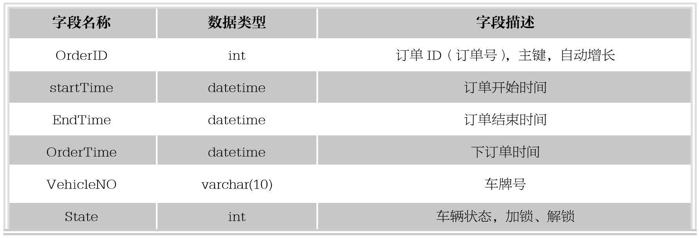

### 
  19.2 数据库分析与设计

 本节视频教学录像：9分钟

本节主要讲解如何根据需求分析构建E-R图，如何通过E-R图来设计数据库。

根据上面的需求，了解到只要考虑分时租用的设计就可以了，不用考虑MP和AP的设计，下面给出了分时租用部分的数据库设计过程。

1.绘制数据流图并进行分析

根据需求分析给出系统的数据流程图,下图是根据租车的业务流程图,在需求分析的时候,绘制得到的数据流程图。可以按照同样的方法将得到所有的数据流程图。

根据需求分析并结合数据流程图，需要给出数据字典。只有数据流程图没有数据字典会使我们无法准确地表达需求。

2.数据词典

理论上讲，数据字典应包括数据项、数据结构、数据处理、数据存储、数据流等的描述和说明，这里限于篇幅只给出了部分的数据项和数据结构，如下面两表所示。

3.E-R图

按照数据流图和数据字典，结合需求分析，设计出系统的E-R图,如下图所示。

图中 表示1， 表示n，比如车主和车辆管理员之间就拥有1∶n的关系，订单和账单之间是1∶1的关系。图中的每个实体最终表示为下图的形式。这里只给出租用者的实体图和订单的实体图，其他E-R请读者自行分析。

4.设计表结构

根据设计得到的E-R图构建系统的表结构。转换规则如下。

⑴一个实体一个表，表的字段为实体的属性。再根据数据字典定义字段的类型。

⑵一个1∶1的关系合并到任何一端的表中，并作为外码。

⑶一个1∶n的关系合并到n端的表中，1端的码作为n端的外码。

⑷一个n∶m的关系建立一个新的表，分别把n和m 的码作为新建表的外码。

设计的表结构如下。

其他表结构请读者按照同样的方法设计。

